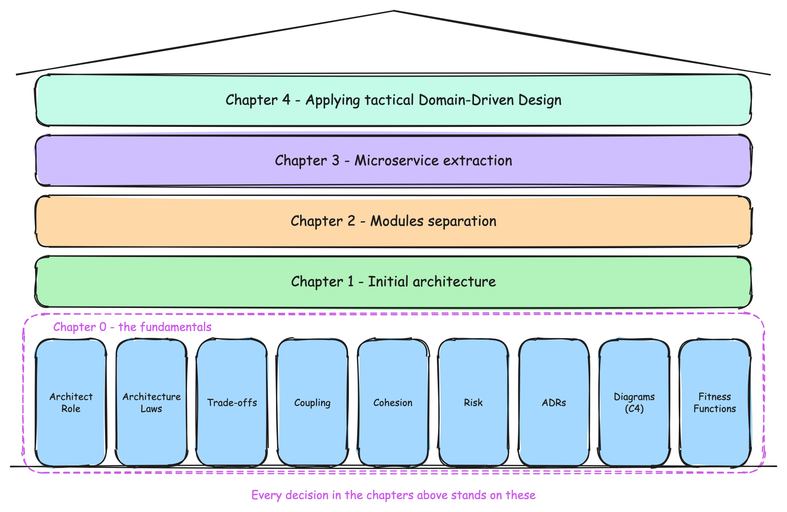
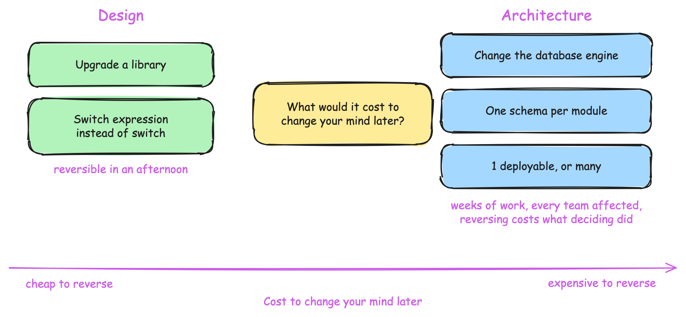
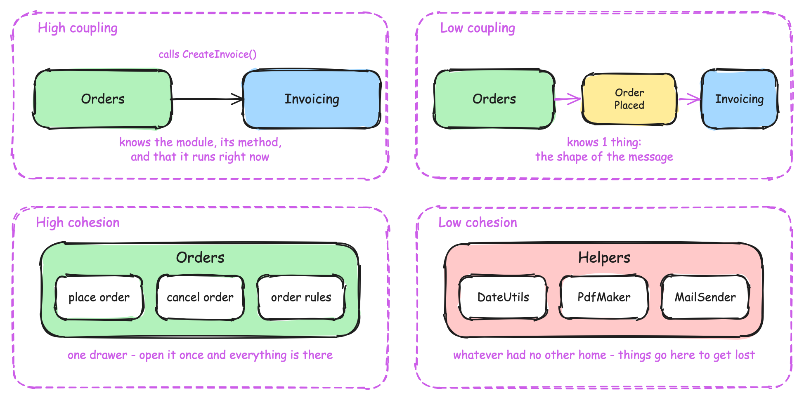
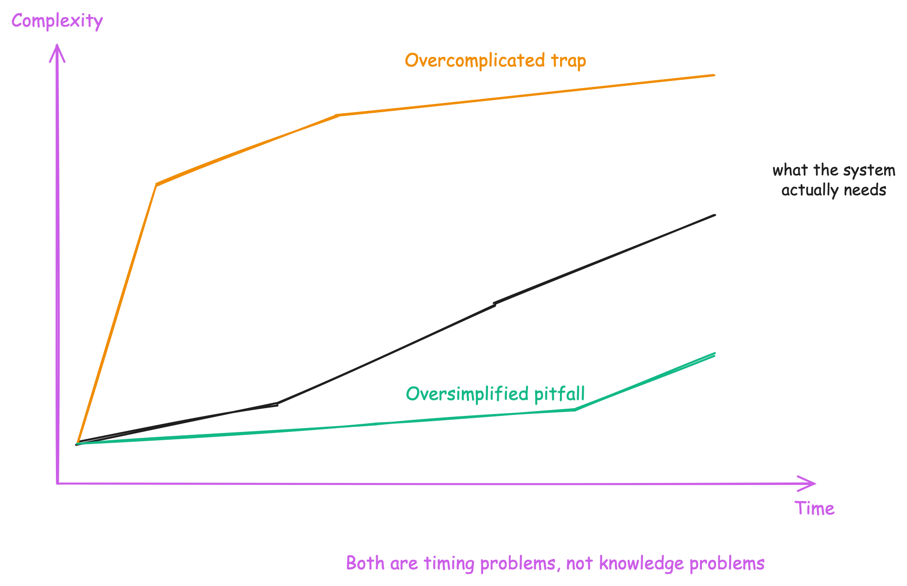
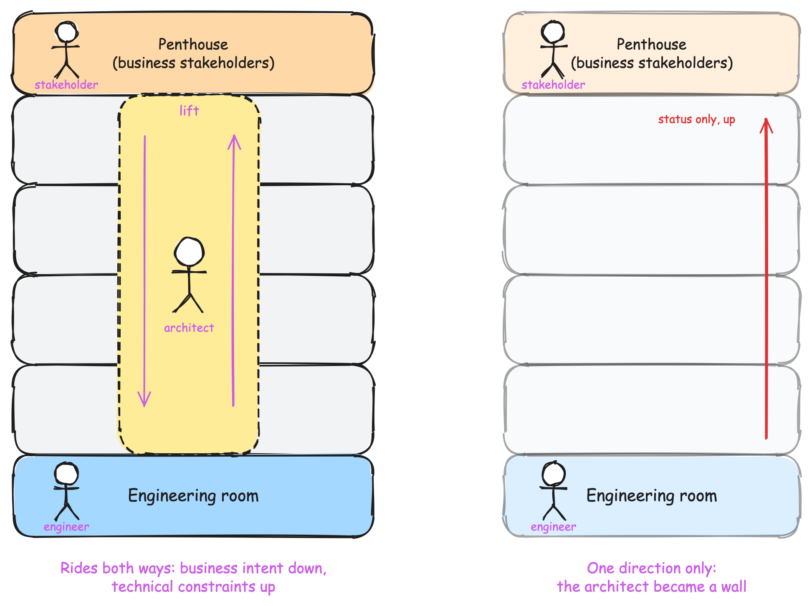
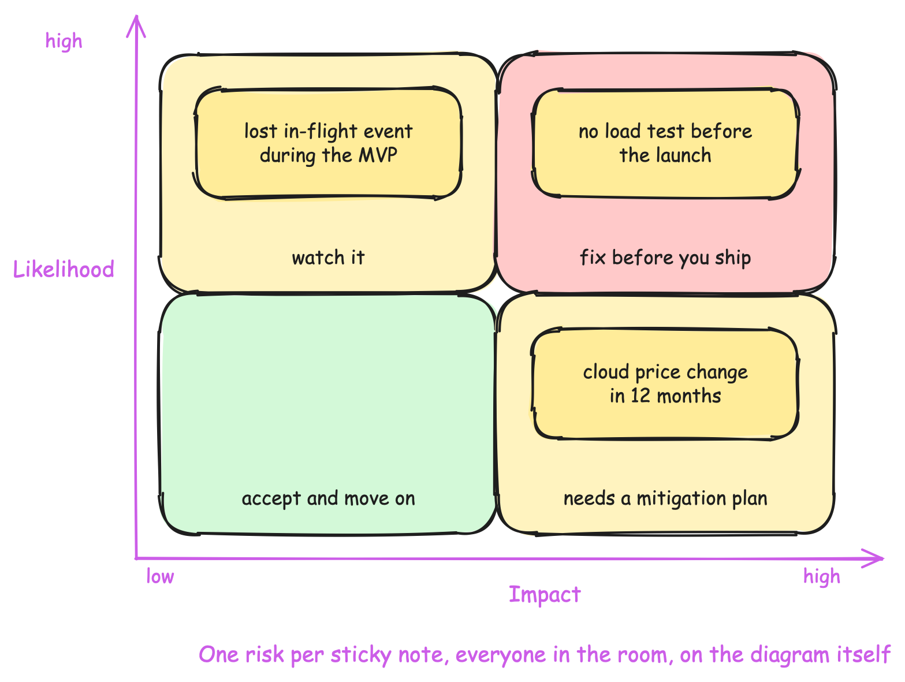
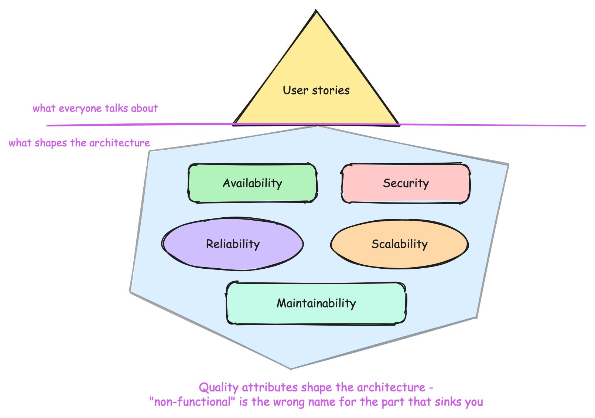

= Chapter 0: Software Architecture Fundamentals: Focus On Foundations
:toc:

++++

  <picture>
    <source srcset="../Assets/ea_banner_dark.png" media="(prefers-color-scheme: dark)">
    <source srcset="../Assets/ea_banner_light.png" media="(prefers-color-scheme: light)">
    
  </picture>

++++

== Why Start With Fundamentals?

This chapter builds the foundation of architectural thinking. Nothing here is tied to Fitnet, and everything here gets applied in practice from Chapter 1 onward, where the same ideas stop being definitions and turn into decisions on a real system under real constraints.

The gap it fills is not coding skill. You already know your language, your framework, and the awkward corners of your codebase. What is missing is a way of reasoning about questions that have no lookup answer (1 service or 3, shared database or a schema per module, is this pattern worth the complexity it adds) and the technical breadth to judge options built on technology you have never run in production. Nobody teaches either one on purpose, and those questions reach you long before anyone hands you the architect title.

So the purpose here is narrow: prepare you to understand the decisions the rest of this repository makes, not walk you through making them yet. Chapter 1 is where that thinking gets applied to a real system for the first time, and every chapter after it assumes you already reason this way.

Before Fitnet has a single line of code, before we even start thinking about Fitnet's own architecture, we need that mindset in place. The chapters ahead make architecture decisions constantly, and every one of those decisions leans on a way of thinking we have not built yet.

Take 2 minutes before you keep reading: how would you define software architecture, in your own words? Write it down. Most people struggle with this more than they expect, and that struggle is the point. Basic knowledge of software architecture has become the new "Hello World" of our industry. Everyone touches it eventually, few people are taught it deliberately.

Here is a definition worth anchoring on, from Grady Booch:

[quote, Grady Booch]
Architecture represents the significant design decisions that shape a system, where significant is measured by cost of change.

And a shorter, more honest one from Ralph Johnson:

[quote, Ralph Johnson]
Architecture is about the important stuff. Whatever that is.

Both are correct at the same time, and that is not a contradiction. What counts as "significant" or "important" depends entirely on your system, your team, and your constraints, which is exactly why we spend this chapter building the mindset to reason about it instead of handing you a checklist.

== Why Does Architecture Matter?

Nobody buys architecture. People buy features and the promise that the thing they depend on still works next quarter. Architecture decides whether you can keep that promise, and at what price.

Skip it and nothing collapses on day one. The system gets fragile first, then stops scaling, usually in the middle of the growth you were waiting for. By then the cost has left the codebase: the feature a competitor ships in 2 weeks takes you 6 months, and your outage becomes your customers' reputation.

That is what an architect is for: keeping the cost of change low, so when the business changes its mind the answer is "2 weeks" rather than "not without a rewrite".

== What Architecture Actually Is

If architecture is "the significant decisions", it helps to see what those decisions actually look like in practice. They rarely announce themselves as capital-A Architecture. They show up as ordinary-sounding questions, grouped into a handful of recurring categories:

- Structure: monolith or microservices? Layered or vertical slices?
- Infrastructure architecture: Kubernetes or Docker Swarm?
- Communication architecture: REST or gRPC? Synchronous or event-driven?
- Data architecture: one shared database or one schema per module?
- Deployment unit separation: 1 deployable, or many?
- Testing: what do we verify, and at which boundary?

NOTE: None of these questions has a universally correct answer. Every project has a different context (team size, deadline, budget, regulatory constraints, the problem itself) and context is king. The right answer for one system can be the wrong answer for another one that looks nearly identical on paper.

Not every one of these questions is architectural, and telling the two apart matters more than memorizing the list. Run each candidate decision through Booch's own test: what would it cost to change your mind later? Upgrading a library to its next major version, or preferring a switch expression over a switch statement, is a pull request. It is reversible in an afternoon, maybe a little annoying, not architectural. Changing your database engine 18 months into production is a different animal. The migration itself can take weeks, every query and every team that touches that data is affected, and reversing the decision once it ships costs almost as much as making it did in the first place. The first decision is cheap to reverse, so it is just a choice. The second is expensive to reverse, so it is architecture.

IMPORTANT: The cost-of-change test cuts both ways. A decision that looks trivial today can quietly become architectural later, once enough code depends on it, which is exactly why "we'll clean this up later" is a promise that gets more expensive to keep every day you don't keep it.

=== Design vs Architecture

"Design" and "architecture" get used interchangeably, and that habit is exactly what makes it hard to tell which decisions deserve an architect's attention and which don't. Design happens inside a boundary someone already drew: which data structure to use, what to name a method, whether this class needs an interface. Its blast radius is the file or module you made the decision in. Architecture is drawing the boundary itself: which module owns this data, where "our system" ends and the outside world begins. Its blast radius is the whole system.

Two pairs make it concrete. Choosing a caching library for 1 slow endpoint is design, while deciding that caching lives at the API gateway for every service is architecture. Adding retry logic inside 1 HTTP client is design, while deciding whether failed cross-service calls are retried at all, or handed to a queue so a downstream outage doesn't cascade upstream, is architecture.

Notice that the architectural ones are not harder to *decide*. "One schema per module" takes 5 seconds to say. They are harder to *undo*, and that is the only difference that matters.

Neither skill outranks the other. Good architecture built on sloppy design still produces a system nobody wants to maintain, and beautiful code inside the wrong boundary is still in the wrong boundary.

=== Coupling And Cohesion

Two words explain why boundaries are expensive to move, and you will meet both in every chapter ahead.

**Coupling** is how much one part of the system has to know about another. Picture 2 people sharing an office. If one of them has to ask the other a question before finishing any task, neither can work alone, and a day off for one is a blocked day for the other. That is high coupling. If one only leaves a note on the table and the other picks it up whenever they are ready, both keep working. That is low coupling.

In code it looks the same. A placed order has to produce an invoice. When `Orders` calls a method on `Invoicing` to create it, the caller has to know 3 things: that the module exists, what its method looks like, and that it is running right now. Change any of the 3 and both sides change together. When `Orders` only publishes an `OrderPlaced` event instead, and `Invoicing` reacts to it, each side knows 1 thing, the shape of the message, and either module can be rewritten, restarted or moved without asking the other for permission.

**Cohesion** is how well the things inside one boundary belong together. Picture a drawer. A drawer holding everything you need to issue a pass is a good drawer, because opening it once is enough. A drawer labelled `Helpers`, holding whatever had no other home, is where things go to get lost, and every new item makes it worse.

The same 2 words work 1 level up, and that is where they get expensive. Two services that share 1 database are coupled even though neither ever calls the other: rename a column for one and the other breaks, and neither team can deploy on its own. Two services that each own their data and exchange messages are not. Cohesion at that level asks whether 1 service owns a whole business capability from start to finish, or only half of it, with the other half living somewhere else so that every change needs 2 deployments in the right order.

Every boundary you draw is a bet on both of them at once. Put the things that change together on the same side of the line, then cut the line where the fewest messages have to cross it. Draw it well and a new feature stays inside 1 module and 1 team can ship it. Draw it badly and every feature touches 4 modules and 3 teams, and nobody can start before a meeting.

NOTE: Low coupling is not free either. Replacing a direct method call with an event removes the compile-time dependency, and pays for it with an async flow that is harder to debug, harder to test, and eventually consistent instead of immediate. Every chapter ahead pays some version of that bill.

== When Those Decisions Get Made

Knowing which decisions are expensive raises a harder question: when do you make them? Move too early and you pay for complexity you cannot yet justify. Wait too long and the structure hardens around a choice nobody made on purpose.

Teams get that timing wrong in 2 directions, and this repository has a name for each of them.

The first is the _Overcomplicated trap_: reaching for advanced patterns before you have the need, because they feel like insurance against a future you cannot yet describe. The symptom is a 2-person team running 6 services, spending more hours on pipelines and infrastructure than on features, unable to name which business problem any of that complexity solved.

The second is the _Oversimplified pitfall_: staying simple long after the system outgrew it. The symptom is the mirror image. Every new feature touches the same 3 files, nobody can change one part without breaking another, and the team explains this as "our code is just old" instead of "we never drew a boundary".

Neither trap is a knowledge problem. Both are timing problems, and everything that follows in this chapter is an instrument for telling you when to move.

== The Architect Role

"Architect" is not one job. Picture two axes: how close the role sits to business strategy, and how close it sits to technology. An Enterprise Architect sits high on the business axis. A Cloud Architect or Data Architect sits high on the technology axis. A Solution Architect sits closer to the middle, translating between the two.

That translation work has a name. Gregor Hohpe calls it the _Architect Elevator_. Picture a building where business strategy lives on the top floor and engineering lives in the basement. Most people spend their career on one floor. The architect's job is to ride the elevator between them, carrying context in both directions: explaining technical constraints to the business floor, and business intent to the engineering floor.

IMPORTANT: If you only ride the elevator in one direction, you are not doing the job. An architect who only reports technical status upward, without carrying business context back down to the team, has stopped being an elevator and become a wall.

In a typical setup, a single Solution Architect supports several delivery teams at once, each with its own team lead, backend, frontend, QA, and DevOps engineers. The architect is not part of any one team full time. They are the constant, moving between them.

=== Common Architect Mistakes

There is a second spectrum, and it matters just as much as the business-versus-technology one above: how close does the architect stay to the actual code? Both ends of it are a mistake, and the second one is harder to spot because it looks like a virtue.

==== Ivory Architect

Picture an architect who works entirely from diagrams. The boxes are clean, the arrows are labeled, the decision is handed down as a mandate, and the codebase never gets opened to see whether any of it survives contact with reality.

The mandate is not wrong on paper. It is wrong because it ignores a constraint only visible from inside the code: a third-party API that fails 1 request in 200, a migration that takes longer than a sprint, a library that does not do what its documentation claims. The team hits that constraint in the first week, works around it quietly, and stops bringing the next problem to the architect at all. The diagrams still look authoritative. Nobody builds from them anymore.

This is the **Ivory Tower Architect**, the best known architect anti-pattern, and the reason it survives is that from the top of the tower everything looks fine. No one reports that they stopped listening.

==== Hands-On Architect

So the answer seems obvious: stay in the code. The **Hands-On Architect** writes code, reviews pull requests, and pairs with the team often enough that every decision gets tested against the same reality the engineers live in. Credibility goes up, decisions get better, and the team stops working around you because you already know what they are working around.

That is genuinely better, and it is where the trap is. Every hour spent writing code is an hour not spent riding the elevator, and nobody on the team will complain about it. They got an extra pair of hands and a faster reviewer. The business floor is the one that notices, months later, when a technical constraint that should have been raised in a strategy meeting shows up as a missed deadline instead.

An architect who never leaves the codebase and the architect who never enters it are the same failure from opposite ends. One lost contact with the code, the other lost contact with the business, and the second one is harder to catch, because the team keeps shipping while nobody checks that the system still serves what the business is paying for. Only one of those two failures gets thanked for it while it happens.

==== Where You Should Sit

Somewhere in the middle, and not the same place every month. An architect deep in a critical migration might code daily for weeks. An architect coordinating 4 teams through a quarter-end deadline might code far less, and lean harder on code review and pairing instead.

IMPORTANT: What ruins credibility is not spending less time in the code. It is spending none, for long enough that you stop knowing what you are actually asking the team to build. Being the top committer is not the goal either. Hands-on means you would notice if the diagram stopped matching the system, not that you personally wrote it.

Both ends of this spectrum are catalogued, along with several more architect anti-patterns worth reading about, in Mark Richards and Neal Ford's _Fundamentals of Software Architecture_. The same book gives us the first 2 of the laws we turn to next.

== Fundamental Laws of Architecture

Four laws keep coming back in every decision we make in the chapters ahead. We name them here so that later, when one of them is doing the work, you recognize it instead of reading it as an opinion. The first 2 are stated as laws of software architecture by Richards and Ford. The other 2 come from elsewhere, Conway's 1967 paper and the wider work on evolutionary architecture, and we group them here because in practice they carry the same weight.

=== Everything Is a Trade-off

Security versus performance. High availability versus consistency. Complexity versus cost. Every architectural choice buys you something by spending something else, and we have not yet met one that did not.

So when someone pitches a pattern with no downside, they are selling, not designing. Ask what it costs. If the answer is "nothing", the cost is real and simply has not been found yet.

Ignoring a trade-off does not make it disappear, it only decides when it surprises you. A team that picks strict consistency because it sounds safer, without ever asking whether the business needed 5 nines of availability, finds out the trade-off was real the first time a database failover takes the whole system down instead of degrading gracefully. Paying the cost was never optional. Paying it on purpose was.

NOTE: This is the first law for a reason. The other 3 below each end up negotiating against it.

=== Why Is More Important Than How

Two teams can build the identical modular monolith, and only one of them can say what forced it. That difference decides what happens 18 months later.

The team that knows *why* recognizes the day the reason stops being true, and changes the structure on purpose. The team that only knows *how* keeps the structure long after it stopped paying for itself, because nobody left remembers what it was for. The cost stays and the benefit quietly leaves.

This is the law aspiring architects skip, and it is why the Recording Decisions section further down exists at all. An Architecture Decision Record is this law with a file name.

=== Conway's Law

The architecture of a system is a reflection of the organization that builds it. Consider an ecommerce platform built by 4 teams: a Frontend team owns the FE layer, a Backend team owns the API, a Data Admin team owns the data layer, and a Product team owns business logic. You did not design that architecture on a whiteboard. Your org chart designed it for you. If you want a different architecture, changing the diagram without changing the team boundaries rarely works.

The practical flip side of this law has its own name: the **Inverse Conway Maneuver**. If Conway's Law means your org chart shapes your architecture whether you plan it or not, then reorganizing your teams around the boundaries you actually want is a legitimate architectural tool, not an HR decision that happens to have side effects. Want 4 independently deployable services instead of 1 tangled layer cake? Splitting the team along those same 4 boundaries first will get you there faster than any diagram.

=== Architecture Exists to Enable Change

The goal of an architecture is never perfection. Systems evolve, requirements shift, businesses pivot, and the architecture that survives is the one that absorbs those changes cheaply, not the one that tried to predict them all up front and froze.

==== Fitness Functions

"Absorbs change cheaply" is a feeling until something fails the build over it. So write the rule down as a test: pick the characteristic you decided to protect, then write the check that breaks the moment the system drifts away from it. That check has a name, a **fitness function**, and it turns an architectural intention into something a pipeline can enforce at 3am without you in the room.

The shape is always the same:

- Modules must stay independent, so a test asserts that `Fitnet.Passes` holds no compile-time reference to `Fitnet.Contracts`
- The API must stay fast, so a load test fails the pipeline when the 95th percentile crosses 300ms
- Layers must not be bypassed, so an architecture test fails when a handler talks straight to the database context

Without one, every architectural rule degrades into a code review someone eventually forgets to do, and the boundary erodes 1 "just this once" at a time. The term comes from https://www.thoughtworks.com/insights/books/building-evolutionary-architectures[Building Evolutionary Architectures] by Neal Ford, Rebecca Parsons and Patrick Kua, which is worth reading in full.

IMPORTANT: A fitness function only protects a characteristic you can name and measure, which puts it downstream of the Quality Attributes section further down. If you cannot state the metric, you cannot write the test, and the rule stays a good intention. It also means fitness functions earn their place once a boundary starts to matter, not on the first day of a project when there is barely a boundary to protect.

== Cost Awareness

Cost is a requirement, exactly like availability or scalability. Every initiative you propose, from adopting a message broker to extracting a microservice, arrives with a number attached, and the only question is whether you calculate that number before you commit or read it later on an invoice.

Calculating it once is not enough either. Costs drift as traffic grows, as cloud pricing changes, as a "temporary" workaround quietly becomes permanent. We learned that the ordinary way: a reporting workload moved onto a managed service because it saved us roughly 2 weeks of build time, and the first invoice looked fine. The fourth one, after traffic tripled, did not, and moving back cost more than the 2 weeks we had saved. Nothing about that decision was wrong on the day we made it. We simply stopped watching the number afterwards.

So keep watching it after the decision ships, not only before it. In a real business every stakeholder in the room asks about cost, and "what does this cost us this month, compared to last month" will matter to them far more than whether your data model has 1 table or 2.

Watching the cost is not the same as being cheap. Spend money on genuine complexity the moment the numbers justify it. What you never do is spend it on complexity nobody asked for, because "it might be useful later" is not a cost estimate, it is a guess wearing a budget. This discipline has a name and a set of laws worth reading in full: https://thefrugalarchitect.com[The Frugal Architect], written by Werner Vogels, Amazon's CTO.

IMPORTANT: Before you propose an architectural change, you should be able to answer 3 questions: what does this cost to build, what does it cost to run every month afterward, and what does it cost if you are wrong and have to reverse it? If you cannot answer at least the first 2, you are not ready to propose the decision yet, only the idea.

== Managing Risk

Every architectural decision carries risk alongside its cost: what is the probability this decision goes wrong, and how bad is it if it does? A decision with low cost but high risk, like skipping load testing before a big product launch, deserves more scrutiny than a decision with real cost but low risk, like paying for a managed database instead of running your own.

You could capture this in a table or a bullet-point document on your own, 1 risk, 1 likelihood, 1 impact, one row at a time. That works for recording risks once you already know what they are. It does not work for finding them. The risks that sink a project are usually the ones nobody on their own thought to write down, because they sat outside that one person's expertise.

So stop writing that list alone. Put an architecture diagram on a wall (a Container or Component diagram works well) and give everyone in the room a pad of sticky notes. One risk per note, stuck on the part of the system it threatens. The security engineer finds something the backend developer would never have thought to write down, and the backend developer returns the favour. That is the whole reason it works.

Then score each note on 2 axes: how likely it is, and how bad the impact would be. Plot them on a simple grid and the risks worth your attention this quarter gather in one corner, high likelihood and high impact, while everything else can wait until it moves. Color the diagram itself as you go: green where the risk is low, yellow where it needs a mitigation plan, red where it needs one before you ship. A glance at a red cluster on a Container diagram says more than a page of prose.

This technique is called **Risk Storming**. Simon Brown created it, and https://riskstorming.com[riskstorming.com] describes the full workshop if you want to run one properly.

IMPORTANT: Not every risk needs to be eliminated. A risk you have identified, scored, and consciously decided to accept, documented rather than ignored, is a legitimate outcome. The failure mode is not accepting risk, it is not knowing it was there.

== Recording Decisions

Cost, risk, and trade-offs are only useful if the reasoning behind them survives past the meeting where you worked them out. Six months later, someone will ask "why did we choose this?" and "I don't remember, it felt right at the time" is not an answer anyone can build on. An **Architecture Decision Record** (ADR) exists to prevent that.

The code shows the current snapshot of the system. An ADR carries the context behind it, the *why* the second law asks for, in a file that lives next to the code and gets reviewed with it.

A useful one stays short. Give it a number, a date, the problem you faced, the decision you made, and the consequences you accepted:

[source,asciidoc]
----
= 12. Use a message broker between order processing and invoicing

Date: 2024-03-08

== Problem

Invoicing is called synchronously during checkout. Its outages take
checkout down with it, and its slowest calls add 400ms to a request
that has a 300ms budget.

== Decision

We publish an OrderPlaced event to a broker and let invoicing consume
it at its own pace.

== Consequences

- Checkout no longer fails when invoicing is down
- Invoices become eventually consistent, so support can no longer promise
  a customer their invoice exists the moment they pay
- We now run and pay for a broker, and we need a plan for poison messages
----

The consequences section is where an ADR earns its cost. Anyone can write down what was decided. Writing down what you gave up is what stops the next person from reopening the argument, and tells them what to check when the trade-off stops being worth it.

NOTE: Every chapter in this repository keeps its own Architecture Decision Log under `Docs/ArchitectureDecisionLog`. Browse any chapter's folder to see real ADRs written this way. Reading the same log across 2 chapters in a row is the fastest way to see a decision get revisited once its consequences arrived.

== Visualizing Architecture: The C4 Model

Diagrams go stale fast unless they follow a convention everyone agrees on. The C4 model, created by Simon Brown, gives you 4 levels of zoom instead of 1 overloaded diagram that tries to show everything at once:

- **Context**: the system in its environment, who uses it, what other systems it talks to
- **Container**: the applications and data stores inside that system boundary
- **Component**: the groups of functionality inside a single container, each behind an interface
- **Code**: usually auto-generated from the codebase itself, and outside the scope of this chapter

You build these top-down and reuse work as you go. Draw the Context diagram first, then expand it into a Container diagram (the same actors and external systems reappear, just with the system boundary opened up), then draw 1 Component diagram per container that actually needs one.

Each level exists because a different audience needs it, and handing someone the wrong level wastes both your time and theirs:

- **Context** is what you show a stakeholder who has never opened the codebase and never will. It answers "what does this system do, and what does it talk to?" in a single glance.
- **Container** is what you hand a new engineer on day 1, or anyone deciding where a change belongs. It answers "what are the separately runnable pieces, and how do they call each other?"
- **Component** is for the team that owns a specific container and needs to reason about its internals without dragging in the rest of the system.
- **Code** is generated, not drawn by hand, and mostly useful to tooling rather than to a person in a meeting.

Show a stakeholder a Component diagram and you will lose them in the first 10 seconds. Show an engineer only the Context diagram and they will nod politely and still not know which repository to open.

Simon Brown's own example is an internet banking system, and the 3 levels nest like this:

....
Context      Personal Banking Customer
                      |
                      v
             Internet Banking System ==> Mainframe Banking System
                                     ==> E-mail System
                      |
                      v
Container    Web Application
             Single Page Application
             Mobile App
             API Application  <== open this one
             Database
                      |
                      v
Component    Sign-In Controller
             Reset Password Controller
             Accounts Summary Controller
             Security Component
             E-mail Component
             Mainframe Banking System Facade
....

Read it downward and you are zooming in. The same E-mail System that was 1 box on the far right at Context becomes an E-mail Component you own at the bottom. Nothing new appears out of nowhere, because each level only opens a box the level above already drew.

NOTE: You will run into this style of diagram elsewhere in this repository, even though nobody calls it C4 by name there. The interactive diagrams linked from the root README (built with IcePanel) are Context and Container level views of Fitnet itself. When you reach one, come back to these 4 levels and you will recognize what you are looking at.

IMPORTANT: The C4 model, and the banking example sketched above, were created by Simon Brown and are available at https://c4model.com[c4model.com] under a CC BY 4.0 license. This chapter borrows the concept and the terminology, and redraws the example in plain text rather than reusing the original artwork.

== Gathering Requirements

Everything above tells you how to reason about a decision. This section is about where the input comes from, and it arrives in 2 shapes: what the system has to do, and how well it has to do it. Miss the first and you draw boundaries around a business process you never understood. Miss the second and you find out in production.

=== Understanding Functional Requirements

Functional requirements are what the system is supposed to do, and understanding them is as much an architect's skill as any diagram. You cannot put a sensible boundary around a business process you cannot describe out loud.

Two techniques help here, and neither requires you to become a business analyst first:

- **Event Storming**: a collaborative workshop where the team fills a wall with sticky notes, 1 per domain event ("Contract Signed", "Pass Expired"), then works backward to the commands and actors that trigger them. It surfaces the real business process, in the language the business already uses, faster than any requirements document.
- **Domain Storytelling**: a lighter, more visual alternative. Actors, activities, and work objects strung together as a literal story ("the Customer signs the Contract, which creates a Pass"), read left to right like a comic strip instead of parsed like a workshop output.

You will see these 2 techniques named again in this repository's root README, used to identify Fitnet's own subdomains. That is not a coincidence. The skill that helps you draw a module boundary in Chapter 1 is the same one you are building right now.

=== Quality Attributes

The other shape is easier to miss, because nobody volunteers it. It is tempting to justify an architecture decision by pointing at 3 visible user stories it enables, and that is exactly how you miss the point. Picture an iceberg: the user stories are the small tip above the waterline. Underneath, invisible until something breaks, sits the part that decides whether the system survives contact with production: availability, security, reliability, scalability, and maintainability.

Those underwater concerns are not decoration added to a design that already exists. They are what shapes it. A 300ms budget at the 95th percentile rules out a chatty conversation between 2 modules. An availability target the business will not negotiate rules out 1 database that every module shares. A maintainability target is the reason a boundary exists at all, because nothing else forces you to draw one. Functional requirements tell you what to build. Quality attributes decide what the thing you build has to look like, which is why they belong to the architect and why the rest of this chapter keeps returning to them.

These underwater concerns have a name, and it is worth being deliberate about which name you use. You will often hear them called "non-functional requirements". Retire that term. Calling something "non-functional" tells a client or stakeholder, in the name itself, that it is not a function, not valuable, not something they are paying for, when availability, security, and scalability are frequently the requirements that make or break the system in production. "Quality attributes" describes the same thing without insulting it on the way in.

Ownership follows the same split as the naming. Functional requirements, what the system does, are typically owned by a product owner or business stakeholder. Quality attributes, how well it does it and under what conditions and at what scale, are typically owned by the architect. Nobody else in the room is positioned to negotiate the trade-offs between them, which is exactly why the first law keeps showing up in this conversation.

The useful way to write a quality attribute down is not "the system should be fast", which nobody can verify, but as a scenario with 3 parts:

- **Aspect**: which quality attribute (performance, scalability, maintainability, availability, testability, usability, extensibility)
- **Scenario**: the concrete situation it applies to, for example "500 concurrent users submit a contract signature request"
- **Metric**: the number that tells you whether you met it, for example "95th percentile response time under 300ms"

IMPORTANT: A quality attribute without a metric is an opinion, not a requirement. "The system should be scalable" commits you to nothing and cannot be tested. "The system should handle 625,000 daily requests with a 25% safety margin", the exact number Chapter 1 uses for Fitnet's own capacity planning, is something you can design for and verify.

=== How To Gather Them

The metric rarely exists in anyone's head until you ask for it in the right shape. Ask a stakeholder "what performance do you need?" and you will get silence, or a reflexive "as fast as possible", which is not a number, it is a feeling, and you cannot design against a feeling.

Ask a bounded question instead, and the same stakeholder will suddenly have an opinion:

[cols="1,2,3", options="header"]
|===
|Quality Attribute |Instead of asking |Ask this

|Performance
|"How fast should it be?"
|"Is a 1 second response acceptable, or does this need to feel instant, under 200 milliseconds?"

|Scalability
|"How many users do you expect?"
|"If we doubled our user base tomorrow, what is the first thing that would break? What is the busiest hour of your busiest day?"

|Availability
|"How available should this be?"
|"If this goes down for 5 minutes at 2am, does anyone notice? What about 5 minutes at 2pm on a Monday during checkout?"

|Security
|"Does this need to be secure?"
|"What is the worst thing that happens if this data leaks: a fine, a headline, or a shrug? Who is allowed to see it, and who explicitly is not?"

|Maintainability
|"Should this be easy to maintain?"
|"A new engineer joins in 3 months. What should they be able to change safely on day 1, and what should scare them into asking first?"
|===

Each right-hand question forces a concrete boundary out of someone who could not have produced one from the vague version on the left. "As fast as possible", "highly available" and "should be secure" are not requirements. They are the absence of a decision, dressed up to sound like one.

NOTE: The people who can answer these questions are rarely only the architects in the room. Support and on-call engineers know which outages actually paged someone at 2am. Finance knows what an extra nine of availability actually costs to run. Whoever answers "is 1 second acceptable?" is telling you where the real requirement lives, so go find that person before you guess on their behalf.

Once you have a handful of scenarios, you will not be able to hit every metric at once. A stricter availability target usually costs consistency, and instant response times usually cost money. That is the first law again. Gathering quality attributes is not a checklist exercise. It ends in a negotiation about which few of them your system genuinely cannot afford to get wrong, and which ones you are consciously choosing to leave "good enough".

== Before You Move On

Reading this chapter changes nothing on its own. Take 20 minutes on a system you already work on and produce 3 things:

- **One quality attribute scenario**, written with all 3 parts: aspect, scenario, metric. If you cannot fill in the metric, you found the person you need to go ask.
- **One decision from the last year, written as an ADR.** Problem, decision, consequences. The consequences section is the one that will be hard, and that difficulty is the point.
- **One question your team is arguing about right now**, labelled design or architecture, with the cost of reversing it written next to it. Answer that cost honestly and the argument usually resolves itself.

If the metric is missing, if the consequences are blank, or if the reversal cost turns out to be an afternoon, you have learned something about that system that no diagram would have told you.

== Summary And What's Next

None of what you just read is Fitnet-specific. It is the mindset we lean on for the rest of this repository without re-explaining it: what actually counts as an architectural decision, why the reasoning matters more than the structure it produced, the habit of zooming through Context, Container, and Component instead of drawing 1 diagram that tries to do everything, and the discipline of naming a trade-off, a cost, or a risk instead of pretending it isn't there.

One thing this chapter deliberately does not do is compare architectural styles. We will not argue monolith against microservices in the abstract, because the next 3 chapters do it with running code, real numbers, and the consequences visible in the same repository.

[quote]
Always choose architecture based on *your current needs and context*. Not a wishful thinking.

Now it is time to put this mindset to work on a real system. In Chapter 1, we start Fitnet from the simplest architecture that could possibly work, and see what that choice costs and buys once real requirements land on it.

More information:

- link:/Chapter-1-initial-architecture/README.adoc[Chapter 1's readme]
- link:/README.adoc[Root readme]
