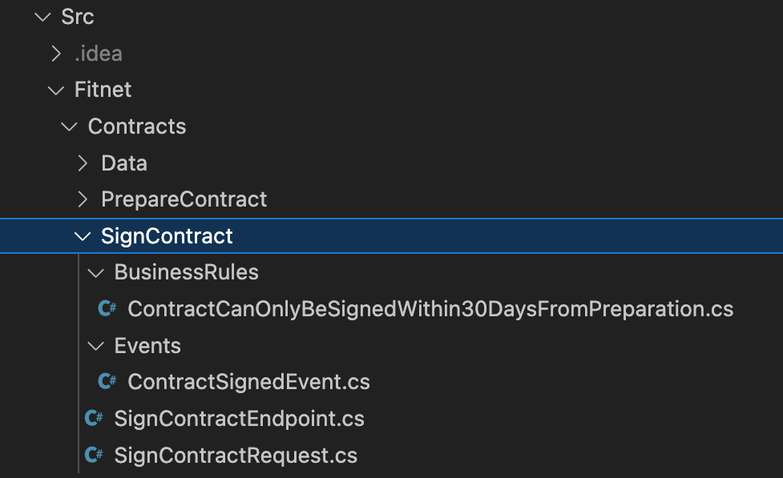
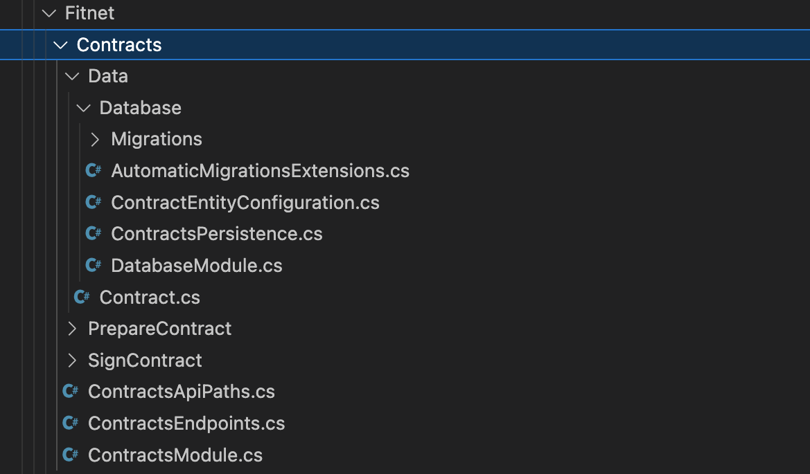

= Chapter 1: Initial Architecture - Focus On Simplicity
:toc:

== Case

=== Overview

When starting a new greenfield application, our focus often shifts to frameworks, libraries, architecture and components that we have heard about from our friends, at conferences, workshops and meetups. As a result, we start to create an overly complicated infrastructure and solution architecture, using components that are not relevant in the beginning.

This is how we fall into the trap associated with the project paradox - we make a lot of decisions at a time when we have almost no prior knowledge about our business domain. As a result, our decisions are usually inaccurate or, if we are lucky, they fit our future needs (a rare case). This means that at some point we will have to change the way we have been thinking, or it will simply be too late and too complex.

In the end, we may have:

- a big ball of mud OR
- big ball of distributed mud

Instead, we should shift our focus and efforts to understanding business processes and preparing the simplest possible solution.

At this point, in the vast majority of cases, you do not need to focus on:

- clean/onion/hexagonal architecture
- microservices
- cache
- tactical Domain-Driven Design
- data streams
- orchestrators

Thanks to this approach:

- we make most decisions only when we need them
- each member of the team has a low entry threshold for the application
- we add components one at a time, so we can build up the knowledge before adding the next components
- we minimise the risk of ending up with spaghetti (however it is still possible!)

This is what _Evolutionary Architecture_ is all about.

[quote]
Always choose architecture based on *your current needs*. *Not a wishful thinking*.

=== Requirements

Fitness Studio ordered a completely new system that we had to implement from scratch. There are 5 main requirements for the MVP that we need to address:

1. A way to create offers for new and existing customers.
2. When the offer is accepted by a customer, it is possible to prepare the contract.
3. The customer can sign the contract.
4. After signing the contract, a new pass is registered for the customer.
5. When the pass expires, a new offer is sent to the customer.

Based on the outcome - success or failure of the application, the requirements will be extended or the system will be dropped (yes, we need to consider both scenarios).

=== Main assumptions

It is important to remember that most systems we want to build are based on many assumptions, since we do not know how the market will react to our idea (even if, based on surveys, polls, potential customer feedback, everything points to success). Just look at the Project Paradox in the root README.

After discussions with our company, we have several assumptions:

1. Since we want to go global and there are a lot of gyms that claim they want to use our software, we assume that our application will be used by 500 - 5000 people in the beginning.
2. Each gym has different opening hours (some are open 12 hours, some 16 hours and some 24/7).
3. We only work in Europe, so the time differences are not big.
4. Each person creates about 100 requests per day, which gives 5000 people * 1000 req/day = 500 000 req/day for all people. We add 25% of the traffic (to be on the safe side), so it will be 500,000 + 125,000 = 625,000 req/day = 7 req/second. Now we know that we do not need a fancy infrastructure to start with for such a load.

NOTE: We will not cover the topic of infrastructure in this repository. The assumptions are marked here to show you that you should also consider the infrastructure, not just the solution structure. The initial calculation (such as 7 req/sec) is simply to take into account your potential traffic - which may be different during the day and at night - and to design the infrastructure architecture with this in mind. Often this is not thought through and we end up with super complicated infrastructure blocks.

IMPORTANT: Before going live with the application, it is advisable to run performance tests to see where our real limits are. You can do this for example with https://k6.io/[k6].

=== Solution

==== Overview

Before we dive into the technical solution, let's have a look at what we want to build for the MVP of the software that operates in the _Fitness Studio_ domain:

image::../Assets/subdomains_communication.jpg[]

During the business analysis we divided our business domain into the above subdomains and identified the most important processes. We also agreed that it made sense to translate our subdomains directly into bounded contexts. So in our case 1 subdomain equals 1 bounded context.

NOTE: There is a chance that in your project you will discover that it makes sense to combine 2 or more subdomains into 1 bounded context at the beginning. This is perfectly fine - in most cases, at some point, you will have the majority of bounded contexts containing multiple subdomains. There is also a chance that 1 subdomain will evolve into several different ones. This is the most likely case for our initial partitioning, as we are focusing on really common (with the potential to become very large) subdomains. Be flexible and accept that the business will certainly change.

Look at the example below, which shows a bounded context that spans multiple subdomains (we will not cover this scenario in this repo):

image::Assets/multiple_subdomains_single_bounded_context.jpg[]

There are 3 subdomains that are grouped into a single bounded context - _Personalised Training_ - because it makes sense. What does "it makes sense" mean? Based on different heuristics and ubiquitous language, we see that these subdomains will communicate very often with each other, the naming convention is the same (e.g. training in _Progress Tracking_ means the same as in _Virtual Coaching_ and _Assessments_).

Ok. So, now we are ready to translate the above bounded contexts into our solution architecture.

==== Solution structure

After creation of our solution, we decided to split the code *into 3 projects*. 

*Yes! It is only be 3 projects* and you can easily follow this path within your greenfield application:

image::Assets/projects_division.jpg[]

The first project called _Fitnet_ contains entire production code that is responsible for:

1. API to our application.
2. Business logic for our processes.
3. Data access.

However, it is not a classic division between some API, Service and Data access layers. What we focus on is to divide and structure our code on:

- Module that is represented by a namespace - we create separate module for each bounded context
- Data is divided into schemas, where each module has its own schema
- Business processes are closed in vertical slices, so all the code needed for e.g. contract signing is closed in a _SignContract_ folder.

This is how it looks like inside solution:

As you can see, there are some business rules, events, endpoint and the request object that is used inside the endpoint. Everything grouped together.

There is some code that is reused for each vertical slice (like _PrepareContract_ and _SignedContract_): 

 
as you can see on the above image:

- there is an entity _Contract_ inside folder _Data_ because it is reused by both business processes
- there are database migrations and operations for _Contracts_ module
- there are module registrations for endpoints, database usage and API paths

NOTE: Each module is done in a similar way - own namespace, vertical slices for processes and its own database schema. This way we are able to easily extract module to another project (or set of projects) or microservice. Thanks to vertical slices, the entry threshold for each team member is low because of no need to search in technical folders for events, handlers, queries, controllers, entities and so on. Every piece related to a concrete business process is closed in its own folder.

== How to run?

=== Requirements

- .NET SDK
- PostgresSQL
- Docker

=== How to get .NET SDK?

To run the Fitnet application, you will need to have the recent .NET SDK installed on your computer.
Click link:https://dotnet.microsoft.com/en-us/download[here] 
to download it from the official Microsoft website.

=== How to prepare Postgres?

The Fitnet application requires PostgresSQL as a component to work properly. You can either install it directly on your system or launch it using Docker Compose.

To run PostgresSQL using Docker Compose, navigate to the `root` chapter directory using the Terminal and run the command:
1. Build the Docker compose:

[source,shell]
----
 docker-compose up
----

This will start the PostgresSQL service. Once Postgres is up and running, you can proceed to run the Fitnet application.

=== Run the Fitnet Application

There are two options to run the Fitnet application:

==== Option 1: Launch the Fitnet application in an IDE

If you have an IDE installed, you can launch the Fitnet application directly from there by following these steps:

1. Open the project in your IDE.
2. Run the project.
3. The Fitnet application should start running.

[NOTE]
Fitnet supports .NET User Secrets to store local secrets like connection strings on developer machine. 
We encourage you to use this feature to securely store the connection string.
[end]

==== Option 2: Build and run the Fitnet application as a Docker container

If you prefer to run the Fitnet application as a Docker container, you can build and run it using the following steps:

- Build the Docker image:

[source,shell]
----
docker build -t fitnet .
----

- Run the Docker container:
[source,shell]
----
docker run -p 8080:80 --name fitnet-container fitnet
----

The "8080" is the port number on which the container will be exposed, and "myapp" is the name of the image that you built in the previous step. Once the container is up and running, you should be able to access the application by navigating to http://localhost:8080 in your web browser.

That's it! You should now be able to run the application using either one of the above. :thumbsup:

=== How to run Integration Tests?
To run the integration tests for the project located in the Fitnet.IntegrationTests project, you can use either the command:
[source,shell]
----
dotnet test
----
or the `IDE test Explorer`. 

These tests are written using `xUnit` and require `Docker` to be running as they use `test containers` package to run PostgresSQL in a Docker container during testing. 
Therefore, make sure to have `Docker` running before executing the integration tests.