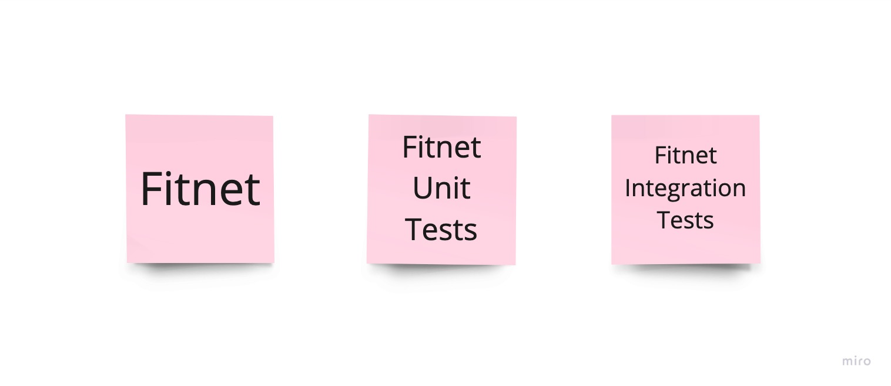

= Chapter 1: Initial Architecture - Focus On Simplicity
:toc:

++++

  <picture>
    <source srcset="../Assets/ea_banner_dark.png" media="(prefers-color-scheme: dark)">
    <source srcset="../Assets/ea_banner_light.png" media="(prefers-color-scheme: light)">
    
  </picture>

++++

image:https://github.com/evolutionary-architecture/evolutionary-architecture-by-example/actions/workflows/chapter-1-workflow.yml/badge.svg[Build Status]

image:https://codecov.io/gh/evolutionary-architecture/evolutionary-architecture-by-example/branch/main/graph/badge.svg[Codecov, link=https://codecov.io/gh/evolutionary-architecture/evolutionary-architecture-by-example]

== Case

=== Overview

When building a new application, we often get caught up in using the latest tech stack - jumping straight to advanced frameworks, complex architectures, and trendy tools. This creates unnecessary complexity from day one.

Here is the core problem: We make critical technical decisions at the exact moment (the beginning) when we understand the least about what we are building. Most of these early decisions turn out to be wrong, or at best, lucky guesses. By the time we realize our mistakes, the codebase is either too complex to change or it is too late.

This approach typically leads to one of two outcomes:

- A big ball of mud
- A big ball of distributed mud

The solution? Focus first on understanding the business requirements and build the simplest working solution possible.

At the start, we skip these complexities:

- Microservices
- Caching
- Aggregates
- Data streaming
- Heavy container orchestrators

Starting simple brings clear benefits:

- Decisions are made when you have enough knowledge to make them
- New developers can onboard quickly
- The team can master each component before adding more complexity
- The codebase stays maintainable and clean

This approach doesn't guarantee perfection, but it dramatically improves your chances of building something that is both useful and maintainable. And that is our way.

Let's get into the details!

[quote]
Always choose architecture based on *your current needs and context*. Not a wishful thinking.

=== Requirements

A fitness studio we work with needed a simple membership management system. Here is what they asked for in their MVP:

- Create offers for customers (both new and existing)
- Prepare contracts when customers accept offers
- Enable contract signing by customers
- Automatically create customer passes after contract signing
- Send renewal offers when passes expire

They were clear about their approach: if the system proves valuable, they will invest in more features, and help us to get more customers. If not, they will cut their losses and try something else. This practical mindset helped us focus on delivering the core functionality first.

=== Main assumptions

It is important to remember that most systems we want to build are based on many assumptions, since we do not know how the market will react to our idea (even if, based on surveys, polls, potential customer feedback, everything points to success). Just look at the Project Paradox in the root README.

After discussions with our company, we have several assumptions:

1. Since we want to go global and there are a lot of gyms that claim they want to use our software, we assume that our application will be used by 500 - 5000 people in the beginning.
2. Each gym has different opening hours (some are open 12 hours, some 16 hours and some 24/7).
3. We only work in Europe, so the time differences are not big.
4. Each person creates about 100 requests per day, which gives 5000 people * 100 req/day = 500 000 req/day for all people. We add 25% of the traffic (to be on the safe side), so it will be 500,000 + 125,000 = 625,000 req/day = 7 req/second. Now we know that we do not need a fancy infrastructure to start with for such a load.

NOTE: We will not cover the topic of infrastructure in this repository. The assumptions are marked here to show you that you should also consider the infrastructure, not just the solution structure. The initial calculation (such as 7 req/sec) is simply to take into account your potential traffic - which may be different during the day and at night - and to design the infrastructure architecture with this in mind. Often this is not thought through and we end up with super complicated infrastructure blocks.

IMPORTANT: Before going live with the application, it is advisable to run performance tests to see where our real limits are. You can do this for example with https://k6.io/[k6].

=== Solution

==== Overview

Before we dive into the technical solution, let's have a look at what we want to build for the MVP of the software that operates in the _Fitness Studio_ domain:

image::../Assets/subdomains_communication.jpg[]

During the business analysis we divided our business domain into the above subdomains and identified the most important processes. We also agreed that it made sense to translate our subdomains directly into bounded contexts. So in our case 1 subdomain equals 1 bounded context.

NOTE: There is a chance that in your project you will discover that it makes sense to combine 2 or more subdomains into 1 bounded context at the beginning. This is perfectly fine - in most cases, at some point, you will have the majority of bounded contexts containing multiple subdomains. There is also a chance that 1 subdomain will evolve into several different ones. This is the most likely case for our initial partitioning, as we are focusing on really common (with the potential to become very large) subdomains. Be flexible and accept that the business will certainly change.

Look at the example below, which shows a bounded context that spans multiple subdomains (we will not cover this scenario in this repo):

image::Assets/multiple_subdomains_single_bounded_context.jpg[]

There are 3 subdomains that are grouped into a single bounded context - _Personalised Training_ - because it makes sense. What does "it makes sense" mean? Based on different heuristics and ubiquitous language, we see that these subdomains will communicate very often with each other, the naming convention is the same (e.g. training in _Progress Tracking_ means the same as in _Virtual Coaching_ and _Assessments_).

Ok. So, now we are ready to translate the above bounded contexts into our solution architecture.

==== Solution structure

After creation of our solution, we decided to split the code *into 3 projects*. 

*Yes! It is only 3 projects* and you can easily follow this path within your greenfield application. No one said that the modules should be split into separate projects. It is a question of accepting a completely different approach, and dividing them into namespaces. It is hard to accept, but worth giving a chance:

The main advantage of this approach is that you do not have to decide at this stage whether you want to follow a clean, hexagonal, onion or layered architecture, and whether there is a need to apply things like Domain-Driven Design to a particular module or not. In this way, you postpone such decisions until you have enough knowledge to make them.

The first project called _Fitnet_ contains entire production code that is responsible for:

1. API to our application.
2. Business logic for our processes.
3. Data access.

However, it is not a classic division between some API, Service and Data access layers. What we focus on is to divide and structure our code on:

- Module that is represented by a namespace - we create separate module for each bounded context
- Data is divided into schemas, where each module has its own schema
- Business processes are closed in vertical slices, so all the code needed for e.g. contract signing is closed in a _SignContract_ folder.

You can check how does it look like https://github.com/evolutionary-architecture/evolutionary-architecture-by-example/tree/main/Chapter-1-initial-architecture/Src/Fitnet/Contracts/SignContract[here].

As you can see, there are some business rules, events, endpoint and the request object that is used inside the endpoint. Everything grouped together.

There is some https://github.com/evolutionary-architecture/evolutionary-architecture-by-example/tree/main/Chapter-1-initial-architecture/Src/Fitnet/Contracts[code] that is reused for each vertical slice (like _PrepareContract_ and _SignedContract_):

- there is an entity _Contract_ inside folder _Data_ because it is reused by both business processes
- there are database migrations and operations for _Contracts_ module
- there are module registrations for endpoints, database usage and API paths

Integration and unit tests for each module are located in the same project - _Fitnet.IntegrationTests_ and _Fitnet.UnitTests_ and are also divided into module namespaces.

NOTE: Each module is done in a similar way - own namespace, vertical slices for processes and its own database schema. This way we are able to easily extract module to another project (or set of projects) or microservice. Thanks to vertical slices, the entry threshold for each team member is low because of no need to search in technical folders for events, handlers, queries, controllers, entities and so on. Every piece related to a concrete business process is closed in its own folder.

==== Communication

The topic of communication is often discussed. It was no different in our case. In the end we decided to use our own in-memory event bus. This has several advantages and disadvantages:

1. By implementing an in-memory event bus, our components will be loosely coupled and better able to communicate and interact with each other. This will allow us to develop and deploy our system in a more scalable and flexible way.
2. One consequence of using it rather than an external message broker is that we cannot retire messages and persist them on the event bus for later retrieval. In an external message broker, messages can be persisted and stored for a period of time so that they can be replayed or reprocessed if necessary. In an in-memory event bus, messages are stored only in memory and are lost when the event bus is stopped or restarted.

Overall, we believe that the benefits of implementing in-memory communication in the early stages of our project outweigh the potential risks and challenges.

NOTE: As this may be a controversial topic for you, you should judge it on your own case. If you can accept some data inconsistency and the application is in its very early stages (e.g. the MVP), you may choose to use in-memory communication. If you prefer to start with a more relevant solution, you can implement an _Outbox_ pattern or integrate an external component like RabbitMQ from day one of your project. The choice is yours.

==== Tests

Here we are. The decision we have made is to have 2 sets of tests in the early stages of our application:

1. _Integration tests_ - here we test the whole business process with different input parameters. We may get a successful response or an exception will be thrown. In some cases we use snapshot testing using the https://github.com/VerifyTests/Verify[Verify] library. Integration tests for all modules and shared logic are located here.

2. _Unit Tests_ - What could be more standard than unit testing? Unit tests for all modules and shared logic can be found here.

In test projects you will find _GlobalUsings.cs_. You are not required to use it in your project, but it does make it easier to manage global usings (each class will contain less code).

NOTE: If you are implementing your own application, you may want to consider contract testing. This means you would have another project called _Fitnet.ContractTests_. There is also another approach you can take, where you can combine contract and integration tests together. This will give you something called _ModuleTests_. If you choose contract testing, we suggest https://docs.pact.io/[Pact]. If you go for module tests, we suggest using Verify (mentioned above) or https://github.com/approvals/ApprovalTests.Net[ApprovalTests], as this makes maintenance easier.

==== Miscellaneous

Within _Docs_ you will find the _Architecture Decision Log_. This log contains _Architecture Decision Records_. Each record is immutable and contains an explanation of why we chose one approach over another. If you need to override one of the previous decisions, you need to create a new record. This is one of the easiest ways to keep your architecture documentation up to date. You can read more about this at https://cognitect.com/blog/2011/11/15/documenting-architecture-decisions[here].

If you want to test the endpoints, you can find http files in the docs for each module. The only thing you need to configure is the application url in _http-client.env.json_.

== How to run?

=== Requirements

- .NET SDK
- Docker

=== How to get .NET SDK?

To run the Fitnet application, you will need to have the recent .NET SDK installed on your computer.

Click link:https://dotnet.microsoft.com/en-us/download[here] 

to download it from the official Microsoft website.

=== Run locally

The Fitnet application requires Docker to run properly.

There are only 3 steps you need to start the application:

1. Make sure that you are in `/Src` directory. 
2. Run `docker-compose build` to build the image of the application.
3. Run `docker-compose up` to start the application. In the meantime it will also start Postgres inside container.

The application runs on port `:8080`. Please navigate to http://localhost:8080 in your browser or http://localhost:8080/swagger/index.html to explore the API.

That's it! You should now be able to run the application using either one of the above. :thumbsup:

=== How to run Integration Tests?
To run the integration tests for the project located in the Fitnet.IntegrationTests project, you can use either the command:

`dotnet test`

or the `IDE test Explorer`. 

These tests are written using `xUnit` and require `Docker` to be running as they use `test containers` package to run PostgresSQL in a Docker container during testing. 
Therefore, make sure to have `Docker` running before executing the integration tests.
