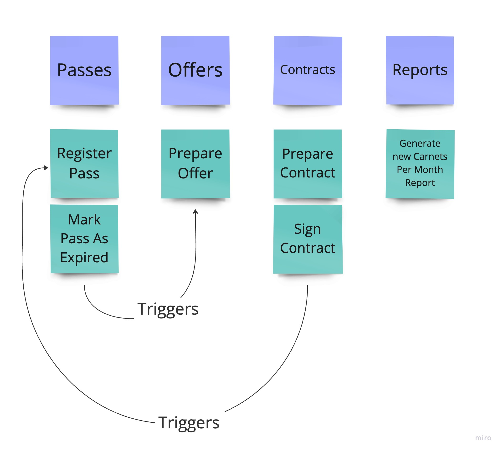
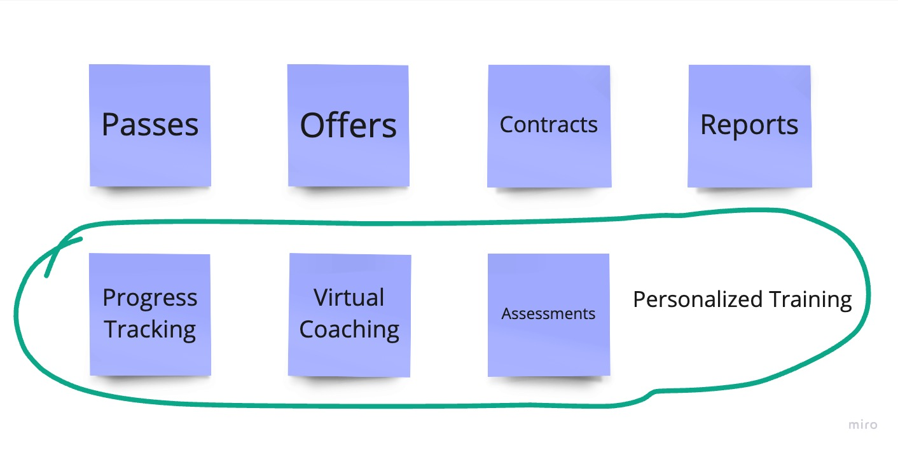
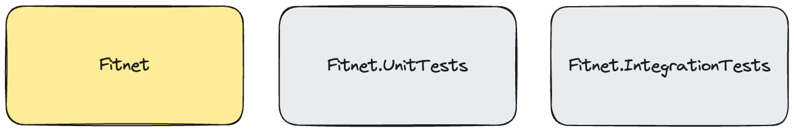

= Chapter 1: Initial Architecture - Focus On Simplicity
:toc:

++++

  <picture>
    <source srcset="../Assets/ea_banner_dark.png" media="(prefers-color-scheme: dark)">
    <source srcset="../Assets/ea_banner_light.png" media="(prefers-color-scheme: light)">
    
  </picture>

++++

image:https://github.com/evolutionary-architecture/evolutionary-architecture-by-example/actions/workflows/chapter-1-workflow.yml/badge.svg[Build Status]

image:https://codecov.io/gh/evolutionary-architecture/evolutionary-architecture-by-example/branch/main/graph/badge.svg[Codecov, link=https://codecov.io/gh/evolutionary-architecture/evolutionary-architecture-by-example]

== Case

=== Overview

When building a new application, we often get caught up in using the latest tech stack - jumping straight to advanced frameworks, complex architectures, and trendy tools. This creates unnecessary complexity from day one.

Here is the core problem: We make critical technical decisions at the exact moment (the beginning) when we understand the least about what we are building. Most of these early decisions turn out to be wrong, or at best, lucky guesses. By the time we realize our mistakes, the codebase is either too complex to change or it is too late.

This approach typically leads to one of two outcomes:

- A big ball of mud
- A big ball of distributed mud

The solution? Focus first on understanding the business requirements and build the simplest working solution possible.

At the start, we skip these complexities:

- Microservices
- Caching
- Aggregates
- Data streaming
- Heavy container orchestrators

Starting simple brings clear benefits:

- Decisions are made when you have enough knowledge to make them
- New developers can onboard quickly
- The team can master each component before adding more complexity
- The codebase stays maintainable and clean

This approach doesn't guarantee perfection, but it dramatically improves your chances of building something that is both useful and maintainable. And that is our way.

Let's get into the details!

[quote]
Always choose architecture based on *your current needs and context*. Not a wishful thinking.

=== Requirements

A fitness studio we work with needed a simple membership management system. Here is what they asked for in their MVP:

- Create offers for customers (both new and existing)
- Prepare contracts when customers accept offers
- Enable contract signing by customers
- Automatically create customer passes after contract signing
- Send renewal offers when passes expire

They were clear about their approach: if the system proves valuable, they will invest in more features, and help us to get more customers. If not, they will cut their losses and try something else. This practical mindset helped us focus on delivering the core functionality first.

=== Main assumptions

Even with market research, surveys, and customer feedback pointing to success, any new system is built on assumptions. We need to be realistic about what we don't know. We have the following key assumptions.

Initial scale and usage:

- Starting userbase: 500-5000 people
- European market only (minimal timezone complexity)
- Mix of operating hours (12h, 16h, and 24/7 facilities)

Traffic calculations:

- Average 100 requests per user per day
- With 5000 users: 500,000 daily requests
- Adding 25% safety margin: 625,000 daily requests
- Breaks down to about 7 requests per second (to simplify - it could only happen in a perfect world with the even distribution)

This relatively modest load means we can start with simple infrastructure - no need for complex systems yet.

NOTE: Each application has different characteristics. For instance, on social media platforms, users may generate an average of several thousand requests each, while in banking or intranet applications, it might be dozens or hundreds. In addition, in real-world applications, traffic is not evenly distributed. Your application needs to be able to handle spikes.

NOTE: Before you go live with the application, it is a good idea to see how it performs under heavy traffic. This will help you understand the limitations of your architecture. This is usually done against expected traffic (load tests) and spikes (stress tests). You can use any tool to do this. Our recommendation is https://k6.io/[k6].

=== Solution

==== Overview

Before we dive into the technical solution, let's have a look at what we want to build for the MVP of the software that operates in the _Fitness Studio_ domain:

During the business analysis we divided our business domain into the above subdomains and identified the most important processes. We also agreed that it made sense to translate our subdomains directly into bounded contexts. So in our case 1 subdomain equals 1 bounded context.

NOTE: There is a chance that in your project you will discover that it makes sense to combine 2 or more subdomains into 1 bounded context at the beginning. This is perfectly fine - in most cases, at some point, you will have the majority of bounded contexts containing multiple subdomains. There is also a chance that 1 subdomain will evolve into several different ones. This is the most likely case for our initial partitioning, as we are focusing on really common (with the potential to become very large) subdomains. Be flexible and accept that the business will certainly change.

Look at the example below, which shows a bounded context that spans multiple subdomains (we will not cover this scenario in this repo):

There are 3 subdomains that are grouped into a single bounded context - _Personalised Training_ - because it makes sense. What does "it makes sense" mean? Based on different heuristics and ubiquitous language, we see that these subdomains will communicate very often with each other, the naming convention is the same (e.g. training in _Progress Tracking_ means the same as in _Virtual Coaching_ and _Assessments_).

Ok. So, now we are ready to translate the above bounded contexts into our solution architecture.

==== Solution structure

After creating our solution, we split the code into just 3 projects:

- `Fitnet` (main production code)
- `Fitnet.IntegrationTests`
- `Fitnet.UnitTests`

Yes, you read that right - only 3 projects! While this might seem unconventional, it is worth considering for your greenfield application. Rather than splitting modules into separate projects, we organize them using namespaces. It is a different mindset, but one that offers significant benefits.

The main Fitnet project contains the entire production code responsible for:

- API to our application
- Business logic for our processes
- Data access

However, this isn't a classic technical layer split. Instead, we structure our code based on:

- Modules represented by namespaces - each bounded context gets its own module
- Data divided into database schemas (logical split), with each module having its own schema
- Business processes organized in vertical slices - all code needed for a specific process (like contract signing) lives in one folder

Looking at the contract signing process as an example, you will find these elements grouped together:

- Business rules
- Events
- Endpoints
- Request objects used by the endpoints

You can see how it looks like https://github.com/evolutionary-architecture/evolutionary-architecture-by-example/tree/main/Chapter-1-initial-architecture/Src/Fitnet/Contracts/SignContract[here].

Some code is naturally shared within each module:

- Entities in the Data folder (reused across business processes)
- Database migrations and operations
- Module registrations for endpoints, database usage, and API paths

There is some https://github.com/evolutionary-architecture/evolutionary-architecture-by-example/tree/main/Chapter-1-initial-architecture/Src/Fitnet/Contracts[code] that is reused for each vertical slice (such as _PrepareContract_ and _SignedContract_):

Integration and unit tests follow the same organizational principle - they are in their respective projects (`Fitnet.IntegrationTests` and `Fitnet.UnitTests`) and are divided into the same module namespaces.

NOTE: Each module follows this pattern - its own namespace, vertical slices for processes, and its own database schema. This approach makes it easy to extract a module into another project or microservice later. Thanks to vertical slices, the entry threshold for team members is low - no need to search through technical folders for events, handlers, queries, controllers, and entities. Everything related to a specific business process lives in its own folder.

==== Communication

For communication, we decided to implement our own in-memory event bus at this point. While this might seem like a simple solution, it came after careful consideration of our current needs and future flexibility. The key advantage of this approach is how it enables loose coupling between our components right from the start. When different parts of our system need to interact, they can do so through events rather than direct calls, making the system more flexible and easier to modify as we learn more about our business requirements.

NOTE: In practice, there are times when direct calls are an acceptable solution. For example, when you need an immediate response, or when you are dealing with critical business operations that require synchronous communication. The key is to be pragmatic - while loose coupling is generally preferred, forcing it everywhere can lead to unnecessary complexity. Sometimes a direct call is simply a better choice.

However, we need to be upfront about the limitations of this approach. Unlike external message brokers, our in-memory solution doesn't persist messages. This means if our system restarts, any messages in transit are lost. We also can't replay messages later - a feature that can be valuable for debugging or recovering from errors. These limitations might sound serious, but for our early-stage MVP, we believe the benefits of keeping things simple outweigh these drawbacks.

The choice of using in-memory communication wasn't made lightly, and it might not be right for every project. If you are building a system where data is crucial from day one, you might want to consider implementing the Outbox and Inbox patterns or integrating a message broker like RabbitMQ from the start. However, if you are in the early stages of your project and can accept some data loss while you validate your business model, an in-memory solution could help you move faster and learn more quickly.

The beauty of this approach is that it doesn't lock us in. As our system grows and our needs evolve, we can gradually introduce more sophisticated messaging solutions. Starting simple doesn't mean staying simple - it means building on a foundation that we understand completely and can evolve confidently.

==== Tests

We decided to start with two essential types of tests.

===== Integration Tests

These focus on testing complete business processes end-to-end. We run processes with various input parameters, checking both successful outcomes and error scenarios. For some complex responses, we use snapshot testing with the https://github.com/VerifyTests/Verify[Verify] library. All integration tests, whether for specific modules or shared logic, live in the `Fitnet.IntegrationTests` project.

===== Unit Tests

These are your standard unit tests, focused on testing individual behaviors in isolation. You will find them organized by module and shared logic in the `Fitnet.UnitTests` project.

Both test projects include a `GlobalUsings.cs` file. While not mandatory, it helps reduce code clutter in individual test files by centralizing common using statements.

NOTE: As your project evolves, you might want to consider additional testing strategies. Contract testing is one option, which would live in a separate `Fitnet.ContractTests` project. Another approach is combining contract and integration tests into what we call module tests. If you choose contract testing, we recommend looking into https://docs.pact.io/[Pact]. For module tests, consider using Verify or https://github.com/approvals/ApprovalTests.Net[ApprovalTests] - both make test maintenance significantly easier by simplifying the verification of complex test outputs. The choice largely depends on your specific needs.

==== Miscellaneous

In our _Docs_ folder, you will find the _Architecture Decision Log_ - a collection of _Architecture Decision Records_. Each record is immutable and documents why we made specific architectural choices. When we need to change a previous decision, we create a new record rather than modifying the old one. This approach helps maintain a clear history of our architectural evolution and keeps our documentation current. If you are interested in learning more about this method, check out https://cognitect.com/blog/2011/11/15/documenting-architecture-decisions[Cognitect's blog post] on documenting architecture decisions.

NOTE: _Architecture Decision Log_ is particularly valuable when new team members join or when you need to understand historical context months or years later. They answer not just what was decided, but why - making them an invaluable part of your project's documentation.

For testing the API endpoints, we have included HTTP files in the docs folder for each module. Getting started is simple - just update the application URL in http-client.env.json, and you are ready to test the endpoints.

== How to run?

=== Requirements

- .NET SDK
- Docker

=== How to get .NET SDK?

To run the Fitnet application, you will need to have the recent .NET SDK installed on your computer.

Click link:https://dotnet.microsoft.com/en-us/download[here] 

to download it from the official Microsoft website.

=== Run locally

The Fitnet application requires Docker to run properly.

There are only 3 steps you need to start the application:

1. Make sure that you are in `/Src` directory. 
2. Run `docker-compose build` to build the image of the application.
3. Run `docker-compose up` to start the application. In the meantime it will also start Postgres inside container.

The application runs on port `:8080`. Please navigate to http://localhost:8080 in your browser or http://localhost:8080/swagger/index.html to explore the API.

That's it! You should now be able to run the application using either one of the above. :thumbsup:

=== How to run Integration Tests?
To run the integration tests for the project located in the Fitnet.IntegrationTests project, you can use either the command:

`dotnet test`

or the `IDE test Explorer`. 

These tests are written using `xUnit` and require `Docker` to be running as they use `test containers` package to run PostgresSQL in a Docker container during testing. 
Therefore, make sure to have `Docker` running before executing the integration tests.
