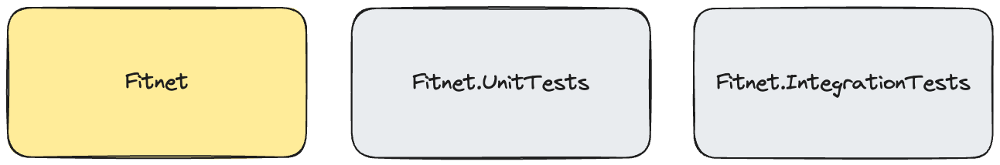

= 第1章：初始架构——专注于简单
:toc:

++++

  <picture>
    <source srcset="../Assets/ea_banner_dark.png" media="(prefers-color-scheme: dark)">
    <source srcset="../Assets/ea_banner_light.png" media="(prefers-color-scheme: light)">
    
  </picture>

++++

image:https://github.com/evolutionary-architecture/evolutionary-architecture-by-example/actions/workflows/chapter-1-workflow.yml/badge.svg[构建状态]

image:https://codecov.io/gh/evolutionary-architecture/evolutionary-architecture-by-example/branch/main/graph/badge.svg[Codecov, link=https://codecov.io/gh/evolutionary-architecture/evolutionary-architecture-by-example]

== 案例

=== 概述

在构建新应用时，我们常常陷入追逐最新技术栈的误区——直接上手高级框架、复杂架构和流行工具，从第一天起就引入了不必要的复杂性。

核心问题在于：我们在对业务理解最少的时候（项目初期）做出了最关键的技术决策。这些早期决策大多是错误的，或者说只是碰巧对了。当我们意识到问题时，代码库要么已经复杂到难以更改，要么为时已晚。

这种做法通常导致两种结果：

- 一团乱麻的单体系统
- 一团乱麻的分布式系统

解决方案？首先专注于理解业务需求，构建最简单可用的解决方案。

初期我们跳过了这些复杂性：

- 微服务
- 缓存
- 聚合
- 数据流
- 重型容器编排

简单起步带来诸多好处：

- 决策在有足够信息时再做
- 新开发者可快速上手
- 团队能在增加复杂性前掌握每个组件
- 代码库保持可维护和整洁

这种方式不能保证完美，但极大提升了构建有用且可维护系统的概率。这就是我们的方式。

让我们深入细节！

[quote]
始终根据*当前需求和上下文*选择架构，而不是凭空想象。

=== 需求

一家健身工作室需要一个简单的会员管理系统，MVP 需求如下：

- 为新老客户创建优惠
- 客户接受优惠后准备合同
- 支持客户签署合同
- 合同签署后自动生成客户通行证
- 通行证到期后自动发送续约优惠

他们非常务实：系统有价值就继续投资，否则就放弃。这种心态帮助我们聚焦核心功能。

=== 主要假设

即使有市场调研、问卷和反馈，任何新系统都建立在假设之上。我们需正视未知。

初始规模与使用量：

- 用户量：500-5000
- 仅限欧洲市场（时区复杂度低）
- 营业时间混合（12h、16h、24/7）

流量估算：

- 平均每用户每天100次请求
- 5000用户即50万次/天
- 加25%安全裕度：62.5万次/天
- 平均约7次/秒（理想均匀分布）

这一负载允许我们采用简单基础设施，无需复杂系统。

NOTE: 每个应用特性不同，实际流量分布不均。上线前建议做压力测试，推荐 https://k6.io/[k6]。

=== 解决方案

==== 概览

业务分析后，我们识别出健身领域的多个子域，并将每个子域作为独立的有界上下文。

image::../Assets/subdomains.png[]

每个有界上下文在代码中用独立模块表示。随着业务发展，这些上下文会演变。

下一步是定义解决方案结构。

==== 结构

我们将代码拆分为3个项目：

- `Fitnet`（主生产代码）
- `Fitnet.IntegrationTests`
- `Fitnet.UnitTests`

没错，只有3个项目！我们用命名空间组织模块，而不是分项目。这样更利于新项目。

主项目 `Fitnet` 包含：

- 应用 API
- 业务逻辑
- 数据访问

但不是传统的技术分层，而是：

- 用命名空间表示模块，每个有界上下文一个模块
- 数据按数据库 schema 逻辑划分，每模块独立 schema
- 业务流程按垂直切片组织，相关代码集中在一个文件夹

以合同签署为例，相关业务规则、事件、端点、请求对象都集中在一起。

部分代码在模块内共享，如实体、数据库迁移、模块注册等。

集成测试和单元测试也按模块划分，分别在 `Fitnet.IntegrationTests` 和 `Fitnet.UnitTests`。

NOTE: 每个模块都遵循：独立命名空间、垂直切片、独立 schema。方便后续拆分为独立项目或微服务。

==== 通信

我们实现了自定义的内存事件总线，实现松耦合。各部分通过事件交互，而非直接调用。

NOTE: 有时直接调用更合适，关键是务实。

但内存总线有局限：消息不持久，系统重启会丢失消息，无法重放。对早期 MVP 来说，简单优先。

未来可逐步引入更复杂的消息方案。

==== 测试

我们采用两类测试：

===== 集成测试

端到端测试完整业务流程，覆盖成功和异常场景。部分复杂响应用 https://github.com/VerifyTests/Verify[Verify] 快照测试。

===== 单元测试

标准单元测试，按模块组织。

两个测试项目都包含 `GlobalUsings.cs`，集中常用 using。

NOTE: 随项目发展可考虑契约测试（推荐 https://docs.pact.io/[Pact]）或模块测试。

==== 其他

_Docs_ 文件夹下有 _Architecture Decision Log_，记录架构决策。

NOTE: 决策日志对新成员和历史追溯极有价值。

API 测试用 HTTP 文件，配置 http-client.env.json 即可。

== 如何运行？

=== 依赖要求

- .NET SDK
- Docker

=== 如何获取 .NET SDK？

访问 https://dotnet.microsoft.com/en-us/download[官方下载页面] 下载并安装。

=== 本地运行

Fitnet 需 Docker 支持。

只需3步：

1. 进入 `/Src` 目录
2. 执行 `docker-compose build` 构建镜像
3. 执行 `docker-compose up` 启动应用（会自动启动 Postgres）

应用运行在 `:8080` 端口，访问 http://localhost:8080 或 http://localhost:8080/swagger/index.html 查看 API。

=== 如何运行集成测试？

进入 `Fitnet.IntegrationTests` 项目，执行：

`dotnet test`

或用 IDE 测试工具。

测试基于 xUnit，需 Docker 正常运行（测试用 test containers 启动 Postgres）。

