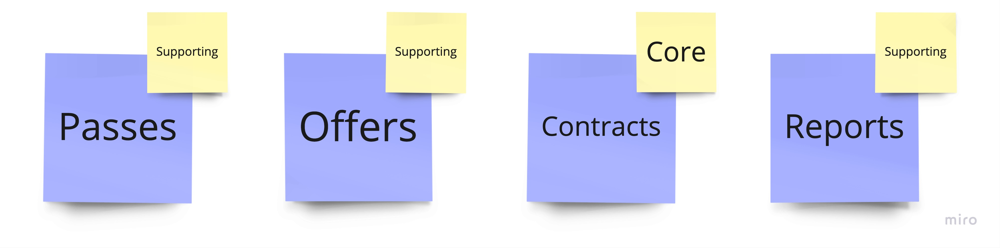

= Chapter 2: Modules Separation: Focus On Maintainability
:toc:

== Case

=== Overview

After the initial steps - while building the MVP of the application - the codebase starts to get bigger and more complicated.

Imagine that you started developing your application with a similar approach as in the first chapter - with only 1 production code project. It was successful, got more and more traction in the market, and therefore a lot of customers. In addition, together with the development team, you introduce new features and therefore:

1. Each module grows.
2. Some modules change more often than others.
3. New teams are created. Now there are 3 different teams working on features within one project. It becomes harder to maintain - teams touch the same areas, there are a lot of conflicts.
4. You notice that some modules are typical CRUD modules and some are very complex.

It makes sense now to start splitting a production project into a set of projects per domain. 

NOTE: This step makes the codebase much larger than before. Think twice before deciding to do this.

IMPORTANT: To keep the code simple and understandable while comparing it to the first chapter, we have not added any new features (business processes). Thanks to this, you can see how complex the code structure is compared to the previous one.

=== Requirements

As mentioned in the overview, the requirements remain unchanged to keep the codebase comparable to the previous step. We will continue to do this throughout the chapters.

=== Main assumptions

Due to changing requirements and the current market situation (here you have to imagine that this is the case, although we do not assume any new requirements), we have to adjust our assumptions:

1. Our application is now being used by 5000 people, which is the maximum number of users based on our initial MVP assumptions. It still makes no sense to extract parts of the application into microservices, so we keep our modular monolith and scale it as a single deployment unit.
2. A lot of new features will be added to our solution. There are many requests from our customers and after considering them, we usually decide to implement them. We also decide to add some features on our own based on analytics observations.
3. Parts of the application change extremely quickly - several times a day.
4. The _Contracts_ module is becoming increasingly complex due to new business logic.
5. We have several development teams and they start complaining about conflicts they have while working with the code and touching the same areas.

NOTE: We can utilize load balancer and feature flags to independently scale modules in our monolith.

=== Solution

==== Overview

The step we decided to take was crucial to our application. We started in a very simple way:

1. Create 3 projects, where 1 is production code and 2 are test related.
2. Separate the modules by namespace.
3. Communicate using an in-memory queue.

Over time, however, we have found that it makes sense to divide it up more granularly (see the _Main Assumptions_ chapter). 

Before we look at the technical solution, a few explanations are in order. First, we discussed the complexity of each module and tried to rethink the subdomain types we decided on in the first chapter. After further investigation, we agreed to stick with what we had originally thought:

- _Contracts_ is a _core_ type.
- The rest of our subdomains are still _supporting_.

The next step is to focus on the patterns that can be used in our modules - we were not able to make this decision in the first chapter due to lack of knowledge about our business domain and how it will be used by our customers (see _Project Paradox_ we described earlier). Thanks to the knowledge we gained, we decided on the following patterns for our modules:

- In _Contracts_ we will use the _Domain Model_.
- For _Passes_ and _Offers_ we have chosen the _Active Record_.
- In _Reports_ we will use _Transaction Script

image::../Assets/subdomains_architectural_patterns.jpg[]

Let's translate all of the above into code.

NOTE: _Domain Model_ and _Transaction Script_ are domain logic patterns and _Active Record_ is a data source architecture pattern. That's why we're grouping them all together under the term _Patterns_. You can see how they are implemented in our solution by looking at the codebase.

==== Solution structure

==== Communication

We decided to keep the in-memory queue communication (because we plan to replace it in the third chapter), but it makes sense to think about a more reliable component. 

You have several options - e.g. implement an _Outbox_ pattern or integrate a 3rd party component like RabbitMQ. That way, if something goes wrong in the process, you can retry and send the information again.

The change we have already made in this chapter is to create a separate project for each module that sends an integration event. This way the consuming modules can only reference this project and use the integration event from the sending module. The disadvantage of this solution is that we are tightly coupling, for example, the _Passes_ module with a project from the _Contracts_ module.

The above problem of an additional project for the module's integration events can be solved either by extending the in-memory implementation of our queue or by using a third party component, which we will show in the third chapter.

==== Tests

==== Miscellaneous

== How to Run?

=== Requirements
- .NET SDK
- PostgresSQL
- Docker

=== How to get .NET SDK?

To run the Fitnet application, you will need to have the recent .NET SDK installed on your computer.
Click link:https://dotnet.microsoft.com/en-us/download[here] 
to download it from the official Microsoft website.

=== How to prepare Postgres?

The Fitnet application requires PostgresSQL as a component to work properly. You can either install it directly on your system or launch it using Docker Compose.

To run PostgresSQL using Docker Compose, navigate to the `root` chapter directory using the Terminal and run the command:
1. Build the Docker compose:

[source,shell]
----
 docker-compose up
----

This will start the PostgresSQL service. Once Postgres is up and running, you can proceed to run the Fitnet application.

=== Run the Fitnet Application

There are two options to run the Fitnet application:

==== Option 1: Launch the Fitnet application in an IDE

If you have an IDE installed, you can launch the Fitnet application directly from there by following these steps:

1. Open the project in your IDE.
2. Run the project.
3. The Fitnet application should start running.

[NOTE]
Fitnet supports .NET User Secrets to store local secrets like connection strings on developer machine. 
We encourage you to use this feature to securely store the connection string.
[end]

==== Option 2: Build and run the Fitnet application as a Docker container

If you prefer to run the Fitnet application as a Docker container, you can build and run it using the following steps:

1. Build the Docker image:

[source,shell]
----
docker build -t fitnet .
----

2. Run the Docker container:
[source,shell]
----
docker run -p 8080:80 --name fitnet-container fitnet
----

The "8080" is the port number on which the container will be exposed, and "myapp" is the name of the image that you built in the previous step. Once the container is up and running, you should be able to access the application by navigating to http://localhost:8080 in your web browser.

That's it! You should now be able to run the application using either one of the above. :thumbsup:

=== How to run Integration Tests?
To run the integration tests for the project located in the Fitnet.IntegrationTests project, you can use either the command:
[source,shell]
----
dotnet test
----
or the `IDE test Explorer`. 

These tests are written using `xUnit` and require `Docker` to be running as they use `test containers` package to run PostgresSQL in a Docker container during testing. 
Therefore, make sure to have `Docker` running before executing the integration tests.