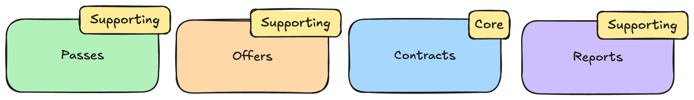
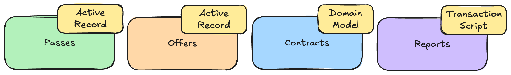

= 第2章：模块拆分——专注于可维护性
:toc:

++++

  <picture>
    <source srcset="../Assets/ea_banner_dark.png" media="(prefers-color-scheme: dark)">
    <source srcset="../Assets/ea_banner_light.png" media="(prefers-color-scheme: light)">
    
  </picture>

++++

image:https://github.com/evolutionary-architecture/evolutionary-architecture-by-example/actions/workflows/chapter-2-workflow.yml/badge.svg[构建状态]

== 案例

=== 概述

在初始阶段，随着 MVP 的开发，代码库逐渐变大、变复杂。

假设你像第1章那样只用一个生产项目开发应用，结果很成功，市场反响好，客户越来越多。与此同时，开发团队不断引入新功能，导致：

1. 各模块规模增长。
2. 某些模块变更频繁。
3. 新团队成立，现在有3个团队在同一项目开发，维护变难，冲突增多。
4. 发现有些模块只是简单 CRUD，有些则非常复杂。

此时，将生产项目按领域拆分成多个项目就很有意义了。

NOTE: 这样会让代码库比以前大很多，决策前请三思。

IMPORTANT: 为便于与第1章对比，本章未增加新业务功能，仅结构更复杂。

=== 需求

为保持可比性，需求与第1章一致，后续章节也会如此。

=== 主要假设

假设调整如下：

1. 用户量已达5000，仍采用模块化单体架构，无需微服务。
2. 新功能需求多，客户和团队都不断提出新需求。
3. 部分应用变更极快——每天多次。
4. _Contracts_ 模块因业务复杂度持续增加。
5. 多团队开发，代码冲突和协作难度上升。

NOTE: 可用负载均衡和特性开关独立扩展单体内模块。

=== 解决方案

==== 概览

我们最初的做法：

1. 创建3个项目（1个生产，2个测试）。
2. 用命名空间分隔模块。
3. 用内存队列通信。

随着业务发展，逐步细化：

- _Contracts_ 属于核心域，其余为支撑域。

各模块采用不同模式：

- _Contracts_ 用领域模型（Domain Model）
- _Passes_、_Offers_ 用活动记录（Active Record）
- _Reports_ 用事务脚本（Transaction Script）

NOTE: 领域模型、事务脚本是领域逻辑模式，活动记录是数据源架构模式，具体实现见代码。

==== 结构

现在有20+项目。每个模块根据所选模式有不同项目结构：

1. _Contracts_：`Api`、`Application`、`Core`、`Infrastructure`，还有单元/集成测试和集成事件项目。
2. _Offers_、_Passes_：`Api`、`DataAccess`，还有集成测试和集成事件项目。
3. _Reports_：仅有一个生产项目和集成测试。
4. 公共逻辑（如异常中间件、业务规则校验、事件总线）抽出为公共项目。
5. `Fitnet` 项目负责所有模块注册和应用启动。

NOTE: 结构明显更复杂。建议与第1章结构对比，思考 MVP 阶段是否值得如此拆分。

==== 通信

仍用内存队列通信（第3章将替换）。每个模块的集成事件单独成项目，消费方只需引用该项目。

IMPORTANT: 这种方式会导致模块间耦合，可通过扩展内存队列或引入第三方消息组件（如 RabbitMQ）解决。

==== 测试

测试项目按模块拆分：

- `SelectedModule.UnitTests`
- `SelectedModule.IntegrationTests`

公共代码测试在 `Common` 命名空间。

==== 其他

引入特性开关，可按需启用/禁用模块：

1. 控制模块在生产代码中的可见性，支持按业务需求或订阅级别启用。
2. 测试时可只运行相关模块，提升效率。

NOTE: 非必需，但强烈推荐，可提升灵活性和资源利用率。

== 如何运行？

=== 依赖要求

- .NET SDK
- Docker

=== 如何获取 .NET SDK？

访问 https://dotnet.microsoft.com/en-us/download[官方下载页面] 下载并安装。

=== 本地运行

Fitnet 需 Docker 支持。

只需3步：

1. 进入 `/Src` 目录
2. 执行 `docker-compose build` 构建镜像
3. 执行 `docker-compose up` 启动应用（会自动启动 Postgres）

应用运行在 `:8080` 端口，访问 http://localhost:8080 或 http://localhost:8080/swagger/index.html 查看 API。

=== 如何运行集成测试？

进入模块集成测试项目（如 `SelectedModule.IntegrationTests`），执行：

[source,shell]
----
dotnet test
----

或用 IDE 测试工具。

测试基于 xUnit，需 Docker 正常运行（测试用 test containers 启动 Postgres）。

