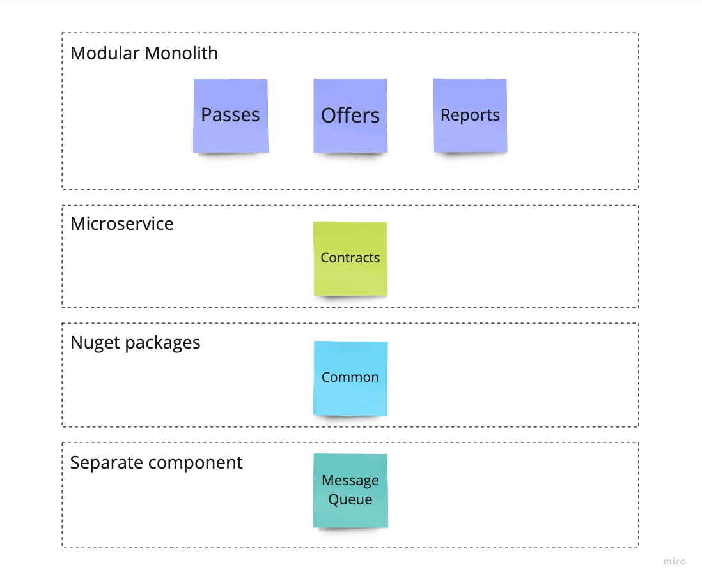

= Chapter 3: Microservice Extraction: Focus On Growth
:toc:

== Case

=== Overview

After separating the modules per project in our modular monolith, we were able to handle different areas well:

- Synchronisation conflicts - after splitting into multiple projects, there were fewer conflicts when committing to the main branch.
- Changes were encapsulated in module projects.
- We applied patterns that fit the needs.

However, we have now reached the limit of our capacity. New issues have arisen, and we can see that we are on the edge of resource usage. In addition, the cost of scaling the entire application had increased significantly, we have more development teams and security levels are different between modules. Another point is the risk of deployment of an entire single unit. We might break something - even when there is a gret automation of everything and we follow continuous deployments, problems can still arise.

It makes sense to analyse our modular monolith and extract the relevant parts to microservices. 

NOTE: This step makes your solution much more complex than before. You have to think about network failures, latency, secure communications and many other things that are often forgotten. Think twice before you decide to do this. Look at our main assumptions - they will help you to understand the reasoning (disintegrator) for a module extraction.

IMPORTANT: To keep the code simple and understandable while comparing it to the second chapter, we have not added any new features (business processes).

=== Requirements

As mentioned in the overview, the requirements remain unchanged to keep the codebase comparable to the previous step. We will continue to do this throughout the chapters.

=== Main assumptions

Due to changing requirements and the current market situation (here you have to again imagine that this is the case, although we do not assume any new requirements), we have to adjust our assumptions:

1. Our application is now being used by 500000 people, which exceeds the maximum number of users based on our initial MVP assumptions (5000). One of our modules is used extremely often - _Contracts_ and it leads to a situation where we have to scale entire modular monolith (and it now becomes quite expensive), even though other modules usage is kept low.
2. _Contracts_ module changes quicker than other modules - the ratio is 10:1, where 10 changes are done daily to _Contracts_ and 1 change to other module like _Offers_.
3. _Contracts_ module requires higher security standards than other modules as we keep here sensitive data of our customers.
4. At the moment we have 10 development teams working on the same deployment unit (modular monolith). It leads to more and more issues related to conflicts and syncing.

Thanks to above assumptions we have 4 factors that help us to decide to extract _Contracts_ module to a microservice:

- Extreme usage
- Change frequency
- Different security level than other modules

IMPORTANT: Often there are also disintegrators related to poor communication between teams or different time zones. As you can see, these are not technical reasons. They are often related to behaviour, geographical location or other areas.

=== Solution

==== Overview

The step we take here completely changes the structure of the application. In the previous chapter - where we modularised our solution based on projects (migrating from the namespace-based modular monolith we introduced in Chapter 1) - we made significant changes to our solution, increasing the overall complexity. What happened was

- Extracting the common components (such as exception middleware or business rule validation mechanism to a separate set of projects)
- Separating each module into its own set of projects

In this way, our solution grew from 3 projects in Chapter 1 to more than 20 in Chapter 2.

In the current chapter, the complexity grows even more, as we had to

- extract contracts into a separate microservice
- extract shared components into a separate solution and create packages for each component library
- introduce a reliable message handling - RabbitMQ + MassTransit

This way our application looks like this:

==== Solution structure

==== Communication

==== Tests

==== Miscellaneous

== How to Run?

=== Requirements
- .NET SDK
- PostgresSQL
- Docker

=== How to get .NET SDK?

To run the Fitnet application, you will need to have the recent .NET SDK installed on your computer.
Click link:https://dotnet.microsoft.com/en-us/download[here] 
to download it from the official Microsoft website.

=== How to prepare Postgres?

The Fitnet application requires PostgresSQL as a component to work properly. You can either install it directly on your system or launch it using Docker Compose.

To run PostgresSQL using Docker Compose, navigate to the `root` chapter directory using the Terminal and run the command:
1. Build the Docker compose:

[source,shell]
----
 docker-compose up
----

This will start the PostgresSQL service. Once Postgres is up and running, you can proceed to run the Fitnet application.

=== Run the Fitnet Modular Monolith Application

There are two options to run the Fitnet Modular Monolith application:

==== Option 1: Launch the Fitnet Modular Monolith application in an IDE
If you have an IDE installed, you can launch the Fitnet Modular Monolith application directly from there by following these steps:

- 1. Open the project in your IDE.
- 2. Run the project.
- 3. The Fitnet Modular Monolith application should start running.

[NOTE]
====
Fitnet supports .NET User Secrets to store local secrets like connection strings on a developer machine. We encourage you to use this feature to securely store the connection string.
====

==== Option 2: Build and run the Fitnet Modular Monolith application as a Docker container

1. Build the Docker image:

[source,shell]
----
docker build -t fitnet_modular_monolith .
----

2. Run the Docker container:

[source,shell]
----
docker run -p 8080:80 --name fitnet_modular_monolith_container fitnet_modular_monolith
----

Once the container is up and running, you should be able to access the application by navigating to http://localhost:8080 in your web browser.

=== Run the Fitness.Contracts Application

==== Option 1: Launch the Fitness.Contracts application in an IDE

To launch the Fitness.Contracts application at any IDE, follow these steps:

- 1. Open the project in your IDE.
- 2. Run the project.
- 3. The Fitness.Contracts application should start running.

==== Option 2: Build and run the Fitness.Contracts application as a Docker container

1. Build the Docker image:

[source,shell]
----
docker build -t fitness_contracts .
----

2. Run the Docker container:

[source,shell]
----
docker run -p 8081:80 --name fitness_contracts_container fitness_contracts
----

Once the container is up and running, you should be able to access the application by navigating to http://localhost:8081 in your web browser.

=== Setting up Artifactory and EvolutionaryArchitecture NuGet Packages

- 1. Open JetBrains Rider and navigate to `File > Settings > NuGet > Sources`.
- 2. Click the `+` button to add a new package source.
- 3. In the `Add Package Source` window, provide Artifactory URL in the `https://nuget.pkg.github.com/evolutionary-architecture/index.json`, fill your Github Username and PAT.
- 4. Click `OK` to confirm the new package source.
- 5. Make sure your new package source is enabled and then click `OK` to close the `Settings` window.

You should now be able to restore and download the EvolutionaryArchitecture nuget packages from your Artifactory source within Rider.

[NOTE]
====
The provided instruction is primarily intended for JetBrains Rider. However, the procedure for adding a NuGet package source in alternative IDEs like Visual Studio is quite similar.
====

=== How to run Integration Tests?
Running integration tests for both the Fitnet Modular Monolith and Fitness.Contracts applications involves similar steps, as the testing setup for both projects.
To run the integration tests for project, you can use either the command:
[source,shell]
----
dotnet test
----
or the `IDE test Explorer`. 

These tests are written using `xUnit` and require `Docker` to be running as they use `test containers` package to run PostgresSQL in a Docker container during testing. 
Therefore, make sure to have `Docker` running before executing the integration tests.
