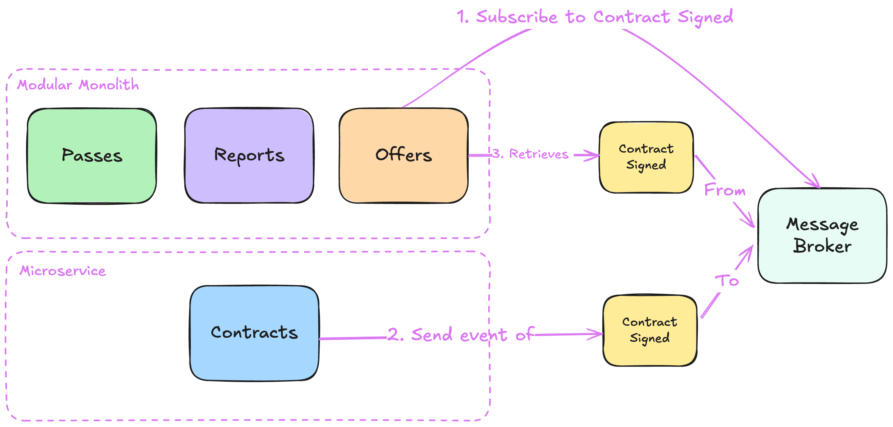

= Chapter 3: Microservice Extraction: Focus On Growth
:toc:

++++

  <picture>
    <source srcset="../Assets/ea_banner_dark.png" media="(prefers-color-scheme: dark)">
    <source srcset="../Assets/ea_banner_light.png" media="(prefers-color-scheme: light)">
    
  </picture>

++++

image:https://github.com/evolutionary-architecture/evolutionary-architecture-by-example/actions/workflows/chapter-3-workflow.yml/badge.svg[Build Status]
image:https://github.com/evolutionary-architecture/evolutionary-architecture-by-example/actions/workflows/chapter-3-contracts-package-workflow.yml/badge.svg[Build Status]
image:https://github.com/evolutionary-architecture/evolutionary-architecture-by-example/actions/workflows/chapter-3-contracts-workflow.yml/badge.svg[Build Status]
image:https://github.com/evolutionary-architecture/evolutionary-architecture-by-example/actions/workflows/chapter-3-package-workflow.yml/badge.svg[Build Status]

== Case

=== Overview

After separating the modules per project in our modular monolith, we were able to handle different areas well:

- Synchronisation conflicts - after splitting into multiple projects, there were fewer conflicts when committing to the main branch.
- Changes were encapsulated in module projects.
- We applied patterns that fit the needs.

However, we have now reached the limit of our capacity. New issues have arisen, and we can see that we are on the edge of resource usage. In addition, the cost of scaling the entire application had increased significantly, we have more development teams and security levels are different between modules. Another point is the risk of deployment of an entire single unit. We might break something - even when there is a gret automation of everything and we follow continuous deployments, problems can still arise.

It makes sense to analyse our modular monolith and extract the relevant parts to microservices. 

NOTE: This step makes your solution much more complex than before. You have to think about network failures, latency, secure communications and many other things that are often forgotten. Think twice before you decide to do this. Look at our main assumptions - they will help you to understand the reasoning (disintegrator) for a module extraction.

IMPORTANT: To keep the code simple and understandable while comparing it to the second chapter, we have not added any new features (business processes).

=== Requirements

As mentioned in the overview, the requirements remain unchanged to keep the codebase comparable to the previous step. We will continue to do this throughout the chapters.

=== Main assumptions

Due to changing requirements and the current market situation (here you have to again imagine that this is the case, although we do not assume any new requirements), we have to adjust our assumptions:

1. Our application is now being used by 500000 people, which exceeds the maximum number of users based on our initial MVP assumptions (5000). One of our modules is used extremely often - `Contracts` and it leads to a situation where we have to scale entire modular monolith (and it now becomes quite expensive), even though other modules usage is kept low.
2. `Contracts` module changes quicker than other modules - the ratio is 10:1, where 10 changes are done daily to `Contracts` and 1 change to other module like `Offers`.
3. `Contracts` module requires higher security standards than other modules as we keep here sensitive data of our customers.
4. At the moment we have 10 development teams working on the same deployment unit (modular monolith). It leads to more and more issues related to conflicts and syncing.

Thanks to above assumptions we have 4 factors that help us to decide to extract `Contracts` module to a microservice:

- Extreme usage
- Change frequency
- Different security level than other modules

IMPORTANT: Often there are also disintegrators related to poor communication between teams or different time zones. As you can see, these are not technical reasons. They are often related to behaviour, geographical location or other areas.

=== Solution

==== Overview

The step we take here completely changes the structure of the application. In the previous chapter - where we modularised our solution based on projects (migrating from the namespace-based modular monolith we introduced in Chapter 1) - we made significant changes to our solution, increasing the overall complexity. What happened was

- Extracting the common components (such as exception middleware or business rule validation mechanism to a separate set of projects)
- Separating each module into its own set of projects

In this way, our solution grew from 3 projects in Chapter 1 to more than 20 in Chapter 2.

In the current chapter, the complexity grows even more, as we had to

- extract contracts into a separate microservice
- extract shared components into a separate solution and create packages for each component library
- introduce a reliable message handling - `RabbitMQ` + `MassTransit`

This way our application looks like this:

++++

  

++++

==== Solution structure

After the changes, our solution was divided into 3 separate solutions:

1. `Fitnet.Contracts` is a solution that contains our only microservice.
2. `Fitnet.Common` is a solution that contains all reusable components (no common business logic, only technical components like exception middleware).
3. `Fitnet` is a solution that contains our modular monolith with 3 modules - `Passes`, `Offers` and `Reports`.

For each solution, we have created a separate build in GH Actions. 

Components located in `Fitnet.Common` are built into packages that are then reused by both - modular monolith and microservice. Whenever you extract another microservice, it is ready to integrate common components inside.

NOTE: As you can see, this is even more complicated than before. That's why you should always think about whether it's worth extracting one of the modules into a microservice, as it will complicate your application. Always try to find reasonable disintegrators. Otherwise, try to postpone this decision as much as possible.

==== Communication

This time we needed to move from our in-memory queue to something that could operate between 2 different instances - our modular monolith and the microservice as separate deployment units.

At this point, our application was already being used by many people, and we wanted something more reliable than before (if you remember, we suggested thinking about introducing another communication mechanism in Chapter 2).

We decided to use `RabbitMQ` with `MassTransit`. In doing so, we have created a separate component that now requires additional maintenance. Whenever an integration event arrives in the message queue, the module subscribed to it can receive it and update itself accordingly:

IMPORTANT: If you are deploying a separate component like `RabbitMQ` for production purposes, it makes sense to create at least 1 other replica (our suggestion is to have 2) - in case the first instance goes down, another instance can handle the message communication. This way you protect your application from random failures (or rather, you reduce the chance of your application going down :)).

==== Tests

Our test structure has not changed since Chapter 2. The only difference is that they have been moved to a separate solution along with `Fitnet.Common` and `Fitnet.Contracts`.

The difference in content is that this time we have an additional component that we had to spin up, and that is `RabbitMQ` with `MassTransit`.

==== Packages

This chapter introduces a new concept called _Packages_. Instead of duplicating some logic in the `Contracts` microservice and modular monolith, we decided to

- extract `Common` projects into a separate solution
- make the `Contracts.IntegrationEvents` project a package

Both areas are built as packages inside our GH repository (we use GH Packages).

This means the following things:

- every time we change any of the above, we have to raise a package version. In production code, it would be preferable to automate the version bump - in this repo, we decided to do it manually to avoid overcomplicating things. The versioning is done using https://semver.org/[Semantic Versioning] and we recommend you do the same.
- after a package version upgrade, we need to update it in both - `Contracts` Microservice and Modular Monolith - if we want to use the latest introduced features (or changes)
- Thanks to the extraction of `IntegrationEvents` from `Contracts`, we can reuse the same events implementation in both - `Contracts` microservice and modular monolith.

IMPORTANT: If you have the packages in the same repository as other production code, at some point you will find that the cognitive complexity is too high - too many things are happening in one repository. This is the moment when you should think about extracting the `Common` or `Contracts` part into separate repositories.

== How to Run?

=== Requirements
- .NET SDK
- PostgresSQL
- Docker

=== How to get .NET SDK?

To run the `Fitnet` application, you will need to have the recent `.NET SDK` installed on your computer.
Click link:https://dotnet.microsoft.com/en-us/download[here] 
to download it from the official Microsoft website.

=== Run locally

The `Fitnet` application requires `Docker` to run properly.

There are only 5 steps you need to start the application:

1. Create you own personal access token in Github (it is needed to be able to download our GH Packages for `Common`). Instruction how to do it you can find https://www.educative.io/answers/how-to-create-a-personal-access-token-for-github-access[here]. Your PAT must have only one value of `read:packages`. Note the token somewhere as it won't be possible to read it again.
2. Go to `Contracts\Src` folder and edit `Dockerfile`. You must change `your_username` and `your_personal_access_token` to your own values (your GH username and PAT that you generated in Step 1). Repeat the step for `ModularMonolith\Src`.
3. Make sure that you go back to `root` directory of Chapter 3. 
4. Run `docker-compose build` to build the image of the application.
5. Run `docker-compose up` to start the application. In the meantime it will also start Postgres inside container.

The `Fitnet``modular monolith application runs on port `:8080`. Please navigate to http://localhost:8080 in your browser or http://localhost:8080/swagger/index.html to explore the API.

The `Contracts` microservice runs on port `:8081`. Please navigate to http://localhost:8081 in your browser or http://localhost:8081/swagger/index.html to explore the API.

That's it! You should now be able to run the application using either one of the above. :thumbsup:

=== Run with .NET Aspire

The Fitnet application uses .NET Aspire for local development.

To run the application locally using Aspire, follow these steps:

1. **Ensure Docker is running** on your machine.
2. **Navigate to the AppHost directory:**
[source,shell]
----
cd Fitnet.AppHost
----
3. **Run the AppHost project:**
[source,shell]
----
dotnet run
----

The Aspire Dashboard will open automatically, showing all services, resources, and logs.

=== Building and debugging code in Rider IDE

Before you build or debug code in `Rider` or `Visual Studio` IDE, you first have to provide your user name and previously generated PAT for artifactory to download packages for `Common` which is a part of this repository. When you load the solution, your IDE should request the credentials:  

 - Rider: 
++++

  

++++
 - Visual Studio: 
++++

  

++++

In case of any issues, you can add nuget feed manually:

- `Rider`
   1. Open `JetBrains Rider`, right click on the solution in the solution explorer and click `Manage NuGet Packages`.
   1. Click on the `Sources` tab.
   1. Click the `+` button to add a new package source.
   1. In the `Add Package Source` window, provide Artifactory URL in the `https://nuget.pkg.github.com/evolutionary-architecture/index.json`, fill your Github Username and PAT.
   1. Click `OK` to confirm the new package source.
   1. Make sure your new package source is enabled and then click `OK` to close the `Settings` window.
   1. You sould be promted for user name and password (PAT).
- `Visual Studio`
   1. Open `Microsoft Visual Studio`, right click on the solution in the solution explorer and click `Manage NuGet Packages for Solution`.
   1. Click on the `gears` icon.
   1. Click the `+` button to add a new package source.
   1. Set the package name and se the source to Artifactory URL `https://nuget.pkg.github.com/evolutionary-architecture/index.json`.
   1. You sould be promted for user name and password (PAT).
   1. Click `OK` to confirm the new package source.

You should now be able to restore and download the EvolutionaryArchitecture nuget packages from your Artifactory source within Rider.

[NOTE]
====
The provided instruction is primarily intended for JetBrains Rider. However, the procedure for adding a NuGet package source in alternative IDEs like Visual Studio is quite similar.
====

=== How to run Integration Tests?
Running integration tests for both the `Fitnet` Modular Monolith and `Fitness.Contracts` applications involves similar steps, as the testing setup for both projects.
To run the integration tests for project, you can use either the command:
[source,shell]
----
dotnet test
----
or the `IDE test Explorer`. 

These tests are written using `xUnit` and require `Docker` to be running as they use `test containers` package to run `PostgresSQL in a Docker` container during testing. 
Therefore, make sure to have `Docker` running before executing the integration tests.
