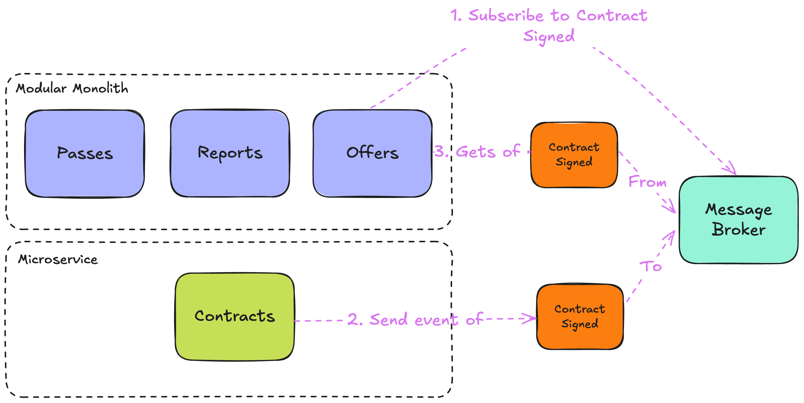

= 第3章：微服务拆分——专注于增长
:toc:

++++

  <picture>
    <source srcset="../Assets/ea_banner_dark.png" media="(prefers-color-scheme: dark)">
    <source srcset="../Assets/ea_banner_light.png" media="(prefers-color-scheme: light)">
    
  </picture>

++++

image:https://github.com/evolutionary-architecture/evolutionary-architecture-by-example/actions/workflows/chapter-3-workflow.yml/badge.svg[构建状态]
image:https://github.com/evolutionary-architecture/evolutionary-architecture-by-example/actions/workflows/chapter-3-contracts-package-workflow.yml/badge.svg[构建状态]
image:https://github.com/evolutionary-architecture/evolutionary-architecture-by-example/actions/workflows/chapter-3-contracts-workflow.yml/badge.svg[构建状态]
image:https://github.com/evolutionary-architecture/evolutionary-architecture-by-example/actions/workflows/chapter-3-package-workflow.yml/badge.svg[构建状态]

== 案例

=== 概述

在将模块按项目拆分为模块化单体后，我们解决了：

- 同步冲突减少
- 变更封装在模块项目内
- 各模块采用合适的架构模式

但现在遇到新瓶颈：

- 资源使用接近极限，整体扩容成本高
- 团队数量增多，安全需求各异
- 整体部署风险大

因此，分析后决定将部分模块拆分为微服务。

NOTE: 这一步会极大增加系统复杂度。请务必结合实际业务“分离因子”再做决策。

IMPORTANT: 为便于对比，本章未增加新业务，仅结构更复杂。

=== 需求

需求与第2章保持一致。

=== 主要假设

假设调整如下：

1. 用户量已达50万，超出最初MVP假设。`Contracts`模块使用极高，导致整体扩容成本上升。
2. `Contracts`模块变更频率远高于其他模块（10:1）。
3. `Contracts`模块需更高安全标准，涉及敏感数据。
4. 10个开发团队协作，冲突和同步问题加剧。

据此，决定将`Contracts`模块拆分为微服务，原因包括：

- 极端使用量
- 变更频率高
- 安全级别不同

IMPORTANT: 很多分离因子并非技术原因，而是团队协作、地理等。

=== 解决方案

==== 概览

本章结构变化：

- 提取公共组件为独立解决方案并打包
- `Contracts`模块独立为微服务
- 引入可靠消息机制（RabbitMQ + MassTransit）

==== 结构

现在分为3个独立解决方案：

1. `Fitnet.Contracts`：微服务
2. `Fitnet.Common`：可复用技术组件
3. `Fitnet`：模块化单体，含`Passes`、`Offers`、`Reports`模块

每个解决方案独立构建，`Fitnet.Common` 组件以包形式复用。

NOTE: 结构更复杂，务必权衡是否值得拆分。

==== 通信

采用 RabbitMQ + MassTransit 替代内存队列，实现跨进程可靠通信。

IMPORTANT: 生产环境建议 RabbitMQ 至少2个副本，提升可用性。

==== 测试

测试结构与第2章一致，只是迁移到新解决方案，并需额外启动 RabbitMQ。

==== 包管理

本章引入“包”概念：

- 公共组件和`Contracts.IntegrationEvents`项目均以包形式发布
- 每次变更需手动升级包版本，推荐用语义化版本号
- 单体和微服务均可复用同一事件实现

IMPORTANT: 随着包和代码共存，认知复杂度提升，建议后续考虑分仓。

== 如何运行？

=== 依赖要求
- .NET SDK
- PostgresSQL
- Docker

=== 如何获取 .NET SDK？

访问 https://dotnet.microsoft.com/en-us/download[官方下载页面] 下载并安装。

=== 本地运行

只需5步：

1. 在 Github 创建个人访问令牌（PAT），仅需 `read:packages` 权限。生成后妥善保存。
2. 分别编辑 `Contracts/Src` 和 `ModularMonolith/Src` 下的 Dockerfile，将 `your_username` 和 `your_personal_access_token` 替换为你的 Github 用户名和 PAT。
3. 回到第3章根目录。
4. 执行 `docker-compose build` 构建镜像。
5. 执行 `docker-compose up` 启动应用（会自动启动 Postgres）。

单体应用运行在 `:8080` 端口，访问 http://localhost:8080 或 http://localhost:8080/swagger/index.html。

`Contracts` 微服务运行在 `:8081` 端口，访问 http://localhost:8081 或 http://localhost:8081/swagger/index.html。

=== Rider/VS IDE 构建与调试

首次加载解决方案时，IDE 会请求输入用户名和 PAT 以下载包。

如遇问题，可手动添加 NuGet 源，详见英文文档说明。

=== 如何运行集成测试？

单体和微服务均可在对应测试项目下执行：

[source,shell]
----
dotnet test
----

或用 IDE 测试工具。

测试基于 xUnit，需 Docker 正常运行（测试用 test containers 启动 Postgres）。

