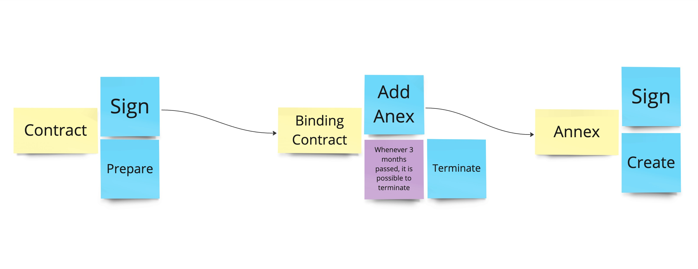

= Chapter 4: Applying Tacical Domain-Driven Design: Focus On Complexity
:toc:

++++

  

++++

image:https://github.com/evolutionary-architecture/evolutionary-architecture-by-example/actions/workflows/chapter-3-workflow.yml/badge.svg[Build Status]
image:https://github.com/evolutionary-architecture/evolutionary-architecture-by-example/actions/workflows/chapter-3-contracts-package-workflow.yml/badge.svg[Build Status]
image:https://github.com/evolutionary-architecture/evolutionary-architecture-by-example/actions/workflows/chapter-3-contracts-workflow.yml/badge.svg[Build Status]
image:https://github.com/evolutionary-architecture/evolutionary-architecture-by-example/actions/workflows/chapter-3-package-workflow.yml/badge.svg[Build Status]

== Case

=== Overview

In Chapter 3, we had to find a way to handle the extreme growth of one of our modules - _Contracts_. Based on concrete factors, the decision was to:

- Extract a separate microservice from the modular monolith for _Contracts_
- Introduce an external component - RabbitMQ - to handle communication between modules and extracted microservice
- Extract building blocks to a separate solution that is built as a NuGet package and reuse it in both modular monolith and microservice

For several weeks, this solution worked as a charm.

However, new requirements appear. The way we signed contracts changed. Additionally, there are new possible actions:

- Termination of the existing binding contract
- Attaching annex to the existing binding contract

We already know that there is a plan to complicate _Contracts_ even more in the upcoming weeks and months. _Contracts_ module becomes increasingly complex.

NOTE: In this step, we will focus on tactical Domain-Driven Design. As business logic grows and becomes more complex, we consider applying the Domain Model in the _Contracts_ microservice. It requires a change in thinking and might initially give the impression of something complicated. Nevertheless, it will make this module more straightforward to extend and maintain without dealing with spaghetti code in the long run.

IMPORTANT: It makes no sense to consider the Domain Model in typical CRUD modules or those based on querying, e.g., _Reports_. You do not need to apply the same patterns in all modules—such behavior is a typical anti-pattern. Choose a matching solution based on your needs!

=== Requirements

Business requirements changed a lot in comparison to Chapter 3:

1. _Contract_ can still be prepared but does not have the force of law - we treat it as a draft.
2. After the _Contract_ is signed, _Binding Contract_ is created. It has the force of law and binds the customer with us.
3. After three months, at any time, the customer can terminate _Binding Contract_ without any penalty.
4. It is possible to attach an _Annex_ to the existing _Binding Contract_. This way, the customer can extend the contract for another year without preparing a new _Contract_ for him.
5. Annex can only be attached if _Binding Contract_ is active - has not yet expired or was not terminated.

=== Main assumptions

The assumptions remain unchanged to keep the environment comparable to the previous step.

=== Solution

==== Overview

In this step we do not change the project structure of the application. We focus only on refactoring the code of _Contracts_ microservice.

We introduce elements like:

- Aggregates
- Entities
- Value Objects
- Domain Events

== How to Run?

=== Requirements
- .NET SDK
- PostgresSQL
- Docker

=== How to get .NET SDK?

To run the `Fitnet` application, you will need to have the recent `.NET SDK` installed on your computer.
Click link:https://dotnet.microsoft.com/en-us/download[here] 
to download it from the official Microsoft website.

=== Run locally

The `Fitnet` application requires `Docker` to run properly.

There are only 5 steps you need to start the application:

1. Create you own personal access token in Github (it is needed to be able to download our GH Packages for `Common`). Instruction how to do it you can find https://www.educative.io/answers/how-to-create-a-personal-access-token-for-github-access[here]. Your PAT must have only one value of `read:packages`. Note the token somewhere as it won't be possible to read it again.
2. Go to `Contracts\Src` folder and edit `Dockerfile`. You must change `your_username` and `your_personal_access_token` to your own values (your GH username and PAT that you generated in Step 1). Repeat the step for `ModularMonolith\Src`.
3. Make sure that you go back to `root` directory of Chapter 3. 
4. Run `docker-compose build` to build the image of the application.
5. Run `docker-compose up` to start the application. In the meantime it will also start Postgres inside container.

The `Fitnet``modular monolith application runs on port `:8080`. Please navigate to http://localhost:8080 in your browser or http://localhost:8080/swagger/index.html to explore the API.

The `Contracts` microservice runs on port `:8081`. Please navigate to http://localhost:8081 in your browser or http://localhost:8081/swagger/index.html to explore the API.

That's it! You should now be able to run the application using either one of the above. :thumbsup:

=== Building and debugging code in Rider IDE

Before you build or debug code in `Rider` or `Visual Studio` IDE, you first have to provide your user name and previously generated PAT for artifactory to download packages for `Common` which is a part of this repository. When you load the solution, your IDE should request the credentials:  

 - Rider: 
++++

  

++++
 - Visual Studio: 
++++

  

++++

In case of any issues, you can add nuget feed manually:

- `Rider`
   1. Open `JetBrains Rider`, right click on the solution in the solution explorer and click `Manage NuGet Packages`.
   1. Click on the `Sources` tab.
   1. Click the `+` button to add a new package source.
   1. In the `Add Package Source` window, provide Artifactory URL in the `https://nuget.pkg.github.com/evolutionary-architecture/index.json`, fill your Github Username and PAT.
   1. Click `OK` to confirm the new package source.
   1. Make sure your new package source is enabled and then click `OK` to close the `Settings` window.
   1. You sould be promted for user name and password (PAT).
- `Visual Studio`
   1. Open `Microsoft Visual Studio`, right click on the solution in the solution explorer and click `Manage NuGet Packages for Solution`.
   1. Click on the `gears` icon.
   1. Click the `+` button to add a new package source.
   1. Set the package name and se the source to Artifactory URL `https://nuget.pkg.github.com/evolutionary-architecture/index.json`.
   1. You sould be promted for user name and password (PAT).
   1. Click `OK` to confirm the new package source.

You should now be able to restore and download the EvolutionaryArchitecture nuget packages from your Artifactory source within Rider.

[NOTE]
====
The provided instruction is primarily intended for JetBrains Rider. However, the procedure for adding a NuGet package source in alternative IDEs like Visual Studio is quite similar.
====

=== How to run Integration Tests?
Running integration tests for both the `Fitnet` Modular Monolith and `Fitness.Contracts` applications involves similar steps, as the testing setup for both projects.
To run the integration tests for project, you can use either the command:
[source,shell]
----
dotnet test
----
or the `IDE test Explorer`. 

These tests are written using `xUnit` and require `Docker` to be running as they use `test containers` package to run `PostgresSQL in a Docker` container during testing. 
Therefore, make sure to have `Docker` running before executing the integration tests.
