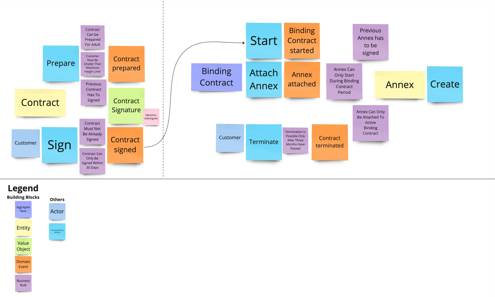

= Chapter 4: Applying Tactical Domain-Driven Design: Focus On Complexity
:toc:

++++

  

++++

image:https://github.com/evolutionary-architecture/evolutionary-architecture-by-example/actions/workflows/chapter-4-workflow.yml/badge.svg[Build Status]
image:https://github.com/evolutionary-architecture/evolutionary-architecture-by-example/actions/workflows/chapter-4-contracts-package-workflow.yml/badge.svg[Build Status]
image:https://github.com/evolutionary-architecture/evolutionary-architecture-by-example/actions/workflows/chapter-4-contracts-workflow.yml/badge.svg[Build Status]
image:https://github.com/evolutionary-architecture/evolutionary-architecture-by-example/actions/workflows/chapter-4-package-workflow.yml/badge.svg[Build Status]

== Domain Driven Design in a Nutshell
=== What is Domain-Driven Design?

Domain-Driven Design (DDD) is a set of techniques and methods that help developers tackle business complexity. It is particularly useful for systems full of business processes and rules that are not easy to understand for people unfamiliar with the business area.

Using DDD is not recommended for trivial business cases, such as when the complexity lies only in the technology itself, or when the application is just CRUD-based and can be designed as simple UI mockups (shallow systems).

=== Domain-Driven Design: Tactical vs. Strategic

Domain-Driven Design techniques are split into two categories: strategic and tactical.

==== Strategic

Strategic techniques help you explore, analyse, and understand the problem space. They provide insights into how the company operates, how communication flows, and help build a shared understanding between the development team and the business. Strategic techniques emphasise building a ubiquitous language.

Examples of strategic techniques include:

- link:https://www.strategyzer.com/canvas/business-model-canvas[Business Model Canvas]
- link:https://learnwardleymapping.com/[Wardley Maps]
- link:https://www.eventstorming.com/[Event Storming]
- link:https://domainstorytelling.org/[Domain Storytelling]
- link:https://vladikk.com/2018/01/26/revisiting-the-basics-of-ddd/[Domain Categorization]
- link:https://github.com/ddd-crew/context-mapping[Context Mapping]

[Note]
====
You don't have to use all of them to be successfully. Treat DDD as pharmacy. You should choose the ones that fit your needs and the complexity of the system you are building.
====

Let's take a look at modelling process. Larger part of the process is about understanding the business and its rules.

image::Assets/ddd-starter-modeling-circular.svg[]

[Important]
====
We are using Strategic Domain-Driven Design techniques from the start to understand problem space
====

==== Tactical
Tactical techniques, focusing on implementing solution for problem that we already explored and understand. They provide a set of patterns and building blocks that help developers to implement the domain model in the code. 

[NOTE]
====
Tactical patterns are used only in the _Contracts_ microservice due to its domain complexity.
====

[IMPORTANT]
====
Use tactical patterns where business complexity is high. Typically, only about 20% of your application will be complex. Implementing these patterns in less complex areas can lead to over-engineering and slow down development.
====

== Case

==== Overview

In Chapter 3, we had to find a way to handle the extreme growth of one of our modules - _Contracts_. Based on concrete factors, the decision was to:

- Extract a separate microservice from the modular monolith for _Contracts_
- Introduce an external component - RabbitMQ - to handle communication between modules and extracted microservice
- Extract building blocks to a separate solution that is built as a NuGet package and reuse it in both modular monolith and microservice

For several weeks, this solution worked as a charm.

However, new requirements appear. The way we signed contracts changed. Additionally, there are new possible actions:

- Termination of the existing binding contract
- Attaching annex to the existing binding contract

We already know that there is a plan to complicate _Contracts_ even more in the upcoming weeks and months. _Contracts_ module becomes increasingly complex.

NOTE: In this step, we will focus on tactical Domain-Driven Design. As business logic grows and becomes more complex, we consider applying the Domain Model in the _Contracts_ microservice. It requires a change in thinking and might initially give the impression of something complicated. Nevertheless, it will make this module more straightforward to extend and maintain without dealing with spaghetti code in the long run.

IMPORTANT: It makes no sense to consider the Domain Model in typical CRUD modules or those based on querying, e.g., _Reports_. You do not need to apply the same patterns in all modules—such behavior is a typical anti-pattern. Choose a matching solution based on your needs!

=== Requirements

Business requirements changed a lot in comparison to Chapter 3:

1. _Contract_ can still be prepared but does not have the force of law - we treat it as a draft.
2. After the _Contract_ is signed, _Binding Contract_ is created. It has the force of law and binds the customer with us.
3. After three months, at any time, the customer can terminate _Binding Contract_ without any penalty.
4. It is possible to attach an _Annex_ to the existing _Binding Contract_. This way, the customer can extend the contract for another year without preparing a new _Contract_ for him.
5. Annex can only be attached if _Binding Contract_ is active - has not yet expired or was not terminated.

image::Assets/flow.jpg[]

=== Main assumptions

The assumptions remain unchanged to keep the environment comparable to the previous step.

=== Solution

== Overview

In this step, we do not change the project structure of the application. We focus only on implementing new features and refactoring the code of the _Contracts_ microservice.

We introduce elements like:

- <<aggregate-root,Aggregates>>
- <<entity,Entities>>
- <<value-object,Value Objects>>
- <<domain-events,Domain Events>>

=== Contracts Bounded Context Tactical Design Analysis

Above photo is the result of the Event Storming Design Level workshop.

Let's focus on business rules that we identified during the workshop.

1. **Annex Can Only Start During Binding Contract Period**:
   - An annex can only be attached if it falls within the active period of the binding contract. This ensures that all extensions and modifications are valid within the contract's timeframe.

2. **Annex Can Only Be Attached To Active Contracts**:
   - The binding contract must be active, meaning it hasn't expired or been terminated. This rule prevents any modifications to contracts that are no longer valid.

3. **Previous Annex Must Be Signed**:
   - Any new annex can only be added if the previous annex has been signed. This maintains a clear and enforceable order of amendments, ensuring that no annex is added without proper authorisation.

Let's take look closer on this rule. __Previous Annex Must Be Signed__. This rule is connected with the relationship between the new and previous annex. This is invariant.

[NOTE]
====
Invariant is a rule or condition that must always be true for a system to be considered in a valid state. It ensures the integrity and consistency of the domain model
====

To enforce this business rules and maintain consistency, we need a robust way to protect invariant, especially in a concurrent environment. This is where the concept of an <<aggregate-root,Aggregate Root>> comes into play.

That’s why the binding contract <<entity,entity>> has to be promoted to <<aggregate-root,Aggregate Root>> that will guard the annexes’ invariants.

TODO: Aggregate Root Canvas image

Annexes are a part of the binding contract <<aggregate,aggregate>>. They has to be uniquely identified and encapsule bussines rules that why we've modeled it as <<entity, entity>>.

Binding contract has signature property which has bussines logic and is no requirment to be uniqly identified. Signature can be compared by its properties. We want to use ubiquites languge so we chosen <<value-object, value object>> as bulidng block to model this concept.

Every time we attach annex to the binding contract, we want to notify other parts of the system about this event. This is a perfect use case for <<domain-events,Domain Events>>.

=== Building Blocks:

[[entity]]
==== Entity

An **Entity** is an object that is defined by its identity rather than its attributes. This means that even if two entities have the same attributes, they are considered different if they have different identities.

[[value-object]]
==== Value Object

A **Value Object** is an object that is defined by its attributes. Unlike entities, value objects have no identity. They are used to describe certain aspects of the domain and are immutable.

TODO: mention primitive model obsession

[[aggregate-root]]
==== Aggregate Root

An **Aggregate Root** is an entity that acts as the entry point for an aggregate, which is a cluster of related objects. The aggregate root ensures the integrity of the aggregate by controlling access and enforcing business rules. 

[[domain-events]]
==== Domain Events

**Domain Events** are used to capture and communicate important events that occur within the domain. These events can trigger side effects or workflows in other parts of the system.

Each of these patterns helps us manage and maintain the complexity of the domain by organizing the code in a way that is closer to the business logic and rules.

=== Guidelines
==== Anemic Domain Model
TODO: Description

== How to Run?

=== Requirements
- .NET SDK
- PostgresSQL
- Docker

=== How to get .NET SDK?

To run the `Fitnet` application, you will need to have the recent `.NET SDK` installed on your computer.
Click link:https://dotnet.microsoft.com/en-us/download[here] 
to download it from the official Microsoft website.

=== Run locally

The `Fitnet` application requires `Docker` to run properly.

There are only 5 steps you need to start the application:

1. Create you own personal access token in Github (it is needed to be able to download our GH Packages for `Common`). Instruction how to do it you can find https://www.educative.io/answers/how-to-create-a-personal-access-token-for-github-access[here]. Your PAT must have only one value of `read:packages`. Note the token somewhere as it won't be possible to read it again.
2. Go to `Contracts\Src` folder and edit `Dockerfile`. You must change `your_username` and `your_personal_access_token` to your own values (your GH username and PAT that you generated in Step 1). Repeat the step for `ModularMonolith\Src`.
3. Make sure that you go back to `root` directory of Chapter 3. 
4. Run `docker-compose build` to build the image of the application.
5. Run `docker-compose up` to start the application. In the meantime it will also start Postgres inside container.

The `Fitnet``modular monolith application runs on port `:8080`. Please navigate to http://localhost:8080 in your browser or http://localhost:8080/swagger/index.html to explore the API.

The `Contracts` microservice runs on port `:8081`. Please navigate to http://localhost:8081 in your browser or http://localhost:8081/swagger/index.html to explore the API.

That's it! You should now be able to run the application using either one of the above. :thumbsup:

=== Building and debugging code in Rider IDE

Before you build or debug code in `Rider` or `Visual Studio` IDE, you first have to provide your user name and previously generated PAT for artifactory to download packages for `Common` which is a part of this repository. When you load the solution, your IDE should request the credentials:  

 - Rider: 
++++

  

++++
 - Visual Studio: 
++++

  

++++

In case of any issues, you can add nuget feed manually:

- `Rider`
   1. Open `JetBrains Rider`, right click on the solution in the solution explorer and click `Manage NuGet Packages`.
   1. Click on the `Sources` tab.
   1. Click the `+` button to add a new package source.
   1. In the `Add Package Source` window, provide Artifactory URL in the `https://nuget.pkg.github.com/evolutionary-architecture/index.json`, fill your Github Username and PAT.
   1. Click `OK` to confirm the new package source.
   1. Make sure your new package source is enabled and then click `OK` to close the `Settings` window.
   1. You sould be promted for user name and password (PAT).
- `Visual Studio`
   1. Open `Microsoft Visual Studio`, right click on the solution in the solution explorer and click `Manage NuGet Packages for Solution`.
   1. Click on the `gears` icon.
   1. Click the `+` button to add a new package source.
   1. Set the package name and se the source to Artifactory URL `https://nuget.pkg.github.com/evolutionary-architecture/index.json`.
   1. You sould be promted for user name and password (PAT).
   1. Click `OK` to confirm the new package source.

You should now be able to restore and download the EvolutionaryArchitecture nuget packages from your Artifactory source within Rider.

[NOTE]
====
The provided instruction is primarily intended for JetBrains Rider. However, the procedure for adding a NuGet package source in alternative IDEs like Visual Studio is quite similar.
====

=== How to run Integration Tests?
Running integration tests for both the `Fitnet` Modular Monolith and `Fitness.Contracts` applications involves similar steps, as the testing setup for both projects.
To run the integration tests for project, you can use either the command:
[source,shell]
----
dotnet test
----
or the `IDE test Explorer`. 

These tests are written using `xUnit` and require `Docker` to be running as they use `test containers` package to run `PostgresSQL in a Docker` container during testing. 
Therefore, make sure to have `Docker` running before executing the integration tests.