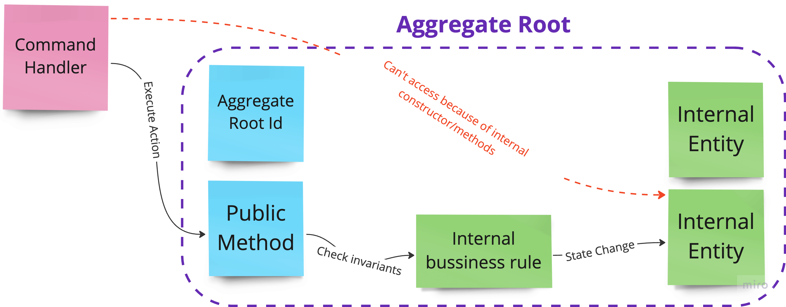

= Chapter 4: Applying Tactical Domain-Driven Design: Focus On Complexity
:toc:

++++

  <picture>
    <source srcset="../Assets/ea_banner_dark.png" media="(prefers-color-scheme: dark)">
    <source srcset="../Assets/ea_banner_light.png" media="(prefers-color-scheme: light)">
    
  </picture>

++++

image:https://github.com/evolutionary-architecture/evolutionary-architecture-by-example/actions/workflows/chapter-4-workflow.yml/badge.svg[Build Status]
image:https://github.com/evolutionary-architecture/evolutionary-architecture-by-example/actions/workflows/chapter-4-contracts-workflow.yml/badge.svg[Build Status]
image:https://github.com/evolutionary-architecture/evolutionary-architecture-by-example/actions/workflows/chapter-4-package-workflow.yml/badge.svg[Build Status]

== Domain Driven Design in a Nutshell
=== What is Domain-Driven Design?

Domain-Driven Design (DDD) is a set of techniques and methods that help developers tackle business complexity.
It is particularly useful for systems full of business processes and rules
that aren’t easy to understand for people unfamiliar with the business area.

Using DDD is not recommended for trivial business cases, such as when the complexity lies only in the technology itself, or when the application is just CRUD-based and can be designed as simple UI mockups (shallow systems).

=== Domain-Driven Design: Tactical vs. Strategic

Domain-Driven Design techniques are split into two categories: __strategic__ and __tactical__.

==== Strategic

Strategic techniques help you explore, analyse, and understand the problem space.
They provide insights into how the company operates, how communication flows,
and help build a shared understanding between the development team and the business.
Strategic techniques emphasise building a ubiquitous language.

Examples of strategic techniques include:

- link:https://www.strategyzer.com/canvas/business-model-canvas[Business Model Canvas]
- link:https://learnwardleymapping.com/[Wardley Maps]
- link:https://www.eventstorming.com/[Event Storming]
- link:https://domainstorytelling.org/[Domain Storytelling]
- link:https://vladikk.com/2018/01/26/revisiting-the-basics-of-ddd/[Domain Categorization]
- link:https://github.com/ddd-crew/context-mapping[Context Mapping]

IMPORTANT: You don't have to use all of them to be successfully. Treat DDD as pharmacy. You should choose the ones that fit your needs and the complexity of the system you’re building.

Let's take a look at the modelling process.

image::Assets/ddd-starter-modeling-circular.svg[]

The larger part of the process is a strategic part. That shows us how important it is to understand the problem space before we start coding. The Tactical part is only a small part of the whole process, but still essential to building good quality software.

NOTE: As you’ve likely noticed, we’ve applied strategic techniques from the first chapter. This included breaking down the business domain into bounded contexts and mapping the relationships between them. We didn’t label it as Strategic DDD at the time because we wanted to focus on resolving problems rather than the tools. However, it’s now necessary to fully explain DDD to ensure everyone has a clear understanding of what it entails.

==== Tactical
Tactical DDD focus on solution implementation for problems that we already comprehend.
They provide a set of patterns and <<building_blocks,building blocks>>
that help developers apply the solution (domain model) in the code and maintain it in the long term.

NOTE: The patterns of tactical DDD are used only in the _Contracts_ microservice due to its domain complexity.

== Case

=== Overview

In Chapter 3, we had to find a way to handle the extreme growth of one of our modules - _Contracts_. Based on concrete factors, the decision was to:

- Extract a separate microservice from the modular monolith for _Contracts_
- Introduce an external component - RabbitMQ - to handle communication between modules and extracted microservice
- Extract building blocks to a separate solution that is built as a NuGet package and reuse it in both modular monolith and microservice

For several weeks, this solution worked as a charm.

However, new requirements appear. The way we signed contracts changed. Additionally, there are new possible actions:

- Termination of the existing __Binding Contract__
- Attaching annex to the existing __Binding Contract__

We already know that there is a plan to complicate _Contracts_ even more in the upcoming weeks and months. _Contracts_ module becomes increasingly complex.

NOTE: In this step, we will focus on tactical Domain-Driven Design. As business logic grows and becomes more complex, we consider applying the Domain Model in the _Contracts_ microservice. It requires a change in thinking and might initially give the impression of something complicated. Nevertheless, it will make this module more straightforward to extend and maintain without dealing with spaghetti code in the long run.

IMPORTANT: It makes no sense to consider the Domain Model in typical CRUD modules or those based on querying, e.g., _Reports_. You don’t need to apply the same patterns in all modules—such behavior is a typical antipattern. Choose a matching solution based on your needs!

=== Requirements

Business requirements changed a lot in comparison to Chapter 3:

1. _Contract_ can still be prepared but doesn’t have the force of law - we treat it as a draft.
2. After the _Contract_ is signed, a __Binding Contract__ is created. It has the force of law and binds the customer with us.
3. After three months, at any time, the customer can terminate __Binding Contract__ without any penalty.
4. It is possible to attach an _Annex_ to the existing __Binding Contract__. This way, the customer can extend the contract for another year without preparing a new _Contract_ for him.
5. Annex can only be attached if a __Binding Contract__ is active - has not yet expired or wasn’t terminated.

=== Main assumptions

The assumptions remain unchanged to keep the environment comparable to the previous step.

=== Solution

== Overview

In this step, we don’t change the project structure of the application.
We focus only on implementing new features and refactoring the code of the _Contracts_ microservice.

We introduce elements like:

- <<aggregate,Aggregates>>
- <<entity,Entities>>
- <<value-object,Value Objects>>
- <<domain-events,Domain Events>>

=== Contracts Bounded Context Tactical Design Analysis

Above image is the result of the Event Storming Design Level workshop.

Let's focus on business rules that we identified during the workshop.

1. **Annex Can Only Start During Binding Contract Period**:
   - An annex can only be attached if it falls within the active period of the ___Binding Contract___. This ensures that all extensions and modifications are valid within the contract's timeframe.

2. **Annex Can Only Be Attached To Active Contracts**:
   - The ___Binding Contract___ must be active, meaning it hasn't expired or been terminated. This rule prevents any modifications to contracts that are no longer valid.

3. **The Previous Annex Must Be Signed**:
   - Any new annex can only be added if the previous annex has been signed. This maintains a clear and enforceable order of amendments, ensuring that no annex is added without proper authorisation.

Let's take a look closer to this rule. __Previous Annex Must Be Signed__. This rule is connected with the relationship between the new and previous annex. This is invariant.

NOTE: Invariant is a rule or condition that must always be true for a system to be considered in a valid state. It ensures the integrity and consistency of the domain model

To enforce these business rules and maintain consistency, we need a robust way to protect invariant, especially in a concurrent environment.

This is where the concept of an <<aggregate,Aggregate>> comes into play.

That’s why the __Binding Contract__ <<entity,entity>> has to be promoted to <<aggregate-root,Aggregate Root>> that will guard the annexes invariants.

image::Assets/aggregate_design_canvas.jpg[]

IMPORTANT: Aggregate is a pattern that solves specific problems. It is not a panacea. "Aggregate Design Canvas" will help you make this decision consciously and consider all essential aspects like purpose, invariants, concurrency and performance. We’re encouraging you to use it in your design process.

Let's proceed with and analysis and take a look at the __Annex__. Annexes are a part of the __Binding Contract__ <<aggregate,aggregate>>. They have to be uniquely identified and encapsulate business logic. We will model it as an <<entity, entity>>  inside the Binding Contract aggregate.

__Binding Contract__ has signature property which has business logic and is no requirement to be uniquely identified. Signature can be compared by its properties, so we’ve chosen <<value-object, value object>> as building block to model this concept.

Every time we attach annex to the __Binding Contract__, we want to notify other parts of the system about this event. This is a perfect use case for <<domain-events,Domain Events>>.

[[building_blocks]]
=== Building Blocks:

[[entity]]
==== Entity

An **Entity** is a representation of a business concept that has its own identity. It is defined by its attributes, behavior, and identity. Entities are used to model objects that have a lifecycle and are mutable.

==== Main characteristics of entities:

- They have a unique identity
- They represent a business concept
- They have behavior (methods)
- They have state (properties)
- They can be changed over time
- They encapsulate business logic
- They can raise domain events after creating or state change
- They can be internal part of an aggregate
- They can be becoming aggregate root when needed of protecting invariants
- In one bounded context concept can be modelled as a value object and in another as an entity

[source,csharp]
----
public sealed class Annex : Entity
{
    public AnnexId Id { get; init; } // Unique Entity Id
    public BindingContractId BindingContractId { get; init; }
    public DateTimeOffset ValidFrom { get; init; } // State

    // EF needs this constructor to create non-primitive types
    private Annex() { }

    private Annex(BindingContractId bindingContractId, DateTimeOffset validFrom)
    {
        Id = AnnexId.Create();
        BindingContractId = bindingContractId;
        ValidFrom = validFrom;

        var @event = AnnexAttachedToBindingContractEvent.Raise(Id, BindingContractId, ValidFrom); // Raise domain event
        RecordEvent(@event); 
    }

    internal static Annex Attach(BindingContractId bindingContractId, DateTimeOffset validFrom) =>
        new(bindingContractId, validFrom); // Behavior method
}
----

NOTE: You probably have heard about Anemic Domain Model. This is known as anti-pattern. It is an entity that has only properties and no behavior. It is acceptable when you have simple CRUD operations. In complex process, we recommend encapsulating behavior (methods) in the domain entity instead of having this logic in the service layer.

[[value-object]]
==== Value Object

A **Value Object** represents a business concept without a lifecycle. Unlike entities, value objects lack identity. They are immutable, serving as explicit types that describe specific aspects of the domain. 

They enhance our domain model's expressiveness, prevent invalid object state and help us avoid primitive obsession.

"Primitive Obsession" is a code smell where we use primitive types to represent domain concepts. 

++++

  

++++

For e.g., you can treat _SSN_ as _string_. _String_ allows put to field every character, but _SSN_ has a specific format. Take a look at the image above. You can see that _SSN_ is just only small subset of _string_ possible values.
**Value object is precise and can validate a format during object initialization.**

==== Examples from different domains:
- Iccid (International Circuit Card Identifier) in the telecommunication domain (this not just string but every character matter)
- Money in the financial domain (amount and currency)
- Address in the e-commerce domain
- PhoneNumber in the telecommunication domain
- Email in the e-commerce domain
- Energy Indicator in the eco domain (amount and unit)

==== Main characteristics of value objects:
- They have no identity
- They represent a business concept
- They can encapsulate business logic like validation during object initialisation
- They can be used as a part of an entity or aggregate root
- They’re immutable
- They’re compared by their properties
- They have equals and hashcode methods implemented
- In one bounded context concept can be modelled as a value object and in another as an entity

[source,csharp]
----
public sealed partial class Signature
{
    private static readonly Regex SignaturePattern = SignatureAllowedCharacters();
    public DateTimeOffset Date { get; }
    public string Value { get; }

    private Signature(DateTimeOffset date, string value)
    {
        Date = date;
        if (!SignaturePattern.IsMatch(value))
        {
            throw new SignatureNotValidException(value);
        }

        Value = value;
    }

    public static Signature From(DateTimeOffset signedAt, string signature) =>
        new(signedAt, signature);

    [GeneratedRegex(@"^[A-Za-z\s]+$")]
    private static partial Regex SignatureAllowedCharacters();
}
----

[[aggregate]]
==== Aggregate

The **Aggregate** enforces consistency by aggregating changes that must occur together to uphold the aggregate’s invariants. This means that all changes within the aggregate are applied in a way that preserves the business rules and consistency requirements.

It consists of one root entity, known as the <<aggregate-root, Aggregate Root>>, and may include other entities and value objects.
Consider the aggregate root as a safeguard for invariants,
ensuring that the aggregate is consistent immediately.
These invariants are critical domain rules that must remain consistent, and they’re inseparable.

NOTE: The pattern name “aggregate”,  might be confusing. An aggregate doesn’t aggregate data or collections of objects or entities. Instead, it aggregates together the pieces of data that **must change together** to **maintain consistency rules**.

Aggregates are also transactional boundaries. All changes to the aggregate should be done through the aggregate root. This ensures that the aggregate is always in a consistent state.

NOTE: When you’re looking for boundaries of an aggregate, you should consider which data has to change together (has to be in the same transaction) and which data can be changed independently.

==== Main characteristics of aggregate roots:
- They enforce business rules and invariants internally
- They have a unique identity
- They encapsulate entities and value objects and protect them from direct access
- They’re transactional boundaries
- They have a lifecycle
- They’re lightweight
- Each method execution state change is wrapped in a transaction
- They can raise domain events after creating or state change

[[aggregate-root]]
The aggregate has its root.
Entity which has been chosen as root will wrap all invariants,
usually other entities and value objects will be also included.
It will be the only way to access them.
This Root entity is called **Aggregate Root**.

[[domain-events]]
==== Domain Events

**Domain Events** are used to capture and communicate important events that occur within the domain, they’re treated as internal events. They can be transformed to public events and published to the outside world to notify other parts of the system about the changes and trigger workflows.

[source,csharp]
----
public sealed record AnnexAttachedToBindingContractEvent(
    Guid Id,
    AnnexId AnnexId,
    BindingContractId BindingContractId,
    DateTimeOffset ValidFrom,
    DateTime OccuredAt) : IDomainEvent
{
    internal static AnnexAttachedToBindingContractEvent Raise(
        AnnexId annexId,
        BindingContractId bindingContractId,
        DateTimeOffset validFrom)
        => new(
            Guid.NewGuid(),
            annexId,
            bindingContractId,
            validFrom,
            DateTime.UtcNow);
}
----

[source,csharp]
----
public interface IDomainEvent
{
    Guid Id { get; }

    DateTime OccuredAt { get; }
}
----

NOTE: Because of entities and aggregates are highly encapsulated; domain events are the only way to check if something happened in the domain model. They’re used as assertion in unit tests that make them more business expressive.

=== Persistence Domain Model
==== Persistence Ignorance
Persistence Ignorance is a principle that states that domain model shouldn’t be aware of the persistence mechanism. It shouldn’t have any dependencies on the database or any other storage mechanism. This allows the domain model to be more focused on the business logic and be easier to test. When are you working on infrastructure, you don't touch crucial business logic, which is good.

image::Assets/persistance_ignorance.png[]

== How to Run?

=== Requirements
- .NET SDK
- PostgresSQL
- Docker

=== How to get .NET SDK?

To run the `Fitnet` application, you will need to have the recent `.NET SDK` installed on your computer.
Click link:https://dotnet.microsoft.com/en-us/download[here] 
to download it from the official Microsoft website.

=== Run locally

The `Fitnet` application requires `Docker` to run properly.

There are only 5 steps you need to start the application:

1. Create you own personal access token in GitHub (it is needed to be able to download our GH Packages for `Common`). Instruction how to do it you can find https://www.educative.io/answers/how-to-create-a-personal-access-token-for-github-access[here]. Your PAT must have only one value of `read:packages`. Note the token somewhere as it won't be possible to read it again.
2. Go to `Contracts\Src` folder and edit `Dockerfile`. You must change `your_username` and `your_personal_access_token` to your own values (your GH username and PAT that you generated in Step 1). Repeat the step for `ModularMonolith\Src`.
3. Make sure that you go back to `root` directory of Chapter 3. 
4. Run `docker-compose build` to build the image of the application.
5. Run `docker-compose up` to start the application. In the meantime it will also start Postgres inside container.

The `Fitnet` modular monolith application runs on port `:8080`. Please navigate to http://localhost:8080 in your browser or http://localhost:8080/swagger/index.html to explore the API.

The `Contracts` microservice runs on port `:8081`. Please navigate to http://localhost:8081 in your browser or http://localhost:8081/swagger/index.html to explore the API.

That's it! You should now be able to run the application using either one of the above. :thumbsup:

=== Building and debugging code in Rider IDE

Before you build or debug code in `Rider` or `Visual Studio` IDE, you first have to provide your username and previously generated PAT for artifactory to download packages for `Common` which is a part of this repository. When you load the solution, your IDE should request the credentials:  

 - Rider: 
++++

  

++++
 - Visual Studio: 
++++

  

++++

In case of any issues, you can add nuget feed manually:

- `Rider`
   1. Open `JetBrains Rider`, right click on the solution in the solution explorer and click `Manage NuGet Packages`.
   1. Click on the `Sources` tab.
   1. Click the `+` button to add a new package source.
   1. In the `Add Package Source` window, provide Artifactory URL in the `https://nuget.pkg.github.com/evolutionary-architecture/index.json`, fill your Github Username and PAT.
   1. Click `OK` to confirm the new package source.
   1. Make sure your new package source is enabled and then click `OK` to close the `Settings` window.
   1. You sould be promted for user name and password (PAT).
- `Visual Studio`
   1. Open `Microsoft Visual Studio`, right click on the solution in the solution explorer and click `Manage NuGet Packages for Solution`.
   1. Click on the `gears` icon.
   1. Click the `+` button to add a new package source.
   1. Set the package name and se the source to Artifactory URL `https://nuget.pkg.github.com/evolutionary-architecture/index.json`.
   1. You sould be promted for user name and password (PAT).
   1. Click `OK` to confirm the new package source.

You should now be able to restore and download the EvolutionaryArchitecture nuget packages from your Artifactory source within Rider.

NOTE: The provided instruction is primarily intended for JetBrains Rider. However, the procedure for adding a NuGet package source in alternative IDEs like Visual Studio is quite similar.

=== How to run Integration Tests?
Running integration tests for both the `Fitnet` Modular Monolith and `Fitness.Contracts` applications involves similar steps, as the testing setup for both projects.
To run the integration tests for project, you can use either the command:
[source,shell]
----
dotnet test
----
or the `IDE test Explorer`. 

These tests are written using `xUnit` and require `Docker` to be running as they use `test containers` package to run `PostgresSQL in a Docker` container during testing. 
Therefore, make sure to have `Docker` running before executing the integration tests.