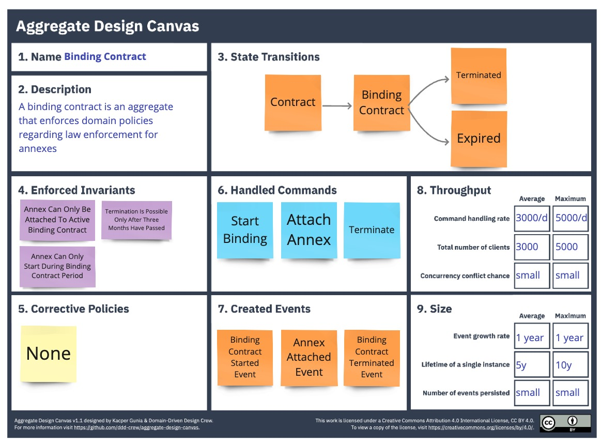
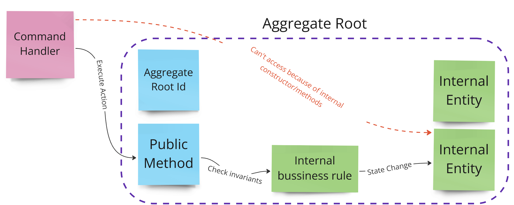
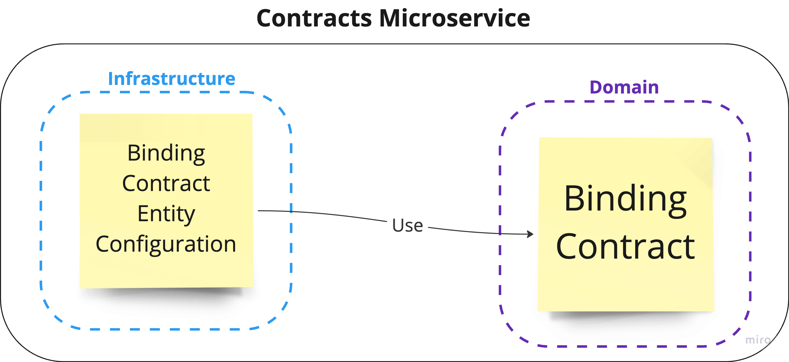

= 第4章：战术领域驱动设计——专注于复杂性
:toc:

++++

  <picture>
    <source srcset="../Assets/ea_banner_dark.png" media="(prefers-color-scheme: dark)">
    <source srcset="../Assets/ea_banner_light.png" media="(prefers-color-scheme: light)">
    
  </picture>

++++

image:https://github.com/evolutionary-architecture/evolutionary-architecture-by-example/actions/workflows/chapter-4-workflow.yml/badge.svg[构建状态]
image:https://github.com/evolutionary-architecture/evolutionary-architecture-by-example/actions/workflows/chapter-4-contracts-workflow.yml/badge.svg[构建状态]
image:https://github.com/evolutionary-architecture/evolutionary-architecture-by-example/actions/workflows/chapter-4-package-workflow.yml/badge.svg[构建状态]

== 领域驱动设计简介
=== 什么是领域驱动设计（DDD）？

领域驱动设计（DDD）是一套帮助开发者应对业务复杂性的技术和方法，尤其适用于充满业务流程和规则、外行难以理解的系统。

对于业务简单、仅技术复杂或纯 CRUD 的系统，不建议采用 DDD。

=== DDD：战略与战术

DDD 技术分为__战略__和__战术__两类。

==== 战略

战略技术帮助你探索、分析和理解问题空间，建立团队与业务的共同语言。

常用战略方法：

- 业务模型画布
- Wardley 地图
- 事件风暴
- 领域故事
- 领域分类
- 上下文映射

IMPORTANT: 不必全部使用，按需选用。

建模流程如图：

image::Assets/ddd-starter-modeling-circular.svg[]

战略部分占比最大，说明理解问题空间比编码更重要。

NOTE: 本项目从第1章起已应用战略 DDD（如有界上下文拆分），只是未特别强调。

==== 战术

战术 DDD 关注已理解问题的解决方案实现，提供一套模式和<<building_blocks,构建块>>，帮助开发者在代码中实现和维护领域模型。

NOTE: 战术 DDD 仅用于 _Contracts_ 微服务，因为其领域复杂。

== 案例

=== 概述

第3章中，为应对 _Contracts_ 模块的极端增长，我们：

- 将 _Contracts_ 拆分为微服务
- 引入 RabbitMQ 处理模块间通信
- 公共构建块提取为 NuGet 包

一段时间后，业务需求变化：

- 合同签署方式变化
- 新增合同终止、附加附件等操作

预计 _Contracts_ 还会持续变复杂。

NOTE: 本章聚焦战术 DDD，随着业务复杂度提升，考虑在 _Contracts_ 微服务中应用领域模型。

IMPORTANT: 典型 CRUD 或查询型模块无需领域模型，切勿一刀切。

=== 需求

业务需求变化如下：

1. 合同可准备但无法律效力，仅为草稿。
2. 签署后生成__正式合同__，具法律效力。
3. 三个月后，客户可随时无罚金终止正式合同。
4. 可为正式合同附加附件，延长一年，无需新合同。
5. 仅在正式合同有效期内可附加附件。

image::Assets/flow.png[]

=== 主要假设

假设与第3章一致。

=== 解决方案

== 概览

本章不改变项目结构，仅实现新功能并重构 _Contracts_ 微服务代码。

引入：

- <<aggregate,聚合>>
- <<entity,实体>>
- <<value-object,值对象>>
- <<domain-events,领域事件>>

=== _Contracts_ 有界上下文战术设计分析

image::Assets/design-level-event-storming.png[设计级事件风暴]

聚焦业务规则：

1. **附件仅可在正式合同有效期内添加**
2. **仅可为有效合同添加附件**
3. **前一个附件必须已签署**

如“前一个附件必须已签署”属于不变式（invariant），需用聚合根保护。

NOTE: 不变式是系统始终必须满足的规则，保证领域模型一致性。

因此，__正式合同__需提升为<<aggregate-root,聚合根>>，守护附件相关不变式。

IMPORTANT: 聚合模式解决特定问题，建议用“聚合设计画布”辅助决策。

附件作为聚合内实体，需唯一标识并封装业务逻辑。签名属性用值对象建模。

每次添加附件需通知系统其他部分，适合用领域事件。

[[building_blocks]]
=== 构建块：

[[entity]]
==== 实体

实体有唯一标识，代表业务概念，有行为和状态，可变。

- 唯一标识
- 代表业务概念
- 有行为和状态
- 可变
- 封装业务逻辑
- 可触发领域事件
- 可作为聚合内部成员
- 可晋升为聚合根

示例：
[source,csharp]
----
public sealed class Annex : Entity
{
    public AnnexId Id { get; init; }
    public BindingContractId BindingContractId { get; init; }
    public DateTimeOffset ValidFrom { get; init; }
    // ...
}
----

NOTE: 仅有属性无行为的“贫血模型”是反模式，复杂业务建议将行为封装进实体。

[[value-object]]
==== 值对象

值对象无标识、不可变，仅用属性判等，适合表达精确业务概念，防止“原始类型偏执”。

- 无标识
- 代表业务概念
- 可封装如格式校验等业务逻辑
- 可作为实体/聚合根成员
- 不可变
- 用属性判等

示例：
[source,csharp]
----
public sealed partial class Signature
{
    // ...
}
----

[[aggregate]]
==== 聚合

聚合通过聚合根统一管理内部实体和值对象，保证业务不变式和一致性，是事务边界。

- 内部强一致性
- 唯一标识
- 封装实体和值对象
- 事务边界
- 生命周期
- 可触发领域事件

[[aggregate-root]]
聚合根是唯一访问聚合内部成员的入口。

[[domain-events]]
==== 领域事件

领域事件用于捕捉和传播领域内的重要事件，可转为公开事件通知系统其他部分。

[source,csharp]
----
public sealed record AnnexAttachedToBindingContractEvent(
    Guid Id,
    AnnexId AnnexId,
    BindingContractId BindingContractId,
    DateTimeOffset ValidFrom,
    DateTime OccuredAt) : IDomainEvent
{
    // ...
}
----

NOTE: 领域事件是测试领域模型行为的唯一入口。

=== 持久化领域模型
==== 持久化无关性

领域模型应与持久化机制解耦，便于聚焦业务逻辑和测试。

== 如何运行？

=== 依赖要求
- .NET SDK
- PostgresSQL
- Docker

=== 如何获取 .NET SDK？

访问 https://dotnet.microsoft.com/en-us/download[官方下载页面] 下载并安装。

=== 本地运行

只需5步：

1. 在 Github 创建个人访问令牌（PAT），仅需 `read:packages` 权限。生成后妥善保存。
2. 分别编辑 `Contracts/Src` 和 `ModularMonolith/Src` 下的 Dockerfile，将 `your_username` 和 `your_personal_access_token` 替换为你的 Github 用户名和 PAT。
3. 回到第4章根目录。
4. 执行 `docker-compose build` 构建镜像。
5. 执行 `docker-compose up` 启动应用（会自动启动 Postgres）。

单体应用运行在 `:8080` 端口，访问 http://localhost:8080 或 http://localhost:8080/swagger/index.html。

`Contracts` 微服务运行在 `:8081` 端口，访问 http://localhost:8081 或 http://localhost:8081/swagger/index.html。

=== Rider/VS IDE 构建与调试

首次加载解决方案时，IDE 会请求输入用户名和 PAT 以下载包。

如遇问题，可手动添加 NuGet 源，详见英文文档说明。

=== 如何运行集成测试？

单体和微服务均可在对应测试项目下执行：

[source,shell]
----
dotnet test
----

或用 IDE 测试工具。

测试基于 xUnit，需 Docker 正常运行（测试用 test containers 启动 Postgres）。

