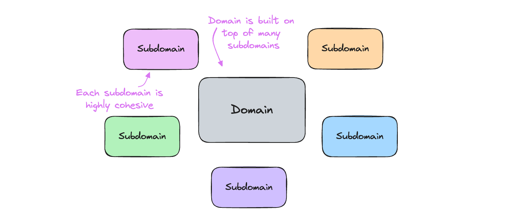
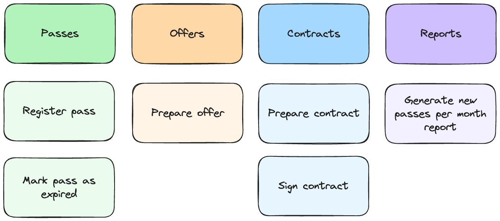

= Evolutionary Architecture
Maciej "MJ" Jedrzejewski; Kamil Baczek
:toc:

++++

  <picture>
    <source srcset="Assets/ea_banner_dark.png" media="(prefers-color-scheme: dark)">
    <source srcset="Assets/ea_banner_light.png" media="(prefers-color-scheme: light)">
    
  </picture>

++++

image:https://img.shields.io/github/v/release/evolutionary-architecture/evolutionary-architecture-by-example[realease, alt="realease"]

image:https://img.shields.io/github/license/evolutionary-architecture/evolutionary-architecture-by-example[GitHub license, alt="License Badge"]
image:https://img.shields.io/github/stars/evolutionary-architecture/evolutionary-architecture-by-example[GitHub stars, alt="Stars Badge"]
image:https://img.shields.io/github/commit-activity/m/evolutionary-architecture/evolutionary-architecture-by-example[GitHub commits, alt="Commits Badge"]
image:https://img.shields.io/github/last-commit/evolutionary-architecture/evolutionary-architecture-by-example[GitHub last commit, alt="Last Commit Badge"]
image:https://img.shields.io/github/issues/evolutionary-architecture/evolutionary-architecture-by-example[GitHub issues, alt="Issues Badge"]
image:https://img.shields.io/github/issues-pr/evolutionary-architecture/evolutionary-architecture-by-example[GitHub pull requests, alt="Pull Requests Badge"]
image:https://img.shields.io/github/forks/evolutionary-architecture/evolutionary-architecture-by-example[GitHub forks, alt="Forks Badge"]
image:https://img.shields.io/github/watchers/evolutionary-architecture/evolutionary-architecture-by-example[GitHub watchers, alt="Watchers Badge"]
image:https://img.shields.io/discord/1140287971367600148[alt="Discord Active"]

== Objective

=== Problem
When searching for guidance on .NET solution architecture, you will find countless repositories and resources. Each tends to focus exclusively on their preferred approach, whether it is:

- Clean, Onion or Hexagonal architecture
- Tactical Domain-Driven Design
- Modular monolith
- Microserverices

The real challenge? Most materials present their chosen approach as the universal solution, overlooking the nuanced reality of day-to-day software development. What is missing is a clear decision map to help you understand when and how to combine these different architectural elements and patterns.

The examples you do find often fall into two extremes: oversimplified demos that don't reflect real-world complexity, or overwhelming enterprise-scale applications that are difficult to learn from. Even worse, some resources inadvertently perpetuate misconceptions by conflating different architectural concepts.

We have all heard the phrase "it depends" so often it's become a cliché. Yes, every decision depends on context-but that doesn't mean we can't develop heuristics to guide our choices.

This repository offers something different: not just another static collection of patterns, but an evolutionary journey through the software architecture decision-making process. Here you will learn how to evaluate tradeoffs, combine approaches, and craft solutions that meet your specific needs at any given time.

Such an approach plays well with the dynamics of system implementation. Every development project faces a fundamental challenge that is called _"_The Project Paradox_:

image::Assets/project_paradox.png[]

When we start a project, we need to make crucial architectural decisions - exactly when we understand the domain the least. This creates a strong temptation to fall into one of two extremes - overcomplicated trap or oversimplified pitfall.

Too often, we get swept up in tech trends and conference talks, leading us to preemptively adopt:

- Microservices before understanding our scaling needs
- Complex orchestration systems
- Data streaming solutions
- NoSQL databases
- Caching layers

...and more, "just in case we need them."

The result? We create our own complexity nightmare. New team members face a steep learning curve, costs spiral without clear benefits, and identifying performance bottlenecks becomes a maze of interconnected systems. We end up solving problems we don't have yet while making it harder to solve the ones we do.

The opposite extreme, though less common, is equally problematic: starting too simple and staying there too long. This usually manifests as a monolith that grows unchecked until it becomes an unmaintainable "big ball of mud" - where new features simply get piled on without proper boundaries or structure.

What we will show you is an evolutionary approach to architecture - one that grows with your understanding of the domain, and the complexity of your system. This path will help you build systems that are neither overengineered from the start nor too simplistic to scale.

=== Solution
Our approach unfolds like a story across four chapters, each building upon the last.

The entire repostiory reflects years of real-world experience, including the lessons we learned the hard way. Our goal is to guide you toward architecture that grows with your needs – neither too simplistic to scale nor too complex to maintain.

What we cover:

- Analysis of a representative business domain (Fitness)
- Domain-Driven Design (strategic and tactical)
- Architectural patterns selection and evolution
- Hybrid architecture combining modular monolith and microservices
- Loose coupling
- .NET backend implementation with minimal API
- Architecture decision log
- Clean coding practices

What we leave to you:

- Frontend technology choice (React, Vue, Angular, Svelte, etc.)
- Logging implementation (we recommend https://serilog.net/[Serilog])
- Contract testing (we suggest https://github.com/pact-foundation/pact-net[Pact Net])

==== Chapter 1: Initial Architecture: Focus On Simplicity
In this chapter, we will show you how to lay the right foundation for your solution architecture. Our approach begins with a single project (`Fitnet`) that is thoughtfully organized from day one - but without overcomplicating things.

The key is our vertical slice approach: each business process gets its own namespace, creating natural boundaries while keeping related code together. Think of it as organizing by what your software does rather than by technical categories.

Why this works:

- Hit the ground running - spend time building features instead of debating project structures
- Everything for a process lives in one place (like SignContract) - no more jumping between Controllers, Entities, and Services folders
- Future-proof your code - need to remove or relocate a feature? Just grab its namespace

Our modules talk to each other through a simple in-memory queue - just enough infrastructure to get the job done without overcomplicating things.

More information:

- link:/Chapter-1-initial-architecture/README.adoc[Chapter's readme]
- https://s.icepanel.io/vY0SkvgDs7V83U/wOj3[Interactive diagram]

==== Chapter 2: Modules Separation: Focus On Maintainability
In this chapter, we will tackle a familiar scenario: your initial architecture is starting to show its limits. Your codebase has matured, and reality has begun to diverge from your early assumptions. Some modules are more complex than anticipated, others simpler. Meanwhile, your growing team is wrestling with merge conflicts in your single project.

Time for the next evolution of your architecture. We will split our project into purpose-built projects that match each module's actual needs.

Simple modules stay simple:

- `Fitnet.Reports`

When all you need is straightforward data access and presentation? One project could be enough.

Middle-ground modules find their balance

- `Fitnet.Passes.Api`
- `Fitnet.Passes.DataAccess`

Perfect for modules that need clean data access patterns but aren't swimming in complex business rules.

Complex domains get room to breathe

- `Fitnet.Contracts.Api`
- `Fitnet.Contracts.Application`
- `Fitnet.Contracts.Core`
- `Fitnet.Contracts.Infrastructure`

For those modules where business logic runs deep.

The beauty of this approach? Each module gets exactly the architecture it deserves - no more, no less. Meanwhile, our modules keep talking through the same in-memory queue, proving you don't need to complicate everything at once.

More information:

- link:/Chapter-2-modules-separation/README.adoc[Chapter's readme]

==== Chapter 3: Microservice Extraction: Focus On Growth

In this chapter, we tackle a crucial evolution: knowing when and how to extract your first microservice. We will explore the real-world signals (we call them "disintegrators") that tell you it is time to let a module spread its wings and become independent.

But extracting a microservice is just part of the story. We will also level up our communication game by replacing our trusty in-memory queue with a proper message queue component. This isn't just about following trends - it is about building the robust communication backbone and ensure redundancy that your growing system needs to communicate with the new microservice.

Along the way, you will pick up key microservice architecture concepts - not just the theory, but the practical knowledge you need to make it work in the real world.

More information:

- link:/Chapter-3-microservice-extraction/README.adoc[Chapter's readme]
- https://s.icepanel.io/EPX45vmGXfBpnJ/cBSP[Interactive diagram]

==== Chapter 4: Applying Tactical Domain-Driven Design: Focus On Complexity

In the final chapter of our journey, we will show you something powerful: you can grow into a domain model without starting from scratch. Getting there is more like evolution than revolution.

Remember all that work you did early on - breaking down your domain, identifying subdomains, and organizing them into modules? Surprise! You have already done most of the heavy lifting for strategic Domain-Driven Design. That's right - your foundation is stronger than you thought.

Now comes the fun part: tactical DDD. Think of it as adding precision tools to your toolkit:

- Value Objects
- Entities
- Aggregates
- Domain Events

The best part? You don't need to apply every DDD concept to get value. It is like a chef's kitchen - you don't need every gadget to cook great meals, just the right ones for your dish.

More information:

- link:/Chapter-4-applying-tactical-domain-driven-design/README.adoc[Chapter's readme]

==== Additional notes
Each chapter includes static code analysis to maintain code quality – a practice we strongly recommend for production environments.

NOTE: All chapters represent various patterns and practices, but they are not hard and fast rules. Choose the approaches that meet your specific needs, or combine them to create the solution that fits your context. Think of this as your architectural compass, ready when you need it.

== Domain

=== Overview
It is time to look at our domain. We have chosen a fitness domain as our example – one that seems familiar at first glance. Most people recognize the basic flow:

- Getting membership offers
- Preparing and signing contracts
- Getting access passes
- Attending fitness classes

But this surface-level familiarity can be deceptive.

However, to identify the above processes, you usually need to analyze the domain with domain experts and break it down into smaller pieces called subdomains. Otherwise, there is a high risk of falling into a big ball of mud (or distributed mud) where everything is tightly coupled.

NOTE: The traditional domain expert is often pictured as a business representative – someone who lives and breathes the business processes every day. But don't overlook another crucial source of domain expertise: your developers, especially those who have been in the trenches with legacy systems. **Think about it:** developers working with legacy code must understand not just how the system works, but why it works that way. They have seen the edge cases, handled the exceptions, and often know which business rules are truly critical versus which ones are historical artifacts.

What appears to be a straightforward domain actually conceals layers of complexity:

- Pass expiration and renewal workflows
- Sophisticated discount strategies
- VIP member privileges
- Access control and rejection handling
- Membership status transitions

While we won't model every aspect of a fitness studio's operations (that would be a year-long endeavor!), we will demonstrate something more valuable: how to identify and separate key subdomains, and how to build extensible components that can grow with your needs. We have carefully chosen examples that are complex enough to illustrate real-world challenges while remaining manageable and instructive.

Ultimately, you should be able to apply similar techniques to your own complex domains, regardless of industry.

=== Subdomains
Every complex business domain becomes more manageable when broken down into smaller pieces. In domain modeling, we call these pieces _Subdomains_. Each subdomain represents a cohesive part of the domain. 

But how do we identify them?

While there are several effective approaches to domain decomposition, we particularly value two powerful techniques:

- https://www.eventstorming.com[Event Storming]: A collaborative modeling method that helps discover domain events and processes
- https://domainstorytelling.org[Domain Storytelling]: A visual approach to understanding business processes through storytelling

Both techniques help reveal the natural boundaries in your system by focusing on business flows and interactions. We won't focus on the details of either here, just the results you can achieve.

After careful analysis, we have identified the following subdomains that represent fitness domain:

NOTE: Watch out! You might have noticed we used simple names like _Pass, Offer,_ and _Contract_ for our subdomains. While these work for our example, they could lead you down the wrong path in real projects. These entity-like names can limit your thinking about what a subdomain represents. Instead, think in terms of business capabilities and processes. For example, instead of _Passes_, consider _Passes Registration_; rather than _Offers_, use _Offers Management_. This process-oriented naming becomes especially valuable when your domain grows. You might need to split a subdomain into more specific business processes – for instance, breaking _Offers Management_ into _Offer Publishing_ and _Offer Advertising_. 

While there are many processes in each of the subdomains, we have chosen specific workflows to keep our example focused and meaningful:

Here is where things get interesting: these six processes across four subdomains initially appear independent. However, this isolation represents a common architectural pitfall in real-world applications. To make our example more realistic and instructive, we need to address how these subdomains communicate with each other.

image::Assets//subdomains_communication.png[]

Our fitness studio system comes alive through two key interactions:

- First, when you sign a contract, the system automatically registers your access pass
- Second, when your membership nears expiration, it triggers the creation of an  offer

These workflows demonstrate how our seemingly separate subdomains need to work together in real-world scenarios.

Now we need to somehow transform our subdomains into a technical solution. It is time to focus on bounded contexts.

=== Bounded Contexts
To represent subdomains in your technical solution, you need a model. Often, we decide to just create a single, unified model for the entire solution. Unfortunately, this leads in future to a lot of issues because every subdomain operates in its own, and unique context.

Let us explain.

Imagine having two subdomains of _Workout Programming_ and _Meal Planning_ and each operate with the _Set_ term. However, it has very different meanings in each context:

- In _Workout Programming_, a it refers to a specific number of exercise repetitions (like "3 sets of 10 pushups")
- In _Meal Planning_, it means a predefined collection of meals (like "the basic meal set includes breakfast, lunch, and two snacks")

Using a single model across different subdomains forces your code to constantly check its context before applying business logic. This inevitable path leads to what developers jokingly call "ifology" - a maze of nested if-statements spreading throughout your codebase. Soon enough, what started as a simple intent to reuse code transforms into the dreaded "big ball of mud" or "spaghetti code" - where business rules become so intertwined that making even small changes becomes risky and time-consuming.

Another approach is to divide your system into multiple models. Each model will represent its ubiquitous language, business capabilities, and rules. This approach allows models to be extended independently without affecting the others. This way each model becomes a separate bounded context.

IMPORTANT: Don't be misled by the word "ubiquitous" in "ubiquitous language" - it is a common trap that catches many development teams. It is only universal (ubiquitous) within its specific bounded context, not across your entire system. 

While working on software systems, you will usually face one of the following cases:

- Multiple subdomains are represented by a single bounded context
- Each subdomain is represented by a single bounded context

In our implementation, we have made a deliberate architectural choice: each subdomain operates as its own bounded context, establishing clear boundaries and independence. However, it is important to note that real-world domains aren't always this neat. Sometimes multiple subdomains naturally group together into a single bounded context. Take, for example, how _Progress Tracking_, and _Virtual Coaching_ might naturally combine into a "Personalized Training" bounded context.

One of the really useful tools while working on the definition of bounded contexts is https://github.com/ddd-crew/bounded-context-canvas[Bounded Context Canvas] from DDD Crew.

When you are finished defining all the bounded contexts, you should define the communication and integration map between them. You can use a _Context Map_ to do this, but we will not focus on explaining it here.

== Repository Structure

=== Overview

Think of this repository as a novel rather than a technical manual. Each chapter builds naturally on the last, telling the story of how a real-world application evolves from its first lines of code to a mature, well-architected system. Simply follow the chapters in order, like turning the pages of a book, and see how each architectural decision naturally leads to the next. This "story-first" approach helps you understand not only what we built, but also why we made each choice along the way (supported by the architecture decision log).

=== How To Navigate?

This repository is organized with crystal-clear simplicity: beyond this main README and its supporting assets, you will find four key chapters that tell our evolutionary story:

In each folder you will find the same root solution, but expanded:

- Chapter 1: Your starting point - a simple, initial architecture
- Chapter 2: Growing pains lead to project separation
- Chapter 3: Taking the microservice leap and upgrading communication
- Chapter 4: Embracing tactical DDD in a maturing microservice

Each chapter comes with its own detailed README - think of it as a chapter-specific guide that walks you through running the code, understanding the structure, and grasping concepts unique to that stage. We believe in building on knowledge, not repeating it, so each chapter focuses on what is new while assuming you are familiar with what came before.

IMPORTANT: While you are free to explore these chapters in any order, we strongly recommend starting with Chapter 1 and progressing sequentially. Like any good story, the earlier chapters lay crucial groundwork that makes later developments more meaningful. Jumping ahead might leave you missing important context and concepts.

== Libraries and Platforms Used

Our solution is built with C# and .NET 9, complemented by a carefully curated set of libraries and platforms. We have intentionally kept external dependencies minimal - just enough to avoid reinventing wheels while keeping the focus on architecture. While using third-party tools means trading some control for productivity, we believe it is a worthwhile tradeoff for most business applications.

Application:

- https://www.docker.com[Docker]
- https://docs.fluentvalidation.net/en/latest/[Fluent Validation]
- https://github.com/jbogard/MediatR[MediatR]
- https://github.com/DapperLib/Dapper[Dapper]
- https://github.com/dotnet/efcore[Entity Framework]
- https://github.com/npgsql/npgsql[Npgsql]
- https://github.com/SonarSource/sonar-dotnet[SonarAnalyzer]
- https://github.com/dotnet/aspire[.NET Aspire]

Testing:

- https://github.com/xunit/xunit[xunit]
- https://nsubstitute.github.io/[NSubstitute]
- https://github.com/VerifyTests/Verify[Verify]
- https://github.com/bchavez/Bogus[Bogus]
- https://docs.shouldly.org/documentation/getting-started[Shouldly]
- https://dotnet.testcontainers.org[Test Containers]

== Videos 🎥

You can get a solid understanding of Evolutionary Architecture through these videos:

=== Webinar from Architecture Weekly 🇬🇧

In this webinar, Maciej "MJ" Jedrzejewski gives an in-depth presentation on Evolutionary Architecture. You can watch the recorded webinar at https://www.architecture-weekly.com/p/webinar-11-maciej-mj-jedrzejewski[here].

=== Presentation at Programistok 2023 Conference 🇵🇱

This is a recorded presentation from the Programistok 2023 conference where Evolutionary Architecture was explained in detail. You can watch it on YouTube link:https://www.youtube.com/watch?v=tfCtM8D_DZ4[here].

=== Evolutionary Architecture Visualized Through NDepend 🇬🇧

Explore Evolutionary Architecture visualized with NDepend, with comprehensive dependency and code analysis in the form of an interview with Kamil conducted by Ferry de Boer. Watch it on YouTube at https://www.youtube.com/watch?v=Z60SAiVevIM&t[here].

== Authors ✍️

[cols=2*,options=header]
|===
|Maciej "MJ" Jedrzejewski
|Kamil Baczek

|Author of the book "Master Software Architecture", technology agnostic architect, and Microsoft MVP.

http://mastersoftwarearchitecturebook.com[Book]
https://newsletter.fractionalarchitect.io[Newsletter]
https://www.linkedin.com/in/jedrzejewski-maciej/[Linkedin]

|.NET Engineer, software architect, and Microsoft MVP who empowers teams to build better software through solid software architecture, utilising techniques such as Event Storming, Domain Driven Design and various architecture styles and design patterns.

https://artofsoftwaredesign.net/[Blog]
https://www.linkedin.com/in/kamilbaczek/[Linkedin]
https://github.com/kamilbaczek[Github]
|===

== 👩‍💻👨‍💻 What Software Engeeniers Say

=== 👨‍💼 Chief Software Architect
____
Really appreciate the repository and the content you are sharing. I think it is really valuable to see the evolutionary approach in practice, and focus on simplicity and pragmatic reasoning and making decisions in software design.
____

=== 👨‍💻 .NET Developer
____
Your work has been super helpful as I dive deeper into this field. Evolutionary Architecture, in particular, is incredible and has really clicked for me thanks to your examples and insights.
____

=== 👨‍💻 .NET Developer
____
I was always concerned about what architecture to use on a project. Sometimes, spending time on researching what's right affects my motivation. Your approach which focuses on creating a project with an architecture that evolves resonates perfectly with me. Your efforts in creating such a wonderful resource is greatly appreciated.
____

== 💬 Join our Community
Connect with fellow architects and developers in our "Evolutionary Architecture" community on our https://discord.gg/BGxYkHFCCF[Discord]. Share your questions, suggestions, or feedback about our repository - we're here to learn and improve together.

image::Assets/discord.png[link="https://discord.gg/BGxYkHFCCF",width=200,height=64]

== ⭐ Say thanks
Finding this repository helpful? Drop us a ⭐! It is a small gesture that makes a big difference in helping others discover it.
