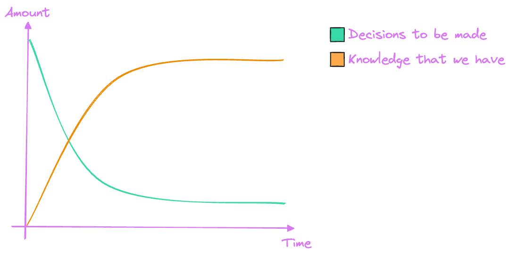

= Evolutionary Architecture
Maciej "MJ" Jedrzejewski; Kamil Baczek
:toc:

++++

  

++++

image:https://img.shields.io/github/v/release/evolutionary-architecture/evolutionary-architecture-by-example[realease, alt="realease"]

image:https://img.shields.io/github/license/evolutionary-architecture/evolutionary-architecture-by-example[GitHub license, alt="License Badge"]
image:https://img.shields.io/github/stars/evolutionary-architecture/evolutionary-architecture-by-example[GitHub stars, alt="Stars Badge"]
image:https://img.shields.io/github/commit-activity/m/evolutionary-architecture/evolutionary-architecture-by-example[GitHub commits, alt="Commits Badge"]
image:https://img.shields.io/github/last-commit/evolutionary-architecture/evolutionary-architecture-by-example[GitHub last commit, alt="Last Commit Badge"]
image:https://img.shields.io/github/issues/evolutionary-architecture/evolutionary-architecture-by-example[GitHub issues, alt="Issues Badge"]
image:https://img.shields.io/github/issues-pr/evolutionary-architecture/evolutionary-architecture-by-example[GitHub pull requests, alt="Pull Requests Badge"]
image:https://img.shields.io/github/forks/evolutionary-architecture/evolutionary-architecture-by-example[GitHub forks, alt="Forks Badge"]
image:https://img.shields.io/github/watchers/evolutionary-architecture/evolutionary-architecture-by-example[GitHub watchers, alt="Watchers Badge"]
image:https://img.shields.io/discord/1140287971367600148[alt="Discord Active"]

== Objective

=== Problem
There are many repositories that describe software and solution architecture in .NET. As there is no single definition of software architecture, they combine several topics:

- Deployment strategies like Modular Monolith and Microservices
- Domain-Driven Design
- Clean, Onion, Hexagonal Architecture
- Infrastructure

as if each of the above were the only possible solution. And that is the problem - it is very rare that any single material shows you a concrete decision path or mix of the above approaches.

Often the examples you find are either too trivial or too complex. Sometimes they are harmful because they misunderstand different concepts. As a result, it is very difficult to take just one and follow some patterns for your own application.

_It depends_ - one of the most overused phrases. Well, it always depends on something, but there are always heuristics to help you decide.

In summary, if you are looking for a journey - not just a single article describing a solution - look no further. It starts here, in this repo.

=== Proposed Solution
Our solution should be read like a story and is divided into 4 chapters:

link:Chapter-1-initial-architecture/README.adoc[**Chapter 1:** Initial Architecture: Focus On Simplicity]

**Chapter 2:** Modules Separation: Focus On Maintainability

**Chapter 3:** Microservice Extraction: Focus On Growth

**Chapter 4:** Applying Tactical Domain-Driven Design: Focus On Complexity

In each chapter we describe the evolution of the architecture of a selected domain:

- Starting with a simple solution architecture that meets early production needs, where business processes are separated in namespaces and communication is handled by an in-memory queue
- Moving to module separation with the structure of multiple projects associated with each module (including CQRS)
- Continue with the single module extraction to a microservice and add the message queue component
- Tackling the complexity of one of the modules using tactical Domain-Driven Design

We apply everything we have learned over many years of software development - our aim is to help you avoid making the same mistakes we have. This way you can be sure that your architecture will not be too trivial for too long, or too complex from the start. Treat it as a guide, something you can refer to at any time.

What we focus on:

- Selected business domain analysis
- Split the domain into subdomains (Core and Supportive)
- Choice of architectural pattern
- Evolution from monolithic to modular
- Evolution to a mix of modular monolith and microservices
- Applying Domain-Driven Design to a Core module
- Backend (.NET) with minimal API
- Loose coupling
- Architecture decision log
- Good coding practices

What we do not focus on:

- Frontend (you can use React, Vue, Angular, Svelte or anything else)
- Logging (you can use https://serilog.net/[Serilog])
- Contract testing (you can use https://github.com/pact-foundation/pact-net[Pact Net])

so that you get the gist of what we have to share with you. Additionally, static code analysis is enabled in all chapters to help us to keep the code base as clean as possible. It is strongly suggested to use it as well in your production code.

NOTE: Keep in mind that these are our suggestions. In the end you will have to decide for yourself which chapters fit your needs or combine them into one solution.

== Domain

=== Overview
The chosen domain for analysis and implementation is a _Fitness Studio_. It is an area that most of people have an idea of how it works. You can:

- Get an offer
- Request for a contract
- Sign the contract
- Receive a pass (to be able to enter the fitness studio)
- Attend to fitness classes

and many more.

However, in order to identify the above processes, you usually need to analyse the domain with _Domain Experts_ and break it down into smaller pieces called _Subdomains_. Otherwise, there is a high risk of falling into a big ball of mud (or distributed mud) where everything is tightly coupled.

At first glance, the domain seems small and problems of oversimplification of initial assumptions usually arise from this interpretation. There are dozens of processes related to expired passes and renewals, discount policies, VIP access, negative cases (e.g. rejection of the access). We often tend to underestimate the problem.

IMPORTANT: Remember that what we want to show you in this repository is how to handle a domain split into a few example subdomains, and how to prepare building blocks that will allow you to easily extend them to cover all processes. We are not able to cover the entire _Fitness Studio_ domain, as that would probably take us a year (or more) of work. **Do not worry -  we try to show ideas here that are complex enough to be applied to your application.**

=== Subdomains
Now that you understand which business domain we are focusing on, it is time to break it down into smaller pieces called _Subdomains_.

There are many ways to do this. Our 3 favourites are:

- https://domainstorytelling.org[Domain Storytelling]
- https://www.eventstorming.com[Event Storming]
- https://storystorming.com[Story Storming]

In general, the idea is to find processes by discovering the flow. Based on different heuristics you are able to define the smaller blocks.

After a round of analysis, we decided to choose the following areas for implementation to show you the idea of _Evolutionary Architecture_:

image::Assets/subdomains.jpg[]

As you can imagine, each subdomain covers a lot of different processes. Again, due to time constraints, we cannot focus on every single aspect. Therefore, we have chosen the following actions for each subdomain:

image::Assets/subdomains_processes.jpg[]

There are 6 different processes in 4 different subdomains. There is a problem here - these subdomains do not communicate with each other and this is one of the most common problems we have in our applications. So we decided to complicate things a bit and add some communication:

image::Assets//subdomains_communication.jpg[]

There are 2 triggers:

- when the contract is signed by you (a customer), then the new pass is registered to allow you to enter the fitness studio
- when the pass expires, then the new offer is prepared (which will be sent to you as a customer)

This way we are almost ready to start the implementation.

One more thing to mention - in our example, each subdomain is a separate _Bounded Context_.

IMPORTANT: It is worth mentioning that there may be a situation where multiple subdomains create a single _Bounded Context_. An example of this in _Fitness Studio_ domain can be: Assessments, Progress Tracking and Virtual Coaching that creates 1 _Bounded Context_ called _Personalised Training_.

=== Potential Patterns
Before you decide to start coding, it is worth to look at your analysis and division one more time and check the complexity of each (it will be mainly defined by the amount of processes and its business rules/policies). Let's take a look at below examples.

==== Passes

image::Assets/subdomain_passes_logic.jpg[]

There is no business logic:

- in the pass registration process, it is only informed that the contract has been signed
- In the pass expiry process, it is only informed that the pass expiry date has been reached.

In addition, the potential for new business rules to be applied to the above processes or other actions is rather low. As it looks like a perfect candidate for CRUD operations, we want to mark it as a candidate to become an _Active Record_ pattern.

NOTE: _Active Record_ is an pattern that rationalises the persistence layer in an application. It encapsulates the idea that a database record is an object in the application, with properties that map to the columns of the database table and the behaviour (domain logic) of that object.

==== Offers

image::Assets/subdomain_offers_logic.jpg[]

The story here is similar to _Passes_. There is no business logic, only the fact that the pass is expiring.

==== Contracts

image::Assets//subdomain_contracts_logic.jpg[]

This is the place where the fun begins. There are 3 business rules:

- in the process of contract preparation, it is only allowed if the customer is an adult AND smaller than the maximum height allowed (210 cm)
- in the contract signing process, it is only allowed if it is signed within 30 days of the contract being created, otherwise the contract has to be created from scratch

In addition, the potential for new business rules being applied to the above processes or other actions is quite high. Here the warning bell should go off - this has a really high potential to become more and more complex, so it might be a good candidate for a _Domain Model_.

NOTE: _Domain Model_ is a widely used pattern in software engineering that encapsulates the concepts and behaviours of a particular problem domain. This representation is designed to mimic the structure and functionality of the real-world system. The domain model pattern is particularly well known for its ability to handle complex business logic by providing a rich, object-oriented representation of the problem domain.

==== Reports

image::Assets/subdomain_reports.jpg[]

This case is really simple. The only thing that we want to achieve is to get the information about new passes that have been registered in each month. 

There is no business logic and there is also no need to have an object representation of the data retrieved. This is a perfect candidate for a _Transaction Script_.

NOTE: _Transaction Script_ is a pattern commonly used in software engineering that organises business logic into procedures, where each procedure handles a single request from the presentation. Each transaction script is a series of procedural steps that represent a sequence of tasks performed as part of a transaction, similar to a script in a play.

==== Summary

After deeper thinking about our subdomains, we decided for following patterns that will be applied in one of 4 chapters:

image::Assets/subdomains_architectural_patterns.jpg[]

== Chapters

In the beginning of every greenfield project we need to make a lot of decisions and we lack of knowledge. It is called _The Project Paradox_:

Quite often we are biased by conferences, meetups, friends and colleagues. As a result we decide for too complex architecture. 

This means starting with:

- microservices (where we do not yet know the traffic, scale and other factors)
- orchestrators
- data streaming
- NoSQL
- cache

and many more. In the end, we have a lot of problems of our own making, and the barrier to entry for any team member is extremely high. In fact, after release, we do not know if we need this or that block. We are also not optimised from a cost perspective and it is very difficult to find bottlenecks.

Another problem is choosing an architecture that is too trivial for too long (this happens less often than "overcomplicated"). This means that we just add code to a monolith, new features flood our codebase and then it becomes a big ball of mud.

What we want to show you in our story is the evolutionary approach that will tackle most of the applications you work with.

=== Chapter 1: Initial Architecture: Focus On Simplicity

In this chapter we will show you how to start your solution architecture. We start with modularisation from day one of the application, but modules are only separated by namespaces (there is only one project for the production code called `Fitnet`). Each process that occurs in each module is sliced vertically - all the code is covered in each process namespace. This gives us several advantages:

- better productivity - when we start a new design, we are not distracted by creating namespaces, renaming, moving things around
- all the code for each process is in just one namespace, so there is no need to look around in folders like `Controllers, Entities, Commands, Queries` etc. Everything is just in e.g. `SignContract`
- deleting or extracting the process is simple - you just drop or extract a namespace

Modules communicate with the in-memory queue.

==== https://s.icepanel.io/vY0SkvgDs7V83U/wOj3[Interactive diagram]
image::Assets/ice_panel_black.png[link="https://s.icepanel.io/vY0SkvgDs7V83U/wOj3",width=100,height=28]

=== Chapter 2: Modules Separation: Focus On Maintainability

This chapter focuses on the second step you can take in your application. After some time, you will find that your assumptions about modules were wrong - they grow fast, the business logic becomes more complex. You may have to decide to use a different type of database (e.g. key-value). Or the other way around - something you thought was going to be complex is actually quite simple and there is not a lot of business logic involved. Also, the team has grown and it is quite difficult to work on one project - lots of conflict and merging hell.

With this in mind, you can now start thinking to split your single `Fitnet` project into several ones:

- for one module it will be just `Fitnet.Reports` - there is only a transaction script, no business logic
- for another, it will be `Fitnet.Passes.Api, Fitnet.Passes.DataAccess` to build around the active record
- for the complex one it will be `Fitnet.Contracts.Api, Fitnet.Contracts.Application, Fitnet.Contracts.Core, Fitnet.Contracts.Infrastructure`

and so on. The modules still communicate with the in-memory queue (alternatives described in the chapter's own README).

=== Chapter 3: Microservice Extraction: Focus On Growth

Over time, you may need to extract a microservice from one of your application modules. In this chapter, you will identify the most common disintegrators (decision drivers for extracting a microservice). 

We will also add a message queue component to replace the in-memory queue. This way, we will improve the exchange of messages between the modules themselves and the microservice.

Here you will learn about various concepts that are important from a microservices architecture perspective.

==== https://s.icepanel.io/EPX45vmGXfBpnJ/cBSP[Interactive diagram]
image::Assets/ice_panel_black.png[link="https://s.icepanel.io/EPX45vmGXfBpnJ/cBSP",width=100,height=28]

=== Chapter 4: Applying Tactical Domain-Driven Design: Focus On Complexity

At the end of the story, we want to show you that it is possible to evolve to a domain model for one of your modules at some point.

You do not have to start from scratch if you do not know your business domain. And you do not need to apply all the concepts of Domain-Driven Design to get good results. 

Interesting fact - if you have done a proper analysis of your business domain in the beginning and have already broken it down into different subdomains (and combined them into e.g. a module), then you are almost done from a strategic Domain-Driven Design perspective. Now you just need to make some adjustments and do some tactical DDD. Cool? Absolutely cool!

Here we focus mainly on tactical DDD and describe

- value objects
- entities
- aggregates

You will also find some tips for the next steps.

== Repository Structure

=== Overview

We are trying to keep this repository as simple as possible, so that you can read it like a book. It contains chapters, where each chapter is an extension of the previous one, read like a story.

=== How To Navigate?

In the root folder of this repository you will find only this README, the assets (images & diagrams) used in it, and 4 folders containing the content for each chapter.

In each folder you will find the same root solution, but expanded:

1. Chapter 1 - Initial state of the application
2. Chapter 2 - Extraction into separate projects
3. Chapter 3 - Extracting a module to a microservice and using the message queue
4. Chapter 4 - Applying Tactical Domain-Driven Design to one of the modules

Another important thing to note is that the detailed description of each chapter is in its own README folder. There you will find the information on how to run the solution, what solution structure is used, and other important things that are only relevant to that particular chapter. 

We are not repeating the information covered in the previous chapter, we are just extending it with the decision we have made.

IMPORTANT: If you want to get the most out of this repository, we recommend that you read the first chapter, understand the code and description, and then navigate to another folder. Of course you can go through the folders in your own way but you might miss some concepts.

== Libraries and Platforms Used

The entire application is developed using C# and .NET 8.

In each chapter we use libraries and platforms that simplify the development process (no need to create them yourself). We try to keep it to a minimum. The certain disadvantage is that we do not have full control over it (trade-off we accept). Here is the list of the most important ones:

Application:

- https://www.docker.com[Docker]
- https://docs.fluentvalidation.net/en/latest/[Fluent Validation]
- https://github.com/jbogard/MediatR[MediatR]
- https://github.com/DapperLib/Dapper[Dapper]
- https://github.com/dotnet/efcore[Entity Framework]
- https://github.com/npgsql/npgsql[Npgsql]
- https://github.com/SonarSource/sonar-dotnet[SonarAnalyzer]

Testing:

- https://github.com/xunit/xunit[xunit]
- https://nsubstitute.github.io/[NSubstitute]
- https://github.com/VerifyTests/Verify[Verify]
- https://github.com/bchavez/Bogus[Bogus]
- https://github.com/fluentassertions/fluentassertions[Fluent Assertions]
- https://dotnet.testcontainers.org[Test Containers]

== Videos 🎥

You can learn the essentials of Evolutionary Architecture from these videos:

=== Webinar from Architecture Weekly 🇬🇧

In this webinar, Maciej "MJ" Jedrzejewski gives a detailed talk on Evolutionary Architecture. You can watch the recorded webinar link:https://www.architecture-weekly.com/p/webinar-11-maciej-mj-jedrzejewski[here].

=== Presentation at Programistok 2023 Conference 🇵🇱

This is a recorded presentation from the Programistok 2023 Conference, where Evolutionary Architecture was extensively explained. You can watch it on YouTube link:https://www.youtube.com/watch?v=tfCtM8D_DZ4&t=598s[here].

=== Evolutionary Architecture Visualized Through NDepend 🇬🇧

Explore Evolutionary Architecture visualized through NDepend, featuring comprehensive dependency and code analysis in the form of an interview led by Ferry de Boer with Kamil. Watch it on YouTube link:https://www.youtube.com/watch?v=Z60SAiVevIM&t[here].

== Authors

[cols=2*,options=header]
|===
|Maciej Jedrzejewski
|Kamil Baczek

|Software architect, tech lead and facilitator of modern software development practices that allow shortening the feedback loop in every area of a lifecycle e.g. trunk-based development, short-living branches, vertical slices, canary releases, CI/CD, and more.

https://meaboutsoftware.com/[Blog]
https://www.linkedin.com/in/jedrzejewski-maciej/[Linkedin]
https://www.youtube.com/@meaboutsoftware[YouTube]

|.NET Engineer, Software Architect who empowers teams to build better software through solid software architecture, utilising techniques such as Event Storming, Domain Driven Design and various architecture styles and design patterns.

https://artofsoftwaredesign.net/[Blog]
https://www.linkedin.com/in/kamilbaczek/[Linkedin]
https://github.com/kamilbaczek[Github]
|===

[cols=3*, options=header]
|===
| Milestone | Date | Done

| Repository Premiere :rocket: | 2023.10 | ✅
| Migration to .NET 8 :fire: | 2023.11 | ✅
| Architecture Tests :wrench: | 2023.12 |
| Chapter 4: Focus on Complexity :brain: | 2024.03 |
| Fitness Functions :gear: | 2024.05 |
|===

== 💬 Join our Community
Join the "Evolutionary Architecture Community" on Discord (https://discord.gg/BGxYkHFCCF) to engage with fellow architects and enthusiasts who share a fervor for pushing boundaries and crafting high-quality software systems. Whether you have questions, suggestions, or feedback for our repository, we're excited to hear from you and collaborate towards continuous improvement.

image::Assets/discord.png[link="https://discord.gg/BGxYkHFCCF",width=200,height=64]

== ⭐ Say thanks
Feel free to give a ⭐ to this repository if you like it. Your support is greatly appreciated!
