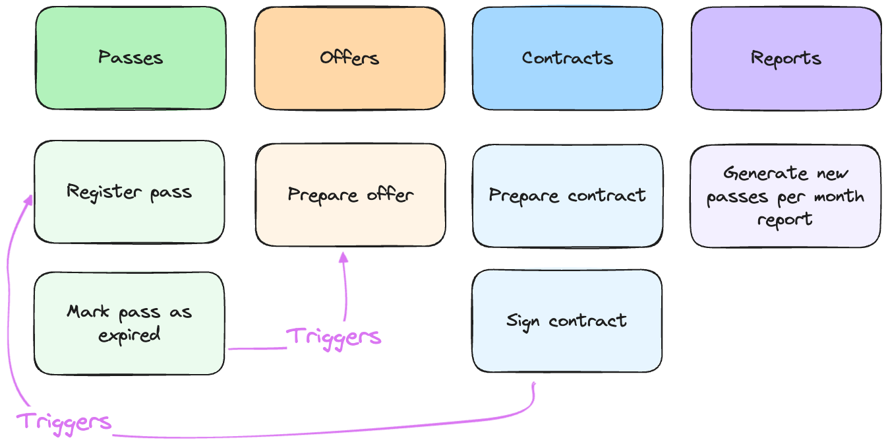

= 演进式架构
Maciej "MJ" Jedrzejewski；Kamil Baczek
:toc:

++++

  <picture>
    <source srcset="Assets/ea_banner_dark.png" media="(prefers-color-scheme: dark)">
    <source srcset="Assets/ea_banner_light.png" media="(prefers-color-scheme: light)">
    
  </picture>

++++

image:https://img.shields.io/github/v/release/evolutionary-architecture/evolutionary-architecture-by-example[realease, alt="realease"]
image:https://img.shields.io/github/license/evolutionary-architecture/evolutionary-architecture-by-example[GitHub license, alt="License Badge"]
image:https://img.shields.io/github/stars/evolutionary-architecture/evolutionary-architecture-by-example[GitHub stars, alt="Stars Badge"]
image:https://img.shields.io/github/commit-activity/m/evolutionary-architecture/evolutionary-architecture-by-example[GitHub commits, alt="Commits Badge"]
image:https://img.shields.io/github/last-commit/evolutionary-architecture/evolutionary-architecture-by-example[GitHub last commit, alt="Last Commit Badge"]
image:https://img.shields.io/github/issues/evolutionary-architecture/evolutionary-architecture-by-example[GitHub issues, alt="Issues Badge"]
image:https://img.shields.io/github/issues-pr/evolutionary-architecture/evolutionary-architecture-by-example[GitHub pull requests, alt="Pull Requests Badge"]
image:https://img.shields.io/github/forks/evolutionary-architecture/evolutionary-architecture-by-example[GitHub forks, alt="Forks Badge"]
image:https://img.shields.io/github/watchers/evolutionary-architecture/evolutionary-architecture-by-example[GitHub watchers, alt="Watchers Badge"]
image:https://img.shields.io/discord/1140287971367600148[alt="Discord Active"]

== 目标

=== 问题
在查找 .NET 解决方案架构的指导时，你会发现无数仓库和资源。每个都只专注于自己偏爱的方式，比如：

- Clean、Onion 或六边形架构
- 战术领域驱动设计（DDD）
- 模块化单体
- 微服务

真正的挑战在于：大多数资料将自己的方法当作万能方案，忽略了日常开发中的实际权衡。缺少的是一张清晰的决策地图，帮助你理解何时、如何组合不同的架构元素和模式。

本仓库提供了不同的视角：不仅仅是静态的模式集合，而是一次架构决策的演进之旅。你将学会如何权衡取舍、组合方法，并根据实际需求打造合适的解决方案。

每个开发项目都面临一个根本挑战，称为 _“项目悖论”_：

image::Assets/project_paradox.png[]

我们在最不了解业务领域时就要做出关键架构决策，这很容易陷入“过度复杂”或“过度简单”的陷阱。

我们常常被技术趋势和会议演讲带偏，提前引入：

- 微服务
- 复杂编排系统
- 数据流方案
- NoSQL 数据库
- 缓存层

……以及更多“以防万一”的东西。

结果？我们制造了自己的复杂性噩梦。新成员难以上手，成本飙升，性能瓶颈难以定位。我们在解决并不存在的问题的同时，让真正的问题更难解决。

相反，过于简单也有风险：单体应用无限膨胀，最终变成难以维护的“泥球”。

我们要展示的是一种演进式架构方法——随着你对领域和系统复杂度的理解逐步成长。这条路能帮助你避免一开始就过度设计，也不会陷入无法扩展的困境。

=== 方案
我们的方案像故事一样分为四章，每一章都在前一章基础上演进。

本仓库反映了多年的真实经验和教训，目标是引导你构建既能扩展又易于维护的架构。

涵盖内容：

- 典型业务领域分析（健身）
- 领域驱动设计（战略与战术）
- 架构模式选择与演进
- 模块化单体与微服务的混合架构
- 松耦合
- .NET 后端实现（Minimal API）
- 架构决策日志
- 干净的编码实践

你可以自行选择：

- 前端技术（React、Vue、Angular、Svelte 等）
- 日志实现（推荐 https://serilog.net/[Serilog]）
- 合同测试（推荐 https://github.com/pact-foundation/pact-net[Pact Net]）

==== 第一章：初始架构，聚焦简单
本章展示如何为你的解决方案打下良好基础。我们从一个项目（`Fitnet`）开始，采用垂直切片方式组织代码，避免过度复杂。

- 相关业务流程的所有代码都集中在一个命名空间
- 模块间通过简单的内存队列通信

详细内容：

- link:/Chapter-1-initial-architecture/README.adoc[本章说明]
- https://s.icepanel.io/vY0SkvgDs7V83U/wOj3[交互式图表]

==== 第二章：模块拆分，聚焦可维护性
本章应对初始架构的局限。我们将项目按模块拆分，每个模块采用最适合自身复杂度的结构。

- 简单模块保持简单
- 中等复杂度模块平衡架构
- 复杂领域模块获得更大空间

详细内容：

- link:/Chapter-2-modules-separation/README.adoc[本章说明]

==== 第三章：微服务提取，聚焦增长
本章讲解何时、如何提取第一个微服务，并用消息队列替换内存队列，提升系统通信的健壮性和冗余性。

详细内容：

- link:/Chapter-3-microservice-extraction/README.adoc[本章说明]
- https://s.icepanel.io/EPX45vmGXfBpnJ/cBSP[交互式图表]

==== 第四章：战术领域驱动设计，聚焦复杂性
最后一章展示如何在不推倒重来的情况下演进到领域模型。你会用上：

- 值对象
- 实体
- 聚合
- 领域事件

无需全部用上 DDD 概念，按需选用即可。

详细内容：

- link:/Chapter-4-applying-tactical-domain-driven-design/README.adoc[本章说明]

==== 其他说明
每章都包含静态代码分析以保证质量——强烈建议在生产环境采用。

NOTE: 所有章节展示了不同的模式和实践，但并非死规矩。请根据实际需求选择或组合使用。

== 领域

=== 概述
我们以健身领域为例，展示如何识别和拆分子域，并构建可扩展的组件。

- 获取会员优惠
- 准备和签署合同
- 获取通行证
- 参加健身课程

这些流程背后隐藏着复杂性。通过与领域专家分析，我们将领域拆分为更小的 _子域_。

image::Assets/subdomains_theory.png[]

我们采用了 Event Storming 和 Domain Storytelling 等方法，最终识别出如下子域：

image::Assets/subdomains.png[]

NOTE: 实际项目中，建议用业务能力和流程命名子域，而非实体名。

这些子域间存在关键交互：

- 签署合同时自动注册通行证
- 会员到期时自动生成新优惠

=== 限界上下文
每个子域在技术上用 _限界上下文_ 表示。每个上下文有独立的模型和业务规则，避免“泥球”现象。

image::../Assets/subdomains.png[]

推荐使用 https://github.com/ddd-crew/bounded-context-canvas[Bounded Context Canvas] 工具。

== 仓库结构

=== 概述
本仓库像小说一样，每章递进。建议按顺序阅读，前后知识递进。

- 第一章：简单起步
- 第二章：模块拆分
- 第三章：微服务与通信升级
- 第四章：战术 DDD

每章有独立 README，聚焦新内容。

== 使用的库与平台

- https://www.docker.com[Docker]
- https://docs.fluentvalidation.net/en/latest/[Fluent Validation]
- https://github.com/jbogard/MediatR[MediatR]
- https://github.com/DapperLib/Dapper[Dapper]
- https://github.com/dotnet/efcore[Entity Framework]
- https://github.com/npgsql/npgsql[Npgsql]
- https://github.com/SonarSource/sonar-dotnet[SonarAnalyzer]

测试：

- https://github.com/xunit/xunit[xunit]
- https://nsubstitute.github.io/[NSubstitute]
- https://github.com/VerifyTests/Verify[Verify]
- https://github.com/bchavez/Bogus[Bogus]
- https://docs.shouldly.org/documentation/getting-started[Shouldly]
- https://dotnet.testcontainers.org[Test Containers]

== 视频 🎥

- 架构周刊 Webinar（英文）：https://www.architecture-weekly.com/p/webinar-11-maciej-mj-jedrzejewski[观看]
- Programistok 2023 大会演讲（波兰语）：https://www.youtube.com/watch?v=tfCtM8D_DZ4[观看]
- NDepend 可视化演进式架构（英文）：https://www.youtube.com/watch?v=Z60SAiVevIM&t[观看]

== 作者 ✍️

[cols=2*,options=header]
|===
|Maciej "MJ" Jedrzejewski
|Kamil Baczek

|《Master Software Architecture》作者，技术无关架构师，微软 MVP。

http://mastersoftwarearchitecturebook.com[图书]
https://newsletter.fractionalarchitect.io[Newsletter]
https://www.linkedin.com/in/jedrzejewski-maciej/[Linkedin]

|.NET 工程师、软件架构师，微软 MVP，专注于事件风暴、DDD 及多种架构风格和设计模式。

https://artofsoftwaredesign.net/[博客]
https://www.linkedin.com/in/kamilbaczek/[Linkedin]
https://github.com/kamilbaczek[Github]
|===

== 👩‍💻👨‍💻 软件工程师评价

=== 👨‍💼 首席软件架构师
____
非常感谢你们分享的内容。演进式方法和关注简单、务实的设计决策非常有价值。
____

=== 👨‍💻 .NET 开发者
____
你们的工作对我深入理解领域架构帮助很大。演进式架构尤其让我豁然开朗。
____

=== 👨‍💻 .NET 开发者
____
我一直纠结项目该用什么架构。你们强调架构随需求演进的理念非常契合我的想法，非常感谢！
____

== 💬 加入社区
欢迎加入我们的 Discord 社区：https://discord.gg/BGxYkHFCCF[Discord]，一起交流架构与开发经验。

image::Assets/discord.png[link="https://discord.gg/BGxYkHFCCF",width=200,height=64]

== ⭐ 点赞支持
觉得本仓库有帮助？请点个 ⭐，让更多人发现它！
